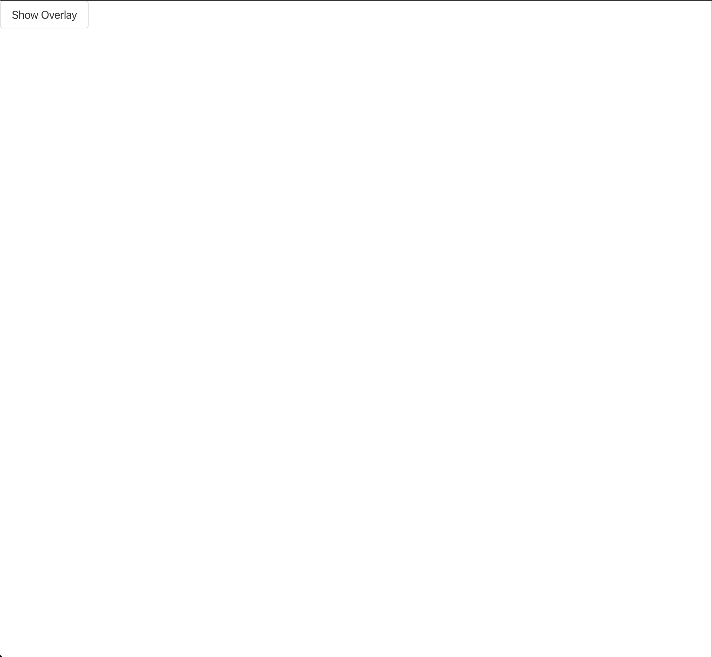

**Angular CDK** is short for **Angular Component Dev Kit (CDK)**. As the name suggests, the CDK provides you a set of tools to build feature-packed and high-quality **Angular** components without having to adhere to **Material Design** that **Google** embraces. The goal of the CDK is to allow developers to easier implement *Common Patterns and Behaviors* in our **Angular** applications. There are many different packages, patterns, and behaviors that you can explore by checking out the CDK [documentation](https://material.angular.io/cdk/categories). 

Lately, I have been involving in an **Angular** project where we have multiple **UI Component Suite** installed like `NgBootstrap` and `PrimeNG`, and couple other miscellaneous packages. Though these packages get the job done (and quick), we are at the point of having too many different moving parts to maintain and keep up-to-date. In other words, **tech debts** are building up and **inconsistency** is haunting our project. One prime example is **Dynamic Dialog** usage where you can a **Dialog** and pass in a custom **Component** as the content of the **Dialog** with extra data. Sounds neat right? At the moment we needed the feature, `PrimeNG` didn't have support for **DynamicDialog** (they do now, check it out at [PrimeNG DynamicDialog](https://www.primefaces.org/primeng/#/dynamicdialog)). One of our developers turned to `NgBootstrap` for their **NgbModal** ([NgBootstrap NgbModal](https://ng-bootstrap.github.io/#/components/modal/examples)). That's when we ended up with both `NgBootstrap` and `PrimeNG` in our project.

Now, we have turned ourselves to these different libraries for just a usage of a **Dialog**. There has to be a better way which is already available to you right? Luckily, yes. **Angular CDK** does provide an "easy" way to implement your own **Dynamic Dialog** with **ANY** stylings you want to go with. I have been looking into the **Angular CDK**, namely the **Overlay** module, to explore a way to build **Dynamic Dialog** without any dependency to those **UI Component Suite** so we will not have to rely on those **Suite** for future projects. This blog post is a mean to share my findings with you all and we are going to utilize **Angular CDK OverlayModule** along with **BulmaCSS** to build a **Dynamic Dialog** that adheres to **Angular** convention and not look like **Material Design.** Let's jump it.

### Preparations

Go ahead and initialize a new **Angular** application using the **Angular CLI**

```shell script
ng new cdk-bulma-dialog
```

> If you haven't installed **Angular CLI**, let's do so with `npm i -g @angular/cli`


*Angular CLI generating new Angular application*

We are **not** going to need `routing` and let's also pick `SCSS` for our stylings. Next, let's install **Angular CDK**

```shell script
ng add @angular/cdk
```

Open `styles.scss` and add this line:

```scss
@import '~@angular/cdk/overlay-prebuilt.css';
```

Open `app.module.ts` and add `BrowserAnimationsModule` import:

```typescript
import { NgModule } from '@angular/core';
import { BrowserModule } from '@angular/platform-browser';
import { BrowserAnimationsModule } from '@angular/platform-browser/animations'; // <-- add this import
import { AppComponent } from './app.component';

@NgModule({
  declarations: [AppComponent],
  imports: [BrowserModule, BrowserAnimationsModule], // <-- add BrowserAnimationsModule
  providers: [],
  bootstrap: [AppComponent]
})
export class AppModule {
}
```

Open `index.html` and edit as following:

```html
<!doctype html>
<html lang="en">
<head>
  <meta charset="utf-8">
  <title>CdkBulmaDialog</title>
  <base href="/">
  <meta name="viewport" content="width=device-width, initial-scale=1">
  <link rel="icon" type="image/x-icon" href="favicon.ico">
    <!-- Add BulmaCSS CDN -->
  <link rel="stylesheet" href="https://cdn.jsdelivr.net/npm/bulma@0.8.0/css/bulma.min.css">
</head>
<body>
  <app-root></app-root>
</body>
</html>
```

Now we are ready to move on to the main content of this blog.

### More Files

We are going to start off by generating and creating all of the files we are going to need.

- Using **Angular CLI**

Generate `DynamicDialogModule`

```shell script
ng generate module dynamic-dialog
```

Generate `DynamicDialogService`

```shell script
ng generate service dynamic-dialog/dynamic-dialog --skipTests
```

> For brevity of this blog post, I am going to include `skipTests` flag in all `ng generate` commands.

Generate `DynamicDialogContentDirective`

```shell script
ng generate directive dynamic-dialog/dynamic-dialog-content --skipTests
```

Generate `DynamicDialogRootComponent`

```shell script
ng generate component dynamic-dialog/dynamic-dialog-root --flat --skipTests --inlineTemplate --inlineStyle
```

> We are going to use `inlineTemplate` and `inlineStyle` here so we keep everything that's happening in our component in one `*.component.ts` file.

- Creating directories and files

We are going to need some **Models** so go ahead and create a `models` directory under `dynamic-dialog`. 

```shell script
# assuming you are currently at the root of the project which is cdk-bulma-dialog
cd src/app/dynamic-dialog
mkdir models
cd models
```

Now, let's create couple files

```shell script
touch animation-state.enum.ts
touch dynamic-dialog-config.model.ts
```

and let's also fill out these two new files. Open up `animation-state.enum.ts` 

```typescript
export enum AnimationState {
  Void = 'void',
  Enter = 'enter',
  Leave = 'leave'
}
```

then `dynamic-dialog-config.model.ts`

```typescript
import { OverlayConfig } from '@angular/cdk/overlay';

export class DynamicDialogConfig<TData = any> {
  header: string;
  closable: boolean;
  containerAnimationTiming: number;
  contentAnimationTiming: number;
  animationChildDelay: number;
  data?: TData;
  overlayConfig?: OverlayConfig;

  constructor() {
    this.header = '';
    this.closable = true;
    this.containerAnimationTiming = 0.3;
    this.contentAnimationTiming = 0.2;
    this.animationChildDelay = 0;
  }
}
```

Let's go through each `config`:

1. `header`: Very self-explanatory. We are going to configure our `dialog` to have a `header title`. We will allow the **Dialog** consumers to be able to configure the `header` through `DynamicDialogConfig`.
2. `closable`: Whether to allow the **Dialog** to be closed via: `clicking on backdrop` and `clicking a close icon`. By default, we would like to have a `close icon` on the right-hand side of the `header`.
3. `containerAnimationTiming`: How long the animation of the **Dialog Container** runs. Visually, this is a fullscreen container underneath the **Dialog Content**.
4. `contentAnimationTiming`: How long the actual **Dialog Content** animation needs to run.
5. `animationChildDelay`: How long the delay is between the `containerAnimation` and `contentAnimation`
6. `data`: Extra data that we want to pass to the **Dialog**. Most of the times, it could be some metadata like `productId` or something like that that we need to fetch required data to display in the **Dialog**. The type is a **Generic Type** which we can specify when we construct our `DynamicDialogConfig` for a specific **Dialog**.
7. `overlayConfig`: `OverlayConfig` pass-through. The **Dialog** that we are building will dictate some default `OverlayConfig`  (from `OverlayModule`) but we will also allow the consumers to configure the `OverlayConfig` and merge it with our default setup should they desire to.

Next, the last thing we are going to need is `DynamicDialogRef`. I will explain the significant of this `ref` when we get to fill it out. For now, let's create the file

```shell script
# assume you are in src/app/dynamic-dialog/models
cd ..
touch dynamic-dialog-ref.ts
```

### Let's start building

First, we are going to take care of `DynamicDialogContentDirective` as it is very short and straightforward. Open up `dynamic-dialog-content.directive.ts`

```typescript
import { Directive, ViewContainerRef } from '@angular/core';

@Directive({
  selector: '[appDynamicDialogContent]'
})
export class DynamicDialogContentDirective {

  constructor(public readonly viewContainerRef: ViewContainerRef) { } // <-- inject ViewContainerRef

}
```

The `directive` will play as the **insertion point.** This is where we want to render our `content` (as a `Component`) dynamically. Hence, we are going to inject `ViewContainerRef` to the `directive` and as the `directive` is mounted, it will have access to the `ViewContainerRef` of the element that the `directive` is used on (Read more about [Angular Directive](https://angular.io/api/core/Directive)) Don't worry, we will piece everything together soon enough.

And that's all we needed for `DynamicDialogContentDirective`. Let's open up `dynamic-dialog-ref.ts` and add this piece of code

```typescript
export class DynamicDialogRef<TReturnType = any> {

}
```

That's it for now. Open `dynamic-dialog-root.component.ts` now

```typescript
import { AfterViewInit, ChangeDetectionStrategy, Component, OnDestroy } from '@angular/core';

@Component({
  selector: 'app-dynamic-dialog-root',
  template: `
    <p>
      dynamic-dialog-root works!
    </p>
  `,
  changeDetection: ChangeDetectionStrategy.OnPush // <-- also use OnPush strategy.
})
export class DynamicDialogRootComponent implements AfterViewInit, OnDestroy { // <-- implements AfterViewInit and OnDestrou

  constructor() {
  }

  ngAfterViewInit(): void { // <-- ngAfterViewInit implementation
  }

  ngOnDestroy(): void { // <-- ngOnDestroy implementation
  }
}
```

We are going to need a couple of fields:

1. `animationState` and `animationStateChanged`: To keep track of animations of the `container` and `content` part of the **Dialog**. We will base on the `animationState`  and `AnimationEvent` from `@angular/animations` to make meaningful decision about when the **Dialog** is actually closed.
2. `contentComponentType`: Type of the `Component` that is used for the `content` of the **Dialog**
3. `componentRef`: This is to hold the current reference to the **Dialog Content** so that we can destroy it in `ngOnDestroy` hook.

Let's fill the fields out

```typescript
import { AnimationEvent } from '@angular/animations';
import { 
    AfterViewInit, 
    ChangeDetectionStrategy, 
    Component, 
    OnDestroy, 
    EventEmitter,
    Type,
    ComponentRef
} from '@angular/core';
import { AnimationState } from './models/animation-state.enum'; // <-- import AnimationState

@Component({
  selector: 'app-dynamic-dialog-root',
  template: `
    <p>
      dynamic-dialog-root works!
    </p>
  `,
  changeDetection: ChangeDetectionStrategy.OnPush
})
export class DynamicDialogRootComponent implements AfterViewInit, OnDestroy {
    animationState: AnimationState = AnimationState.Enter;
    // Make sure you import AnimationEvent from @angular/animations
    animationStateChanged: EventEmitter<AnimationEvent> = new EventEmitter<AnimationEvent>();
    contentComponentType: Type<any>;
    
    private componentRef: ComponentRef<any>;

  constructor() {
  }

  ngAfterViewInit(): void {
  }

  ngOnDestroy(): void {
  }
}
```

We are also going to have a couple of things injected to `DynamicDialogRootComponent` using **Dependency Injection (DI)** 

1. `DynamicDialogConfig`: Our custom-made `configuration`
2. `DynamicDialogRef`: Our custom-made `dialogRef`
3. `ComponentFactoryResolver`: When you define and use a regular `Component` in **Angular**, **Angular** will take the metadata from `@Component()` decorator and create a `factory` out of those metadata for your `Component`. Our **Dialog** will be rendered dynamically on the screen. Hence, we are going to need `ComponentFactoryResolver` to create the `factory` ourselves. 
4. `ChangeDetectorRef`: The idea is we will start constructing our **Dialog Content Component** in `ngAfterViewInit` hook after the initial **DOM** has been loaded. And we are also leveraging `OnPush` strategy so after we create our **Dialog Content Component**, we want to call `changeDetectorRef.markForCheck()` so **Angular Change Detection Mechanism** will check this **Dialog Root Component** for update and we only do it once. The later change detection should be happening inside of the **Dialog Content Component**.

Again, let's fill these out

```typescript
import { AnimationEvent } from '@angular/animations';
import { 
    AfterViewInit, 
    ChangeDetectionStrategy, 
    Component, 
    OnDestroy, 
    EventEmitter,
    Type,
    ComponentRef,
    ComponentFactoryResolver,
    ChangeDetectorRef
} from '@angular/core';
import { AnimationState } from './models/animation-state.enum';
import { DynamicDialogConfig } from './models/dynamic-dialog-config.model';
import { DynamicDialogRef } from './dynamic-dialog-ref';

@Component({
  selector: 'app-dynamic-dialog-root',
  template: `
    <p>
      dynamic-dialog-root works!
    </p>
  `,
  changeDetection: ChangeDetectionStrategy.OnPush
})
export class DynamicDialogRootComponent implements AfterViewInit, OnDestroy {
    animationState: AnimationState = AnimationState.Enter;
    animationStateChanged: EventEmitter<AnimationEvent> = new EventEmitter<AnimationEvent>();
    contentComponentType: Type<any>;
    
    private componentRef: ComponentRef<any>;

  constructor(
        public readonly dialogConfig: DynamicDialogConfig,
        private readonly dialogRef: DynamicDialogRef,
        private readonly cfr: ComponentFactoryResolver,
        private readonly cdr: ChangeDetectorRef
    ) {
  }

  ngAfterViewInit(): void {
  }

  ngOnDestroy(): void {
  }
}
```

Let's fill out the `template` next

```typescript
import { AnimationEvent } from '@angular/animations';
import { 
    AfterViewInit, 
    ChangeDetectionStrategy, 
    Component, 
    OnDestroy, 
    EventEmitter,
    Type,
    ComponentRef,
    ComponentFactoryResolver,
    ChangeDetectorRef,
    ViewChild
} from '@angular/core';
import { AnimationState } from './models/animation-state.enum';
import { DynamicDialogConfig } from './models/dynamic-dialog-config.model';
import { DynamicDialogRef } from './dynamic-dialog-ref';
import { DynamicDialogContentDirective } from './dynamic-dialog-content.directive';

@Component({
  selector: 'app-dynamic-dialog-root',
  template: `
    <div
      class="modal is-active"
      style="padding-left: 1rem; padding-right: 1rem"
    >
      <div class="modal-background"></div>
      <div class="modal-card">
        <header class="modal-card-head">
          <p class="modal-card-title">{{ dialogConfig.header }}</p>
          <button
            class="delete"
            aria-label="close"
            *ngIf="dialogConfig.closable"
          ></button>
        </header>
        <section class="modal-card-body">
          <ng-template appDynamicDialogContent></ng-template>
        </section>
      </div>
    </div>
  `,
  changeDetection: ChangeDetectionStrategy.OnPush
})
export class DynamicDialogRootComponent implements AfterViewInit, OnDestroy {
    // Grab the Directive to use in the TypeScript portion
    @ViewChild(DynamicDialogContentDirective, { static: false }) contentInsertionPoint: DynamicDialogContentDirective;

    animationState: AnimationState = AnimationState.Enter;
    animationStateChanged: EventEmitter<AnimationEvent> = new EventEmitter<AnimationEvent>();
    contentComponentType: Type<any>;
    
    private componentRef: ComponentRef<any>;

    constructor(
        public readonly dialogConfig: DynamicDialogConfig,
        private readonly dialogRef: DynamicDialogRef,
        private readonly cfr: ComponentFactoryResolver,
        private readonly cdr: ChangeDetectorRef
    ) {
    }

    ngAfterViewInit(): void {
    }

    ngOnDestroy(): void {
    }
}
```

I grab the `HTML` directly from [Bulma Modal](https://bulma.io/documentation/components/modal/) and change the `title` to use `dialogConfig.header`. I also replace everything in between `<section class="modal-card-body"></section>` with `<ng-template></ng-template>` and use our `DynamicDialogContentDirective` on the `ng-template`. If you know how **Dynamic Component** works in **Angular,** you'll kind of see what is going on here already. We use `ng-template`, bind `DynamicDialogContentDirective` and if you recall, we inject `ViewContainerRef` in our `DynamicDialogContentDirective`. This all essentially means we're grabbing the `ng-template` as our `ViewContainerRef` and we can use that as the **Insertion Point** for our **Dialog Content Component**. 

Now, let's fill out `ngAfterViewInit()` and `ngOnDestroy()` shall we

```typescript
import { AnimationEvent } from '@angular/animations';
import { 
    AfterViewInit, 
    ChangeDetectionStrategy, 
    Component, 
    OnDestroy, 
    EventEmitter,
    Type,
    ComponentRef,
    ComponentFactoryResolver,
    ChangeDetectorRef,
    ViewChild
} from '@angular/core';
import { AnimationState } from './models/animation-state.enum';
import { DynamicDialogConfig } from './models/dynamic-dialog-config.model';
import { DynamicDialogRef } from './dynamic-dialog-ref';
import { DynamicDialogContentDirective } from './dynamic-dialog-content.directive';

@Component({
  selector: 'app-dynamic-dialog-root',
  template: `
    <div
      class="modal is-active"
      style="padding-left: 1rem; padding-right: 1rem"
    >
      <div class="modal-background"></div>
      <div class="modal-card">
        <header class="modal-card-head">
          <p class="modal-card-title">{{ dialogConfig.header }}</p>
          <button
            class="delete"
            aria-label="close"
            *ngIf="dialogConfig.closable"
          ></button>
        </header>
        <section class="modal-card-body">
          <ng-template appDynamicDialogContent></ng-template>
        </section>
      </div>
    </div>
  `,
  changeDetection: ChangeDetectionStrategy.OnPush
})
export class DynamicDialogRootComponent implements AfterViewInit, OnDestroy {
    @ViewChild(DynamicDialogContentDirective, { static: false }) contentInsertionPoint: DynamicDialogContentDirective;

    animationState: AnimationState = AnimationState.Enter;
    animationStateChanged: EventEmitter<AnimationEvent> = new EventEmitter<AnimationEvent>();
    contentComponentType: Type<any>;
    
    private componentRef: ComponentRef<any>;

    constructor(
        public readonly dialogConfig: DynamicDialogConfig,
        private readonly dialogRef: DynamicDialogRef,
        private readonly cfr: ComponentFactoryResolver,
        private readonly cdr: ChangeDetectorRef
    ) {
    }

    ngAfterViewInit(): void {
        this.loadContentComponent();
        this.cdr.markForCheck();
    }

    ngOnDestroy(): void {
        if (this.componentRef) {
          this.componentRef.destroy();
        }
    }

    private loadContentComponent(): void {
        const factory = this.cfr.resolveComponentFactory(this.contentComponentType);
        const vcr = this.contentInsertionPoint.viewContainerRef;
        vcr.clear();
        this.componentRef = vcr.createComponent(factory);
    }
}
```

As mention before, in `ngAfterViewInit()`, we will `loadContentComponent()` using `ComponentFactoryResolver` and then mark the **Dialog Root** for **Change Detection Check** with `ChangeDetectorRef.markForCheck()`. In `loadContentComponent()`, we also grab the `viewContainerRef` from our `DynamicDialogContentDirective` to act as the **Insertion Point** for our **Dialog Content Component.** If you notice, you will see that we haven't set our `contentComponentType` anywhere in this `DynamicDialogRootComponent` and you are absolutely right. We will assign `contentComponentType` at an earlier point, in a different place. In `ngOnDestroy()`, we just do some cleaning up with `componentRef`. Pretty self-explanatory 😊. Let's add one more method to `DynamicDialogRootComponent` before moving on

```typescript
import { AnimationEvent } from '@angular/animations';
import { 
    AfterViewInit, 
    ChangeDetectionStrategy, 
    Component, 
    OnDestroy, 
    EventEmitter,
    Type,
    ComponentRef,
    ComponentFactoryResolver,
    ChangeDetectorRef,
    ViewChild
} from '@angular/core';
import { AnimationState } from './models/animation-state.enum';
import { DynamicDialogConfig } from './models/dynamic-dialog-config.model';
import { DynamicDialogRef } from './dynamic-dialog-ref';
import { DynamicDialogContentDirective } from './dynamic-dialog-content.directive';

@Component({
  selector: 'app-dynamic-dialog-root',
  template: `
    <div
      class="modal is-active"
      style="padding-left: 1rem; padding-right: 1rem"
    >
      <div class="modal-background"></div>
      <div class="modal-card">
        <header class="modal-card-head">
          <p class="modal-card-title">{{ dialogConfig.header }}</p>
          <button
            class="delete"
            aria-label="close"
            *ngIf="dialogConfig.closable"
          ></button>
        </header>
        <section class="modal-card-body">
          <ng-template appDynamicDialogContent></ng-template>
        </section>
      </div>
    </div>
  `,
  changeDetection: ChangeDetectionStrategy.OnPush
})
export class DynamicDialogRootComponent implements AfterViewInit, OnDestroy {
    @ViewChild(DynamicDialogContentDirective, { static: false }) contentInsertionPoint: DynamicDialogContentDirective;

    animationState: AnimationState = AnimationState.Enter;
    animationStateChanged: EventEmitter<AnimationEvent> = new EventEmitter<AnimationEvent>();
    contentComponentType: Type<any>;
    
    private componentRef: ComponentRef<any>;

    constructor(
        public readonly dialogConfig: DynamicDialogConfig,
        private readonly dialogRef: DynamicDialogRef,
        private readonly cfr: ComponentFactoryResolver,
        private readonly cdr: ChangeDetectorRef
    ) {
    }

    ngAfterViewInit(): void {
        this.loadContentComponent();
        this.cdr.markForCheck();
    }

    ngOnDestroy(): void {
        if (this.componentRef) {
          this.componentRef.destroy();
        }
    }

    // Add this method
    startExitAnimation(): void {
        this.animationState = AnimationState.Leave;
    }

    private loadContentComponent(): void {
        const factory = this.cfr.resolveComponentFactory(this.contentComponentType);
        const vcr = this.contentInsertionPoint.viewContainerRef;
        vcr.clear();
        this.componentRef = vcr.createComponent(factory);
    }
}
```

Remember I said we are going to use `animationState` to make meaningful decision about closing the **Dialog?** `startExitAnimation()` will allow us to start that decision making process. There is still more work to be done in `DynamicDialogRootComponent`, but we will need to come back to it later. Next stop will be our `DynamicDialogRef` 

### DynamicDialogRef

`DynamicDialogRef` is the reference to the current instance `Overlay` that is being opened (and managed by **Angular CDK**). We will need a couple of fields and methods in `DynamicDialogRef`

1. `beforeClosed$`: This will be a `Subject` that will emit when the **Dialog** is **about** to close. We will keep the `Subject` private and expose the `Observable` counterpart via a `getter`
2. `afterClosed$`: Same concept as `beforeClosed$` but this is for when the **Dialog** has already been closed. We will also pass some optional `data` back to the consumers with `afterClosed$` as well.
3. `componentInstance`: The instance of `DynamicDialogRootComponent` which is being used by the `Overlay` to render the **Dialog**. We will hook onto the `animationStateChanged` on `DynamicDialogRootComponent` so we can determine when `beforeClosed$` and `afterClosed$` should emit.
4. `close(data?: TReturnType): void`: We are going to make the `DynamicDialogRef` available in **Dependency Injection Context** so that the **Dialog Content Component** can have access to the current `DynamicDialogRef` and will be able to call `close()` and pass in some `data` . Eg: when you close a **Confirmation Dialog** and upon close, you will want to pass `true` or `false` back to the **Dialog Invoker** so you can make a decision whether the user confirms the action or not. Again, `data` has a **Generic Type** `TReturnType` that we can pass in upon injecting `DynamicDialogRef` in a **Dialog Content Component**.

Beside these 4 things, we also need to inject `OverlayRef` so we can do some clean-up for the `Overlay` itself. Now, let's fill this bad boy up

```typescript
import { OverlayRef } from '@angular/cdk/overlay';
import { Observable, Subject } from 'rxjs';
import { filter, take } from 'rxjs/operators';
import { DynamicDialogRootComponent } from './dynamic-dialog-root.component';
import { AnimationState } from './models/animation-state.enum';

// A local constant.
const AnimationPhase = {
  START: 'start',
  DONE: 'done'
};

export class DynamicDialogRef<TReturnType = any> {
  private beforeClosed$: Subject<void> = new Subject<void>();
  private afterClosed$: Subject<TReturnType> = new Subject<TReturnType>();

  componentInstance: DynamicDialogRootComponent;

  constructor(private readonly overlayRef: OverlayRef) {
        overlayRef.backdropClick().pipe(take(1)).subscribe(this.close.bind(this));
  }

  get beforeClosed(): Observable<void> {
    return this.beforeClosed$.asObservable();
  }

  get afterClosed(): Observable<TReturnType> {
    return this.afterClosed$.asObservable();
  }

  close(data?: TReturnType): void {
    this.componentInstance.animationStateChanged.pipe(
      filter(event => event.phaseName === AnimationPhase.START),
      take(1)
    ).subscribe(() => {
      this.beforeClosed$.next();
      this.beforeClosed$.complete();
      this.overlayRef.detachBackdrop();
    });

    this.componentInstance.animationStateChanged.pipe(
      filter(event => event.phaseName === AnimationPhase.DONE && event.toState === AnimationState.Leave),
      take(1)
    ).subscribe(() => {
      this.overlayRef.dispose();
      this.afterClosed$.next(data);
      this.afterClosed$.complete();
      this.componentInstance = null;
    });

    this.componentInstance.startExitAnimation();
  }
}
```

Quite a lot is happening here. Let's go through it

1. `AnimationPhase` is just a local constant that has `START` and `DONE` properties on it. You can extract this out to its own file or some other place where you keep track of all of your constants. To me, this would work fine. 
2. In the `constructor`, we subscribe to `backdropClick()` on the `overlayRef` and call `close()` method.
3. Declare all of our fields `beforeClosed$` , `beforeClosed` getter, `afterClosed$`, `afterClosed` getter, `componentInstance`, injected `OverlayRef`, and `close()` method.
4. `beforeClosed` and `afterClosed` getters will allow us to provide the underline `Observable` from their `Subject` without exposing the `Subject`. `Subject` has the ability to emit new values and we do not want the consumers to be able to do that. 
5. `close(data?: TReturnType)`: The meat of `DynamicDialogRef`. We setup two `Subscription` to `animationStateChanged`: one is for when `AnimationPhase.START` and another is for when `AnimationPhase.DONE`. When we first invoke `close()`, the animations will actually start first and `@angular/animations` allows us to hook into these `AnimationEvent` . So during `AnimationPhase.START`, we will have the `Subscription` to `filter` by the `phaseName`, and we are only interested in **ONE** and **ONLY ONE** emitted value so we `take(1)`. Then, we have `beforeClosed$` emit and complete right away so it cleans itself up. Finally, we will have the `overlayRef` to `detachBackdrop()`. The other `Subscription` works in a similar manner. `filter` by `phaseName`, `take(1)` and have `afterClosed$` emit new value with `data` then complete itself. We also call `overlayRef.dispose()` to finally dispose the `Overlay` and nullify `componentInstance`. After setting up the `Subscriptions`, we actually invoke `startExitAnimation()` so the `Subscriptions` are **ready** when the animation starts.

That's it for `DynamicDialogRef`. Now, let's go back to `DynamicDialogRootComponent` since we have `DynamicDialogRef.close()` ready.

### Finish up DynamicDialogRootComponent

Let's first setup some methods that will invoke `DynamicDialogRef.close()` by default. 

```typescript
import { AnimationEvent } from '@angular/animations';
import { 
    AfterViewInit, 
    ChangeDetectionStrategy, 
    Component, 
    OnDestroy, 
    EventEmitter,
    Type,
    ComponentRef,
    ComponentFactoryResolver,
    ChangeDetectorRef,
    ViewChild,
    HostListener
} from '@angular/core';
import { AnimationState } from './models/animation-state.enum';
import { DynamicDialogConfig } from './models/dynamic-dialog-config.model';
import { DynamicDialogRef } from './dynamic-dialog-ref';
import { DynamicDialogContentDirective } from './dynamic-dialog-content.directive';

@Component({
  selector: 'app-dynamic-dialog-root',
  template: `
    <div
      class="modal is-active"
      style="padding-left: 1rem; padding-right: 1rem"
    >
      <div class="modal-background"></div>
      <div class="modal-card">
        <header class="modal-card-head">
          <p class="modal-card-title">{{ dialogConfig.header }}</p>
          <button
            class="delete"
            aria-label="close"
            *ngIf="dialogConfig.closable"
          ></button>
        </header>
        <section class="modal-card-body">
          <ng-template appDynamicDialogContent></ng-template>
        </section>
      </div>
    </div>
  `,
  changeDetection: ChangeDetectionStrategy.OnPush
})
export class DynamicDialogRootComponent implements AfterViewInit, OnDestroy {
    @ViewChild(DynamicDialogContentDirective, { static: false }) contentInsertionPoint: DynamicDialogContentDirective;

    animationState: AnimationState = AnimationState.Enter;
    animationStateChanged: EventEmitter<AnimationEvent> = new EventEmitter<AnimationEvent>();
    contentComponentType: Type<any>;
    
    private componentRef: ComponentRef<any>;

    constructor(
        public readonly dialogConfig: DynamicDialogConfig,
        private readonly dialogRef: DynamicDialogRef,
        private readonly cfr: ComponentFactoryResolver,
        private readonly cdr: ChangeDetectorRef
    ) {
    }

    ngAfterViewInit(): void {
        this.loadContentComponent();
        this.cdr.markForCheck();
    }

    ngOnDestroy(): void {
        if (this.componentRef) {
          this.componentRef.destroy();
        }
    }

    startExitAnimation(): void {
        this.animationState = AnimationState.Leave;
    }

    private loadContentComponent(): void {
        const factory = this.cfr.resolveComponentFactory(this.contentComponentType);
        const vcr = this.contentInsertionPoint.viewContainerRef;
        vcr.clear();
        this.componentRef = vcr.createComponent(factory);
    }

    closeDialog() {
        this.dialogRef.close();
    }

    @HostListener("document:keydown", ["$event.key"])
    private handleEscapeKey(key: string) {
        if (key === 'Escape') {
          this.closeDialog();
        }
    }
}
```

We added 2 methods

1. `closeDialog()`: Handle closing the **Dialog** upon clicking the **Close Icon** on the header or clicking on the backdrop.
2. `handleEscapeKey()`: A `HostListener` that listens to `document:keydown` event and will check if it's the `Escape` key to close the **Dialog**.

Now, we are going to add `animations` to this `DynamicDialogRootComponent`

> I'm going to utilize an npm package called `ng-animate` to help with my animation skills. If you want to follow along, please run `npm i ng-animate`

```typescript
import { animateChild, AnimationEvent, group, query, transition, trigger, useAnimation } from '@angular/animations';
import { 
    AfterViewInit, 
    ChangeDetectionStrategy, 
    Component, 
    OnDestroy, 
    EventEmitter,
    Type,
    ComponentRef,
    ComponentFactoryResolver,
    ChangeDetectorRef,
    ViewChild,
    HostListener
} from '@angular/core';
import { fadeIn, fadeOut, zoomIn, zoomOut } from 'ng-animate';
import { AnimationState } from './models/animation-state.enum';
import { DynamicDialogConfig } from './models/dynamic-dialog-config.model';
import { DynamicDialogRef } from './dynamic-dialog-ref';
import { DynamicDialogContentDirective } from './dynamic-dialog-content.directive';

@Component({
  selector: 'app-dynamic-dialog-root',
  template: `
    <div
      class="modal is-active"
      style="padding-left: 1rem; padding-right: 1rem"
    >
      <div class="modal-background"></div>
      <div class="modal-card">
        <header class="modal-card-head">
          <p class="modal-card-title">{{ dialogConfig.header }}</p>
          <button
            class="delete"
            aria-label="close"
            *ngIf="dialogConfig.closable"
          ></button>
        </header>
        <section class="modal-card-body">
          <ng-template appDynamicDialogContent></ng-template>
        </section>
      </div>
    </div>
  `,
  changeDetection: ChangeDetectionStrategy.OnPush,
  animations: [
    trigger('zoom', [
      transition(
        '* => in',
        useAnimation(zoomIn, { params: { timing: '{{timing}}' } })
      ),
      transition(
        '* => out',
        useAnimation(zoomOut, { params: { timing: '{{timing}}' } })
      )
    ]),
    trigger('animation', [
      transition(
        `* => ${ AnimationState.Enter }`,
        group([
          useAnimation(fadeIn, { params: { timing: '{{timing}}' } }),
          query('@zoom', [animateChild({ delay: '{{delayChild}}' })], { optional: true })
        ])
      ),
      transition(
        `* => ${ AnimationState.Leave }`,
        group([
          useAnimation(fadeOut, { params: { timing: '{{timing}}' } }),
          query('@zoom', [animateChild({ delay: '{{delayChild}}' })], { optional: true })
        ])
      )
    ])
  ]
})
export class DynamicDialogRootComponent implements AfterViewInit, OnDestroy {
    @ViewChild(DynamicDialogContentDirective, { static: false }) contentInsertionPoint: DynamicDialogContentDirective;

    animationState: AnimationState = AnimationState.Enter;
    animationStateChanged: EventEmitter<AnimationEvent> = new EventEmitter<AnimationEvent>();
    contentComponentType: Type<any>;
    
    private componentRef: ComponentRef<any>;

    constructor(
        public readonly dialogConfig: DynamicDialogConfig,
        private readonly dialogRef: DynamicDialogRef,
        private readonly cfr: ComponentFactoryResolver,
        private readonly cdr: ChangeDetectorRef
    ) {
    }

    ngAfterViewInit(): void {
        this.loadContentComponent();
        this.cdr.markForCheck();
    }

    ngOnDestroy(): void {
        if (this.componentRef) {
          this.componentRef.destroy();
        }
    }

    startExitAnimation(): void {
        this.animationState = AnimationState.Leave;
    }

    private loadContentComponent(): void {
        const factory = this.cfr.resolveComponentFactory(this.contentComponentType);
        const vcr = this.contentInsertionPoint.viewContainerRef;
        vcr.clear();
        this.componentRef = vcr.createComponent(factory);
    }

    closeDialog() {
        this.dialogRef.close();
    }

    @HostListener("document:keydown", ["$event.key"])
    private handleEscapeKey(key: string) {
        if (key === 'Escape') {
          this.closeDialog();
        }
    }
}
```

Ok, this is going to be painful. I would suggest reading more about [Angular Animations](https://angular.io/guide/animations). Basically, we setup two `triggers` : `zoom` and `animation`. `zoom` will be responsible for animating the **Dialog Content** while `animation` will be responsible for animating the **Dialog Container**. In `animation` trigger, we setup `fadeIn` and `fadeOut` animation (from `ng-animate`, if you're comfortable with **Animations** in general, feel free to setup your own animations) based on the `state` , we also leverage `Animation Params` (eg: `{{timing}}`) to pass in configurable `Animation Configuration` to our animations. Remember `containerAnimationTiming` and `contentAnimationTiming` and such? Those will come into play here. Last but not least, we also setup `query` for `zoom` trigger inside of `animation` trigger so we are able to run `animateChild` with `delay`, again, remember `animateChildDelay` 😅?! Again, I would encourage reading more about **Angular Animations**.

Finally, let's finish up the `template` and hook everything together

```typescript
import { animateChild, AnimationEvent, group, query, transition, trigger, useAnimation } from '@angular/animations';
import { 
    AfterViewInit, 
    ChangeDetectionStrategy, 
    Component, 
    OnDestroy, 
    EventEmitter,
    Type,
    ComponentRef,
    ComponentFactoryResolver,
    ChangeDetectorRef,
    ViewChild,
    HostListener
} from '@angular/core';
import { fadeIn, fadeOut, zoomIn, zoomOut } from 'ng-animate';
import { AnimationState } from './models/animation-state.enum';
import { DynamicDialogConfig } from './models/dynamic-dialog-config.model';
import { DynamicDialogRef } from './dynamic-dialog-ref';
import { DynamicDialogContentDirective } from './dynamic-dialog-content.directive';

@Component({
  selector: 'app-dynamic-dialog-root',
  template: `
    <div
      class="modal is-active"
      style="padding-left: 1rem; padding-right: 1rem"
      [@animation]="{
        value: animationState,
        params: {
          timing: dialogConfig.containerAnimationTiming,
          delayChild: dialogConfig.animationChildDelay
        }
      }"
      (@animation.start)="animationStateChanged.emit($event)"
      (@animation.done)="animationStateChanged.emit($event)"
    >
      <div class="modal-background" (click)="closeDialog()"></div>
      <div
        class="modal-card"
        [@zoom]="{
          value: animationState == 'enter' ? 'in' : 'out',
          params: { timing: dialogConfig.contentAnimationTiming }
        }">
        <header class="modal-card-head">
          <p class="modal-card-title">{{ dialogConfig.header }}</p>
          <button
            class="delete"
            aria-label="close"
            *ngIf="dialogConfig.closable"
            (click)="closeDialog()"
          ></button>
        </header>
        <section class="modal-card-body">
          <ng-template appDynamicDialogContent></ng-template>
        </section>
      </div>
    </div>
`,
  changeDetection: ChangeDetectionStrategy.OnPush,
  animations: [
    trigger('zoom', [
      transition(
        '* => in',
        useAnimation(zoomIn, { params: { timing: '{{timing}}' } })
      ),
      transition(
        '* => out',
        useAnimation(zoomOut, { params: { timing: '{{timing}}' } })
      )
    ]),
    trigger('animation', [
      transition(
        `* => ${ AnimationState.Enter }`,
        group([
          useAnimation(fadeIn, { params: { timing: '{{timing}}' } }),
          query('@zoom', [animateChild({ delay: '{{delayChild}}' })], { optional: true })
        ])
      ),
      transition(
        `* => ${ AnimationState.Leave }`,
        group([
          useAnimation(fadeOut, { params: { timing: '{{timing}}' } }),
          query('@zoom', [animateChild({ delay: '{{delayChild}}' })], { optional: true })
        ])
      )
    ])
  ]
})
export class DynamicDialogRootComponent implements AfterViewInit, OnDestroy {
    @ViewChild(DynamicDialogContentDirective, { static: false }) contentInsertionPoint: DynamicDialogContentDirective;

    animationState: AnimationState = AnimationState.Enter;
    animationStateChanged: EventEmitter<AnimationEvent> = new EventEmitter<AnimationEvent>();
    contentComponentType: Type<any>;
    
    private componentRef: ComponentRef<any>;

    constructor(
        public readonly dialogConfig: DynamicDialogConfig,
        private readonly dialogRef: DynamicDialogRef,
        private readonly cfr: ComponentFactoryResolver,
        private readonly cdr: ChangeDetectorRef
    ) {
    }

    ngAfterViewInit(): void {
        this.loadContentComponent();
        this.cdr.markForCheck();
    }

    ngOnDestroy(): void {
        if (this.componentRef) {
          this.componentRef.destroy();
        }
    }

    startExitAnimation(): void {
        this.animationState = AnimationState.Leave;
    }

    private loadContentComponent(): void {
        const factory = this.cfr.resolveComponentFactory(this.contentComponentType);
        const vcr = this.contentInsertionPoint.viewContainerRef;
        vcr.clear();
        this.componentRef = vcr.createComponent(factory);
    }

    closeDialog() {
        this.dialogRef.close();
    }

    @HostListener("document:keydown", ["$event.key"])
    private handleEscapeKey(key: string) {
        if (key === 'Escape') {
          this.closeDialog();
        }
    }
}
```

We hook up `animation` trigger to the top **DOM** element which is the `modal` and `zoom` trigger to `modal-card`. We also use `dialogConfig` to pass in the configurable **Animation Params**. Next, we set `@animation.start` and `@animation.done` event then have `animationStateChanged` emit accordingly. You see how `startExitAnimation`, `DynamicDialogRef.close()` and `animationStateChanged` all play together now? Finally, we hook up `closeDialog()` to `modal-background` and `button.delete` (`close icon`) on the `header`. 

Woohoo 🔥, we are 60% done now 😅. Let's finish up the last 40% with `DynamicDialogService`

### DynamicDialogService

Beside `DynamicDialogRef`, `DynamicDialogService` is the last piece that will allow the consumers to interact with our whole **Dynamic Dialog.** So open up `dynamic-dialog.service.ts` and jump right in. `DynamicDialogService` only exposes one method which is `open<TReturnType = any>()` so the consumers can use this method to **open** the **Dialog**. 

```typescript
import { Overlay, OverlayConfig, OverlayRef } from '@angular/cdk/overlay';
import { ComponentPortal, PortalInjector } from '@angular/cdk/portal';
import { Injectable, Injector, Type } from '@angular/core';
import { DynamicDialogRef } from './dynamic-dialog-ref';
import { DynamicDialogRootComponent } from './dynamic-dialog-root.component';
import { DynamicDialogConfig } from './models/dynamic-dialog-config.model';

@Injectable()
export class DynamicDialogService {

  private readonly defaultDialogConfig: DynamicDialogConfig;

  constructor(private readonly overlay: Overlay, private readonly injector: Injector) {
    this.defaultDialogConfig = new DynamicDialogConfig();
    this.defaultDialogConfig.overlayConfig = new OverlayConfig({
      disposeOnNavigation: true,
      hasBackdrop: true,
      panelClass: 'dynamic-dialog-panel',
      scrollStrategy: overlay.scrollStrategies.block(),
      positionStrategy: overlay.position().global().centerHorizontally().centerVertically()
    });
  }

  open<TReturnType = any>(component: Type<any>, config?: DynamicDialogConfig): DynamicDialogRef<TReturnType> {
    const mergeConfig = {
      ...this.defaultDialogConfig,
      ...config,
      overlayConfig: {
        ...this.defaultDialogConfig.overlayConfig,
        ...(config && config.overlayConfig ? config.overlayConfig : {})
      }
    };

    const overlayRef = this.createOverlay(mergeConfig);
  }
}
```

Let's import and inject everything we need first. After that, we declare a `private readonly defaultDialogConfig` which will hold our default configuration of the **Dialog**. We did setup some default configurations inside of `DynamicDialogConfig` upon instantiation. Here in the `constructor`, we are going to be **defaulting** some `OverlayConfig` as well

1. `disposeOnNavigation`: Self-explanatory. We want to close the dialog if we navigate away from the current page so we clean up and prevent potential memory-leak.
2. `hasBackdrop`: This can be set default or not. I set it to `true`. If it's `true`, then `Overlay` will also render a `cdk-backdrop` element along side the `cdk-overlay` on our **DOM Tree**.
3. `panelClass`: Customizable `HTML` class so we can customize the `Overlay` element should we desire.
4. `scrollStrategy`: Self-explanatory. Set the scrolling behavior when the `Overlay` is opened. We default it to `BlockScrollStrategy` here. Read more about [ScrollStrategies](https://material.angular.io/cdk/overlay/overview#scroll-strategies)
5. `positionStrategy`: Set the position of the `Overlay` when it's opened. Default to `center`. Read more about [PositionStrategies](https://material.angular.io/cdk/overlay/overview#position-strategies)

Next, we declare `open()` method. `open()` takes in an optional **Generic Type** `TReturnType` . We will have the `open()` method to return an `DynamicDialogRef<TReturnType>` so the `DynamicDialogRef.afterClosed` will have the correct type when the consumers subscribe to it. `open()` will expect a `Component` for the **Dialog Content** (remember `contentComponentType`, here's the **earlier point** that we set the `contentComponentType`) and a `DynamicDialogConfig` to be merged with `defaultDialogConfig`. Afterward, we create our `OverlayRef`. Let's implement `createOverlay()` now. 

```typescript
import { Overlay, OverlayConfig, OverlayRef } from '@angular/cdk/overlay';
import { ComponentPortal, PortalInjector } from '@angular/cdk/portal';
import { Injectable, Injector, Type } from '@angular/core';
import { DynamicDialogRef } from './dynamic-dialog-ref';
import { DynamicDialogRootComponent } from './dynamic-dialog-root.component';
import { DynamicDialogConfig } from './models/dynamic-dialog-config.model';

@Injectable()
export class DynamicDialogService {

  private readonly defaultDialogConfig: DynamicDialogConfig;

  constructor(private readonly overlay: Overlay, private readonly injector: Injector) {
    this.defaultDialogConfig = new DynamicDialogConfig();
    this.defaultDialogConfig.overlayConfig = new OverlayConfig({
      disposeOnNavigation: true,
      hasBackdrop: true,
      panelClass: 'dynamic-dialog-panel',
      scrollStrategy: overlay.scrollStrategies.block(),
      positionStrategy: overlay.position().global().centerHorizontally().centerVertically()
    });
  }

  open<TReturnType = any>(component: Type<any>, config?: DynamicDialogConfig): DynamicDialogRef<TReturnType> {
    const mergeConfig = {
      ...this.defaultDialogConfig,
      ...config,
      overlayConfig: {
        ...this.defaultDialogConfig.overlayConfig,
        ...(config && config.overlayConfig ? config.overlayConfig : {})
      }
    };

    const overlayRef = this.createOverlay(mergeConfig);
  }

  private createOverlay(config: DynamicDialogConfig): OverlayRef {
    return this.overlay.create(config.overlayConfig);
  }
}
```

Very simple. We call `overlay.create()` and pass in the `OverlayConfig` from `DynamicDialogConfig.overlayConfig`. Now that we have `OverlayRef`, we can start creating our custom `DynamicDialogRef`

```typescript
import { Overlay, OverlayConfig, OverlayRef } from '@angular/cdk/overlay';
import { ComponentPortal, PortalInjector } from '@angular/cdk/portal';
import { Injectable, Injector, Type } from '@angular/core';
import { DynamicDialogRef } from './dynamic-dialog-ref';
import { DynamicDialogRootComponent } from './dynamic-dialog-root.component';
import { DynamicDialogConfig } from './models/dynamic-dialog-config.model';

@Injectable()
export class DynamicDialogService {

  private readonly defaultDialogConfig: DynamicDialogConfig;

  constructor(private readonly overlay: Overlay, private readonly injector: Injector) {
    this.defaultDialogConfig = new DynamicDialogConfig();
    this.defaultDialogConfig.overlayConfig = new OverlayConfig({
      disposeOnNavigation: true,
      hasBackdrop: true,
      panelClass: 'dynamic-dialog-panel',
      scrollStrategy: overlay.scrollStrategies.block(),
      positionStrategy: overlay.position().global().centerHorizontally().centerVertically()
    });
  }

  open<TReturnType = any>(component: Type<any>, config?: DynamicDialogConfig): DynamicDialogRef<TReturnType> {
    const mergeConfig = {
      ...this.defaultDialogConfig,
      ...config,
      overlayConfig: {
        ...this.defaultDialogConfig.overlayConfig,
        ...(config && config.overlayConfig ? config.overlayConfig : {})
      }
    };

    const overlayRef = this.createOverlay(mergeConfig);
    const dialogRef = new DynamicDialogRef<TReturnType>(overlayRef);
    dialogRef.componentInstance = this.attachDialogContainer(overlayRef, component, dialogRef, mergeConfig);
  }

  private createOverlay(config: DynamicDialogConfig): OverlayRef {
    return this.overlay.create(config.overlayConfig);
  }
}
```

Remember `componentInstance` on `DynamicDialogRef` that has the type of `DynamicDialogRootComponent`. `DynamicDialogRootComponent` will still be created dynamically and this is really where `Overlay` and `Portal` from **Angular CDK** come into play. `OverlayRef` is a `PortalOutlet` which can `attach` a `ComponentPortal` to render that `Component` dynamically on the screen. Normally, you can leverage [Dynamic Component Loader](https://angular.io/guide/dynamic-component-loader) to create the `Component` dynamically. However, `Overlay` and `Portal` from **Angular** **CDK** provide better APIs to work with, and to clean up. With that in mind, let’s work on `attachDialogContainer` method

```typescript
import { Overlay, OverlayConfig, OverlayRef } from '@angular/cdk/overlay';
import { ComponentPortal, PortalInjector } from '@angular/cdk/portal';
import { Injectable, Injector, Type } from '@angular/core';
import { DynamicDialogRef } from './dynamic-dialog-ref';
import { DynamicDialogRootComponent } from './dynamic-dialog-root.component';
import { DynamicDialogConfig } from './models/dynamic-dialog-config.model';

@Injectable()
export class DynamicDialogService {

  private readonly defaultDialogConfig: DynamicDialogConfig;

  constructor(private readonly overlay: Overlay, private readonly injector: Injector) {
    this.defaultDialogConfig = new DynamicDialogConfig();
    this.defaultDialogConfig.overlayConfig = new OverlayConfig({
      disposeOnNavigation: true,
      hasBackdrop: true,
      panelClass: 'dynamic-dialog-panel',
      scrollStrategy: overlay.scrollStrategies.block(),
      positionStrategy: overlay.position().global().centerHorizontally().centerVertically()
    });
  }

  open<TReturnType = any>(component: Type<any>, config?: DynamicDialogConfig): DynamicDialogRef<TReturnType> {
    const mergeConfig = {
      ...this.defaultDialogConfig,
      ...config,
      overlayConfig: {
        ...this.defaultDialogConfig.overlayConfig,
        ...(config && config.overlayConfig ? config.overlayConfig : {})
      }
    };

    const overlayRef = this.createOverlay(mergeConfig);
    const dialogRef = new DynamicDialogRef<TReturnType>(overlayRef);
    dialogRef.componentInstance = this.attachDialogContainer(overlayRef, component, dialogRef, mergeConfig);
    return dialogRef;
  }

  private createOverlay(config: DynamicDialogConfig): OverlayRef {
    return this.overlay.create(config.overlayConfig);
  }

  private attachDialogContainer(overlayRef: OverlayRef, component: Type<any>, dialogRef: DynamicDialogRef, dialogConfig: DynamicDialogConfig): DynamicDialogRootComponent {
    const injector = this.createInjector(dialogRef, dialogConfig);
    const portal = new ComponentPortal(DynamicDialogRootComponent, null, injector);
    const ref = overlayRef.attach(portal);
    ref.instance.contentComponentType = component;
    return ref.instance;
  }

  private createInjector(ref: DynamicDialogRef, config: DynamicDialogConfig): PortalInjector {
    const injectorTokenMap = new WeakMap();
    injectorTokenMap.set(DynamicDialogRef, ref);
    injectorTokenMap.set(DynamicDialogConfig, config);
    return new PortalInjector(this.injector, injectorTokenMap);
  }
}
```

First thing is we want to `createInjector()` for the **Dialog** because we want `DynamicDialogRef` and `DynamicDialogConfig` to be available via **Dependency** **Injection** in the `Overlay` instance which ultimately manages `DynamicDialogRootComponent` and custom **Dialog** **Content** **Component** which will also have access to the same **Injector** which provides the same `DynamicDialogRef` and `DynamicDialogConfig` instances used when the **Dialog** is opened with `open()`. `PortalInjector` will just merge a token map (`WeakMap` here) with the `parentInjector` so it can provide our custom tokens to the **Injector.** With the `PortalInjector` ready, we can then create an instance of `ComponentPortal` with the `PortalInjector` and our own `DynamicDialogRootComponent`. All that’s left to do is to attach this `ComponentPortal` to the `OverlayRef`. Call `overlayRef.attach()` to do so. Returned value is the reference to the underline `Component` used to instantiate `ComponentPortal`, which in this case is our `DynamicDialogRootComponent` and this is where we will assign the passed-in `component` that `contentComponentType` field. Finally, we return the `ref.instance` which is the instance of `DynamicDialogRootComponent` which is being managed by the current `Overlay`. Ultimately, we return the `dialogRef` for `open()` so the consumers have a hold of the `dialogRef` so they can subscribe to its events when it’s closed. 

### DynamicDialogModule

Every pieces of the **Dynamic Dialog** has been completed. However, we need to put everything in `DynamicDialogModule` before we can use it. Open `dynamic-dialog.module.ts`

```typescript
import { OverlayModule } from '@angular/cdk/overlay';
import { CommonModule } from '@angular/common';
import { NgModule } from '@angular/core';
import { DynamicDialogContentDirective } from './dynamic-dialog-content.directive';
import { DynamicDialogRootComponent } from './dynamic-dialog-root.component';
import { DynamicDialogService } from './dynamic-dialog.service';


@NgModule({
  declarations: [DynamicDialogContentDirective, DynamicDialogRootComponent],
  imports: [CommonModule, OverlayModule], // <-- import OverlayModule
  entryComponents: [DynamicDialogRootComponent], // <-- add DynamicDialogRootComponent to entryComponents. Make sure to put it under declarations as well if you haven't already
  providers: [DynamicDialogService] // provide DynamicDialogService
})
export class DynamicDialogModule {
}
```

### Simple Usage

Before we use our **Dialog**, let's create a simple `Component` to be our **Dialog Content**. Run the following command

```shell script
# assume you are at the root level of the project (cdk-bulma-dialog)
ng generate component test-dialog 
--skipTests 
--inlineTemplate 
--inlineStyle 
--changeDetection=OnPush
--entryComponent
```

We use the **CLI** to generate a `Component` with `inlineTemplate`, `inlineStyle`, `skipTests`, `changeDetection=OnPush`, and `entryComponent` flags. This component will be really simple so we will have everything `inline`. `entryComponent` flag will put this component in `entryComponents` array automatically for us. Now, let's open `test-dialog.component.ts`

```typescript
import { ChangeDetectionStrategy, Component, OnInit } from '@angular/core';

@Component({
  selector: 'app-test-dialog',
    template: `
        <p>test-dialog works!</p>
        <button class="button" (click)="close()">Close</button>
    `,
  changeDetection: ChangeDetectionStrategy.OnPush
})
export class TestDialogComponent implements OnInit {

  constructor(
        private readonly dialogConfig: DynamicDialogConfig, 
        private readonly dialogRef: DynamicDialogRef<string>
    ) {}

  ngOnInit() {
  }

  close() {
    this.dialogRef.close('closed from inside content dialog');
  }
}
```

We only add a `button` with `(click)` bound to `close()` method. We also inject `DynamicDialogConfig` and `DynamicDialogRef<string>` to check if our `PortalInjector` works or not. In `close()`, we call `dialogRef.close()` and pass in a string `'closed from inside content dialog'`. Now, open `app.component.html` 

```html
<button class="button" (click)="showOverlay()">Show Overlay</button>
```

then open `app.component.ts`

```typescript
import { Component } from '@angular/core';
import { DynamicDialogService } from './dynamic-dialog/dynamic-dialog.service';
import { DynamicDialogConfig } from './dynamic-dialog/models/dynamic-dialog-config.model';
import { TestDialogComponent } from './test-dialog/test-dialog.component';

@Component({
  selector: 'app-root',
  templateUrl: './app.component.html',
  styleUrls: ['./app.component.scss']
})
export class AppComponent {
  constructor(private readonly dynamicDialogService: DynamicDialogService) {
  }

  showOverlay() {
    const config = new DynamicDialogConfig();
    config.header = TestDialogComponent.name;
    const ref = this.dynamicDialogService.open<string>(TestDialogComponent, config);
    ref.afterClosed.subscribe(data => {
      console.log('closed with data', data);
    });
  }
}
```

We inject `DynamicDialogService` and implement `showOverlay()` method:

1. Instantiate a new `DynamicDialogConfig`, set the `header` to the name of `TestDialogComponent`.
2. Call `dynamicDialogService.open()` , with `TestDialogComponent` and `config` as the arguments, then assign the returned `DynamicDialogRef` back to local variable `ref`
3. Subscribe to `ref.afterClosed` and log the `data` passed from within `TestDialogComponent.close()` method.

Open `app.module.ts` 

```typescript
import { NgModule } from '@angular/core';
import { BrowserModule } from '@angular/platform-browser';
import { BrowserAnimationsModule } from '@angular/platform-browser/animations'; // <-- add this import
import { AppComponent } from './app.component';
import { DynamicDialogModule } from './dynamic-dialog/dynamic-dialog.module';
import { TestDialogComponent } from './test-dialog/test-dialog.component';

@NgModule({
  declarations: [AppComponent, TestDialogComponent],
  imports: [BrowserModule, BrowserAnimationsModule, DynamicDialogModule],
  bootstrap: [AppComponent],
  entryComponents: [TestDialogComponent]
})
export class AppModule {
}
```

Make sure you have `TestDialogComponent` in `entryComponents` and `DynamicDialogModule` in `imports`. Now, everything is ready. Moment of truth! Run your **Angular** application

```shell script
ng serve -o
```

You should see the following on the screen


*Lonely Show Overlay button*

Clicking on the `Show Overlay` button will bring up our `TestDialogComponent` as a **Dialog**


*Tada!*

Open your **Console**, and click on `Close` button, you'll see 

```shell script
closed with data closed from inside content dialog
```

logged to the **Console**. 👍

### Recap

To recap, I have a little ugly diagram


*...😢*

Here is the encapsulation of what's happening under the hood when you call `dynamicDialogService.open()`. `Overlay` instance is created to manage the current `OverlayRef` that is being used to handle the current `PortalOutlet` which renders the `DynamicDialogRootComponent` as its `ComponentPortal`. Then, we have the `PortalInjector` to inject the current instances of `DynamicDialogRef` and `DynamicDialogConfig` so we can have access to those in the **Dialog Content Component** (`TestDialogComponent`). That's all there is to it. `Overlay` and `Portal` are two very powerful tools that **Angular CDK** provides with robust APIs which allows developers like us build high quality components like the **DynamicDialog**. With the same concept, you can apply `Overlay` and `Portal` to build many different common overlay behaviors like: **Tooltip, Drawer, Toast** etc... 💪

To conclude, I hope that I was able to share something and you learn something new after this long blog post 🚀. Have fun and good luck. I'll see you all in the next blog 👋

### Reference

- [Custom Overlays With Angular CDK](https://blog.thoughtram.io/angular/2017/11/20/custom-overlays-with-angulars-cdk.html)
- [Creating Powerful Components With Angular CDK](https://netbasal.com/creating-powerful-components-with-angular-cdk-2cef53d81cea)  
