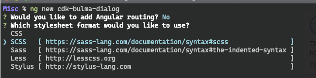
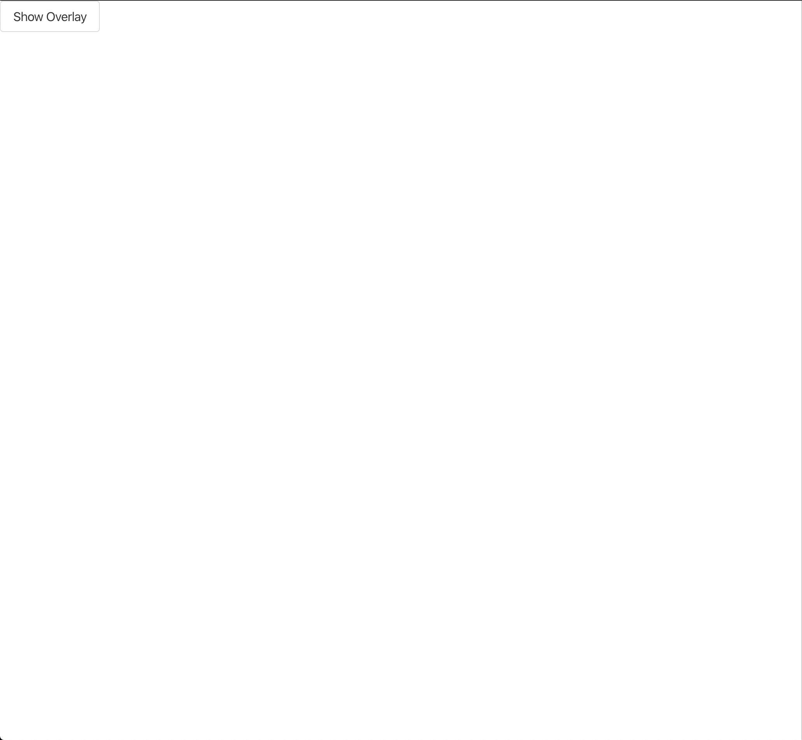
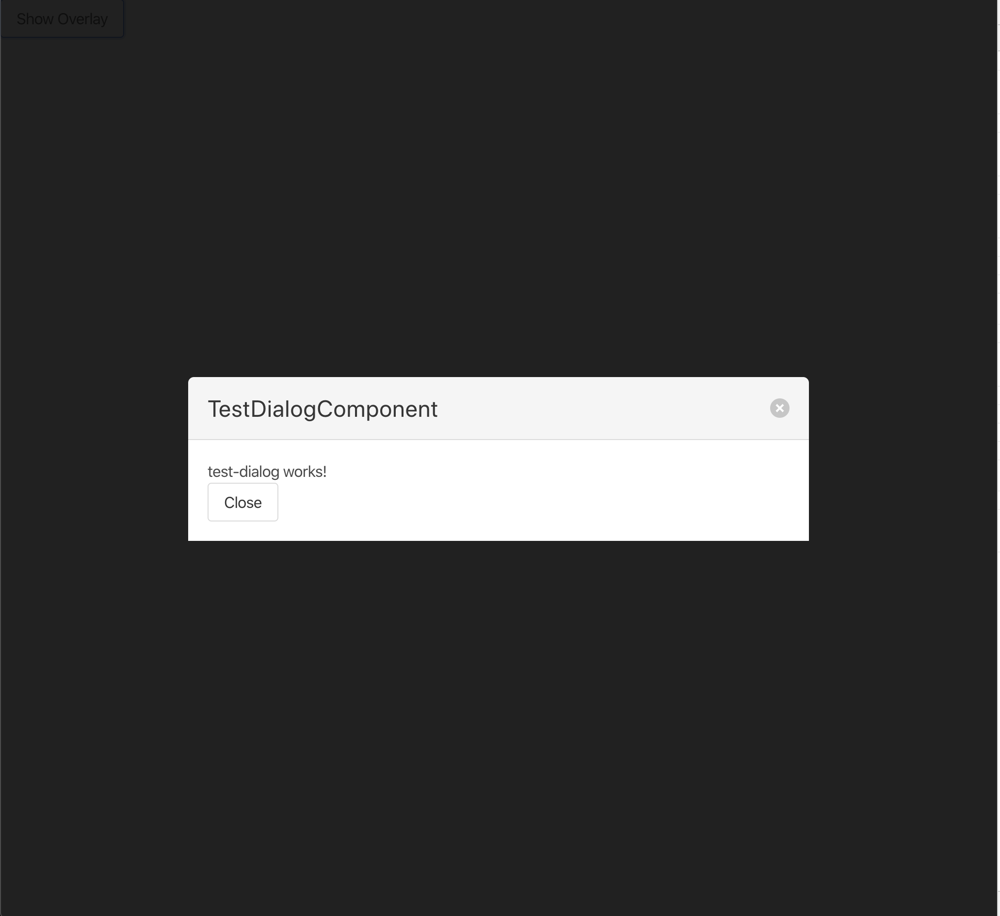
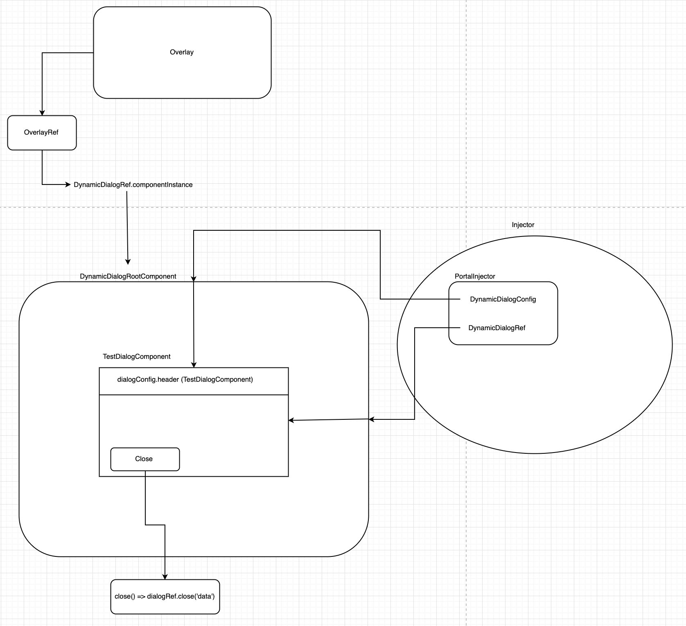

**Angular CDK** là tên viết ngắn gọn cho **Angular Component Dev Kit (CDK)**. Theo như tên gọi, CDK cung cấp cho các bạn một bộ các công cụ dùng để build những  **Angular Components** giàu tính năng và chất lừ mà không cần phải tuân theo tiêu chuẩn của **Material Design** của **Google**. Mục đích của CDK là cho phép developers có thể triển khai *những patterns và behaviors phổ biến* trong ứng dụng **Angular** của mình. Có khá nhiều những gói thư viện, patterns, và behaviors khác nhau mà các bạn có thể khám phá bằng việc nghiên cứu [documentation](https://material.angular.io/cdk/categories) của CDK.

Gần đây, mình đang làm một dự án **Angular** mà trong dự án này, bọn mình có dùng cùng một lúc các **Bộ UI Component** như `NgBootstrap` và `PrimeNG`, cũng như một số thư viện lẻ tẻ khác. Mặc dù là việc dùng các thư viện này giúp bọn mình làm xong việc (và nhanh nữa), nhưng việc dùng vô tội vạ đã đẩy dự án đến một vấn đề là có quá nhiều các bộ phận khác nhau mà cần phải maintain, hoặc update. Nói cách khác, **tech debts** đang bị dồn từng ngày và **sự không thống nhất** đang ám ảnh toàn bộ dự án. Một ví dụ điển hình nhât là **Dynamic Dialog** khi mà cần phải hiển thị một **Dialog** và có thể truyền vào một **Component** để hiển thị nội dung của **Dialog** này. Nghe phê phê he? Tại thời điểm mà bọn mình cần tính năng này, `PrimeNG` chưa có hỗ trợ **DynamicDialog** (bây giờ thì họ có hỗ trợ rồi, nghiên cứu thêm tại [PrimeNG DynamicDialog](https://www.primefaces.org/primeng/#/dynamicdialog)). Một dev trong team mình đã tìm đến `NgBootstrap` vì **NgbModal** (đọc thêm về [NgBootstrap NgbModal](https://ng-bootstrap.github.io/#/components/modal/examples)). Đó là lý do và cũng là lúc mà dự án có cả `NgBootstrap` lẫn `PrimeNG`. 

Nhưng phải có cách nào tốt hơn chứ đúng không? Phải có cái nào mà có thể dùng những cái sẵn có chứ! May mắn cho các bạn là **có**. **Angular CDK** có cung cấp một cách khá "dễ" để triển khai **DynamicDialog** của riêng bạn, có thể kết hợp với **BẤT CỨ** bộ giao diện mà các bạn đang hoặc muốn sử dụng. Từ đó, mình đã và đang tìm hiểu thêm về **Angular CDK**, đặc biệt là **Overlay** module, để khám phá một cách để xây dựng **DynamicDialog** mà không phải phụ thuộc vào bất cứ **Bộ UI Component** nào để trong các dự án tương lai, bọn mình không phải lặp lại sai lầm nữa. Bài blog này là chia sẻ của mình về những gì mình tìm hiểu được và thông qua bài này, chúng ta sẽ sử dụng **Angular CDK OverlayModule** cùng với **Bulma CSS** để xây dựng một **DynamicDialog** theo phong cách **Angular**. Bắt đầu thôi.

### Chuẩn bị

Chúng ta sẽ bắt đầu bằng việc tạo mới một ứng dụng **Angular** với **Angular CLI**

```shell script
ng new cdk-bulma-dialog
```

> Nếu như chưa cài đặt **Angular CLI**, các bạn cài bằng lệnh `npm i -g @angular/cli`


*Angular CLI khởi tạo một ứng dụng Angular mới*

Chúng ta sẽ **không** cần `routing` và sẽ chọn `SCSS` cho phần giao diện. Kế tiếp, chúng ta sẽ cài **Angular CDK**

```shell script
ng add @angular/cdk
```

Mở file `styles.scss` và thêm vào dòng code này:

```scss
@import '~@angular/cdk/overlay-prebuilt.css';
```

Mở file `app.module.ts` và thêm `BrowserAnimationsModule`:

```typescript
import { NgModule } from '@angular/core';
import { BrowserModule } from '@angular/platform-browser';
import { BrowserAnimationsModule } from '@angular/platform-browser/animations'; // <-- thêm import này 
import { AppComponent } from './app.component';

@NgModule({
  declarations: [AppComponent],
  imports: [BrowserModule, BrowserAnimationsModule], // <-- thêm BrowserAnimationsModule
  providers: [],
  bootstrap: [AppComponent]
})
export class AppModule {
}
```

Mở `index.html` và sửa lại như sau:

```html
<!doctype html>
<html lang="en">
<head>
  <meta charset="utf-8">
  <title>CdkBulmaDialog</title>
  <base href="/">
  <meta name="viewport" content="width=device-width, initial-scale=1">
  <link rel="icon" type="image/x-icon" href="favicon.ico">
    <!-- Thêm BulmaCSS CDN -->
  <link rel="stylesheet" href="https://cdn.jsdelivr.net/npm/bulma@0.8.0/css/bulma.min.css">
</head>
<body>
  <app-root></app-root>
</body>
</html>
```

Và bây giờ thì chúng ta đã sẵn sàng để tiếp tục vào phần chính của bài blog này.

### Nhiều Files khác nữa

Chúng ta sẽ bắt đầu phần này với việc khởi tạo một số files cần thiết bằng **Angular CLI** lẫn bằng tay 

- Dùng **Angular CLI**

Khởi tạo `DynamicDialogModule`

```shell script
ng generate module dynamic-dialog
```

Khởi tạo `DynamicDialogService`

```shell script
ng generate service dynamic-dialog/dynamic-dialog --skipTests
```

> Để bài viết này đơn giản, mình sẽ thêm `skipTests` vào tất cả các lệnh `ng generate`

Khởi tạo `DynamicDialogContentDirective`

```shell script
ng generate directive dynamic-dialog/dynamic-dialog-content --skipTests
```

Khởi tạo `DynamicDialogRootComponent`

```shell script
ng generate component dynamic-dialog/dynamic-dialog-root --flat --skipTests --inlineTemplate --inlineStyle
```

> Chúng ta sẽ dùng `inlineTemplate` và `inlineStyle` để có thể thấy được những gì xảy ra trong `DynamicDialogRootComponent` trong một file `*.component.ts` mà thôi.

- Tạo thư mục và files bằng tay

Chúng ta sẽ phải cần một số **Models** nên các bạn hãy tự tạo một thư mục mới tên là `models`. Thư mục này nên nằm dưới `dynamic-dialog` 1 bậc. 

```shell script
# mặc định là các bạn đang ở root của cdk-bulma-dialog
cd src/app/dynamic-dialog
mkdir models
cd models
```

Bây giờ thì hãy tạo 1 số files sau

```shell script
touch animation-state.enum.ts
touch dynamic-dialog-config.model.ts
```

và cũng viết nốt code cho các files này luôn. Mở file `animation-state.enum.ts`

```typescript
export enum AnimationState {
  Void = 'void',
  Enter = 'enter',
  Leave = 'leave'
}
```

sau đó là `dynamic-dialog-config.model.ts`

```typescript
import { OverlayConfig } from '@angular/cdk/overlay';

export class DynamicDialogConfig<TData = any> {
  header: string;
  closable: boolean;
  containerAnimationTiming: number;
  contentAnimationTiming: number;
  animationChildDelay: number;
  data?: TData;
  overlayConfig?: OverlayConfig;

  constructor() {
    this.header = '';
    this.closable = true;
    this.containerAnimationTiming = 0.3;
    this.contentAnimationTiming = 0.2;
    this.animationChildDelay = 0;
  }
}
```

Hãy điểm qua từng `config`:

1. `header`: Khá dễ hiểu. Chúng ta sẽ cấu hình `dialog` của mình để có một `title`. Mình sẽ cho phép người dùng **Dialog** tuỳ chỉnh biến `header` thông qua `DynamicDialogConfig`.
2. `closable`: Cho phép **Dialog** được đóng lại bằng cách: `click vào backdrop` và `click vào close icon`. Mặc định, chúng ta sẽ muốn có một `close icon` ở bên phải của `header`.
3. `containerAnimationTiming`: Thời gian để chạy animation của **Dialog Container**. Nhìn trên màn hình, thì **Dialog Container** sẽ là một khoảng có màu mờ, toàn màn hình và sẽ nằm bên dưới của **Dialog Content**.
4. `contentAnimationTiming`: Thời gian để chạy animation của **Dialog Content**.
5. `animationChildDelay`: Thời giản cách khoảng giữ animation của **Dialog Conatiner` và **Dialog Content**.
6. `data`: Dữ liệu thêm để truyền vào cho **Dialog** khi mở **Dialog**. Phần lớn thì `data` sẽ chứa một số thông tin như `productId` chẳng hạn, để khi mở **Dialog**, mình có thể dùng `productId` để fetch dữ liệu `Product`.  
7. `overlayConfig`: `OverlayConfig` của `Overlay` từ **Angular CDK**. **Dialog** mà chúng ta đang dựng sẽ cấu hình một số giá trị mặc định cho `OverlayConfig` nhưng chúng ta cũng sẽ cung cấp người dùng **Dialog** khả năng cấu hình `OverlayConfig` này thông qua biến `overlayConfig`. `overlayConfig` truyền vào sẽ được gộp (**merge**) với config đã được cấu hình sẵn.

Kế đến, file cuối cùng mà chúng ta cần là `DynamicDialogRef`. Mình sẽ giải thích tầm quan trọng của `ref` khi chúng ta bắt đầu viết code cho nó. Bây giờ thì cứ tạo file đó đi đã.

```shell script
# mặc định là các bạn đang ở bên trong src/app/dynamic-dialog/models
cd ..
touch dynamic-dialog-ref.ts
```

### Bắt đầu chiến thôi

Đầu tiên, chúng ta sẽ xử lý thằng `DynamicDialogContentDirective` trước vì nó rất ngắn và dễ hiểu. Mở file `dynamic-dialog-content.directive.ts` lên thôi

```typescript
import { Directive, ViewContainerRef } from '@angular/core';

@Directive({
  selector: '[appDynamicDialogContent]'
})
export class DynamicDialogContentDirective {

  constructor(public readonly viewContainerRef: ViewContainerRef) { } // <-- inject ViewContainerRef

}
```

Thằng `directive` này sẽ giữ vai trò như một **cột mốc để thêm vào**. Đây là nơi mà chúng ta muốn hiển thị động `nội dung` (bằng một `Component`) của **Dialog**. Vì vậy, chúng ta cần inject `ViewContainerRef` vào thằng `directive` này để khi nó được mount, nó sẽ có quyền truy xuất đến cái element gốc mà `directive` này được sử dụng trên element gốc đó dưới dạng là `ViewContainerRef`. (Đọc thêm về [Angular Directive](https://angular.io/api/core/Directive)). Đừng lo lắng nếu nghe như sét đánh ngang tai, chúng ta sẽ gỡ các nút thắt sớm thôi. 

và đó là tất cả code mà chúng ta cần cho `DynamicDialogContentDirective`. Giờ thì mở file `dynamic-dialog-ref.ts` và thêm 1 đoạn code nhỏ này

```typescript
export class DynamicDialogRef<TReturnType = any> {

}
```

Hiện tại thì chỉ cần nhiêu đó thôi. Giờ hãy mở file `dynamic-dialog-root.component.ts`

```typescript
import { AfterViewInit, ChangeDetectionStrategy, Component, OnDestroy } from '@angular/core';

@Component({
  selector: 'app-dynamic-dialog-root',
  template: `
    <p>
      dynamic-dialog-root works!
    </p>
  `,
  changeDetection: ChangeDetectionStrategy.OnPush // <-- dùng OnPush strategy.
})
export class DynamicDialogRootComponent implements AfterViewInit, OnDestroy { // <-- implements AfterViewInit and OnDestroy

  constructor() {
  }

  ngAfterViewInit(): void { // <-- ngAfterViewInit
  }

  ngOnDestroy(): void { // <-- ngOnDestroy
  }
}
```

Chúng ta sẽ cần một số fields sau:

1. `animationState` và `animationStateChanged`: Dùng để theo dõi các bước animations của `container` và `content` của **Dialog**. Chúng ta sẽ dựa vào `animationState` và `AnimationEvent` từ gói `@angular/animations` để xác định được thời điểm mà **Dialog** bị đóng lại.
2. `contentComponentType`: `Component` được truyền vào và được dùng để hiển thị phần `content` của **Dialog**.
3. `componentRef`: Biến này chỉ dùng để giữ con trỏ hiện tại đến **Dialog Content Component**, được dùng để "dọn dẹp", tiêu huỷ đi khi hook `ngOnDestroy` chạy. 

Quẩy code cho mấy fields này thôi

```typescript
import { AnimationEvent } from '@angular/animations';
import { 
    AfterViewInit, 
    ChangeDetectionStrategy, 
    Component, 
    OnDestroy, 
    EventEmitter,
    Type,
    ComponentRef
} from '@angular/core';
import { AnimationState } from './models/animation-state.enum'; // <-- import AnimationState

@Component({
  selector: 'app-dynamic-dialog-root',
  template: `
    <p>
      dynamic-dialog-root works!
    </p>
  `,
  changeDetection: ChangeDetectionStrategy.OnPush
})
export class DynamicDialogRootComponent implements AfterViewInit, OnDestroy {
    animationState: AnimationState = AnimationState.Enter;
    // Bảo đảm là các bạn import AnimationEvent từ @angular/animations
    animationStateChanged: EventEmitter<AnimationEvent> = new EventEmitter<AnimationEvent>();
    contentComponentType: Type<any>;
    
    private componentRef: ComponentRef<any>;

  constructor() {
  }

  ngAfterViewInit(): void {
  }

  ngOnDestroy(): void {
  }
}
```

Ngoài những fields trên, chúng ta cũng sẽ cần một số thứ được injected vào cho `DynamicDialogRootComponent` này thông qua **Dependency Injection (DI)**

1. `DynamicDialogConfig`: Hàng `configuration` hand-made của mình
2. `DynamicDialogRef`: Hàng `dialogRef` hand-made của mình
3. `ComponentFactoryResolver`: Một chút kiến thức chung. Khi các bạn khởi tạo và sử dụng một `Component` thông thường bên trong **Angular** (nghĩa là dùng `selector` của `Component` trên `template`. Ví dụ: `<app-todo-item></app-todo-item>`), **Angular** sẽ lấy thông tin metadata từ decorator `@Component()` và sẽ tạo một `factory` cho `Component` đó. `Factory` sau đó sẽ được **Angular Compiler** dùng để biết được thông tin về `Component`, từ đó sẽ hiển thị cũng như cung cấp những thứ cần thiết cho `Component` đó sử dụng. **Dialog** của mình sẽ được hiển thị động trên màn hình vào bất cứ thời điểm nào. Vì thế, chúng ta sẽ cần phải dùng đến `ComponentFactoryResolver` để có thể tạo được `factory` cho **Dialog** bằng tay.
4. `ChangeDetectorRef`: Ý tưởng ở đây là chúng ta sẽ bắt đầu việc khởi tạo **Dialog Content Component** trong hook `ngAfterViewInit` sau khi **DOM** ban đầu đã được load xong. Bên cạnh đó, chúng ta cũng sử dụng `OnPush` vì thế sau khi khởi tạo **Dialog Content Component**, chúng ta sẽ muốn gọi `changeDetectorRef.markForCheck()` để thông báo cho **Cơ chế Change Detection của Angular** biến được có sự thay đổi trong `DynamicDialogRootComponent` và việc thông báo này chỉ xảy ra một lần duy nhất thôi. Các thay đổi khác trong tương lai sẽ xảy ra bên trong **Dialog Content Component**.

Một lần nữa, quẩy code thôi

```typescript
import { AnimationEvent } from '@angular/animations';
import { 
    AfterViewInit, 
    ChangeDetectionStrategy, 
    Component, 
    OnDestroy, 
    EventEmitter,
    Type,
    ComponentRef,
    ComponentFactoryResolver,
    ChangeDetectorRef
} from '@angular/core';
import { AnimationState } from './models/animation-state.enum';
import { DynamicDialogConfig } from './models/dynamic-dialog-config.model';
import { DynamicDialogRef } from './dynamic-dialog-ref';

@Component({
  selector: 'app-dynamic-dialog-root',
  template: `
    <p>
      dynamic-dialog-root works!
    </p>
  `,
  changeDetection: ChangeDetectionStrategy.OnPush
})
export class DynamicDialogRootComponent implements AfterViewInit, OnDestroy {
    animationState: AnimationState = AnimationState.Enter;
    animationStateChanged: EventEmitter<AnimationEvent> = new EventEmitter<AnimationEvent>();
    contentComponentType: Type<any>;
    
    private componentRef: ComponentRef<any>;

  constructor(
        public readonly dialogConfig: DynamicDialogConfig,
        private readonly dialogRef: DynamicDialogRef,
        private readonly cfr: ComponentFactoryResolver,
        private readonly cdr: ChangeDetectorRef
    ) {
  }

  ngAfterViewInit(): void {
  }

  ngOnDestroy(): void {
  }
}
```

Quẩy `template` nào

```typescript
import { AnimationEvent } from '@angular/animations';
import { 
    AfterViewInit, 
    ChangeDetectionStrategy, 
    Component, 
    OnDestroy, 
    EventEmitter,
    Type,
    ComponentRef,
    ComponentFactoryResolver,
    ChangeDetectorRef,
    ViewChild
} from '@angular/core';
import { AnimationState } from './models/animation-state.enum';
import { DynamicDialogConfig } from './models/dynamic-dialog-config.model';
import { DynamicDialogRef } from './dynamic-dialog-ref';
import { DynamicDialogContentDirective } from './dynamic-dialog-content.directive';

@Component({
  selector: 'app-dynamic-dialog-root',
  template: `
    <div
      class="modal is-active"
      style="padding-left: 1rem; padding-right: 1rem"
    >
      <div class="modal-background"></div>
      <div class="modal-card">
        <header class="modal-card-head">
          <p class="modal-card-title">{{ dialogConfig.header }}</p>
          <button
            class="delete"
            aria-label="close"
            *ngIf="dialogConfig.closable"
          ></button>
        </header>
        <section class="modal-card-body">
          <ng-template appDynamicDialogContent></ng-template>
        </section>
      </div>
    </div>
  `,
  changeDetection: ChangeDetectionStrategy.OnPush
})
export class DynamicDialogRootComponent implements AfterViewInit, OnDestroy {
    // Giữ lấy con trỏ tới Directive để dùng trong TypeScript
    @ViewChild(DynamicDialogContentDirective, { static: false }) contentInsertionPoint: DynamicDialogContentDirective;

    animationState: AnimationState = AnimationState.Enter;
    animationStateChanged: EventEmitter<AnimationEvent> = new EventEmitter<AnimationEvent>();
    contentComponentType: Type<any>;
    
    private componentRef: ComponentRef<any>;

    constructor(
        public readonly dialogConfig: DynamicDialogConfig,
        private readonly dialogRef: DynamicDialogRef,
        private readonly cfr: ComponentFactoryResolver,
        private readonly cdr: ChangeDetectorRef
    ) {
    }

    ngAfterViewInit(): void {
    }

    ngOnDestroy(): void {
    }
}
```

Mình lấy `HTML` trực tiếp từ [Bulma Modal](https://bulma.io/documentation/components/modal/) luôn và chỉ thay đổi `Modal Title` sang `dialogConfig.header`. Mình cũng bỏ tất cả những thứ râu ria ở giữa `<section class="modal-card-body"></section>` với `<ng-template></ng-template>` và quăng thằng `DynamicDialogContentDirective` lên `ng-tempalte`. Nếu bạn nào đã biết các **Dynamic Component** hoạt động trong **Angular**, bạn có thể thấy được cái gì đang xảy ra ở đây rồi. Chúng ta dùng `ng-template`, bind `DynamicDialogContentDirective` lên `ng-template`, và nếu nhớ lại, thì chúng ta cũng inject `ViewContainerRef` trong `DynamicDialogContentDirective`. Tất cả mấy thứ này sẽ giúp chúng ta lấy được con trỏ tới `ng-template` dưới dạng `ViewContainerRef` và chuyển `ng-template` này thành **cột mốc** để có thể hiển thị động **Dialog Content Component**.

Bây giờ thì triển code cho `ngAfterViewInit()` và `ngOnDestroy()` thôi

```typescript
import { AnimationEvent } from '@angular/animations';
import { 
    AfterViewInit, 
    ChangeDetectionStrategy, 
    Component, 
    OnDestroy, 
    EventEmitter,
    Type,
    ComponentRef,
    ComponentFactoryResolver,
    ChangeDetectorRef,
    ViewChild
} from '@angular/core';
import { AnimationState } from './models/animation-state.enum';
import { DynamicDialogConfig } from './models/dynamic-dialog-config.model';
import { DynamicDialogRef } from './dynamic-dialog-ref';
import { DynamicDialogContentDirective } from './dynamic-dialog-content.directive';

@Component({
  selector: 'app-dynamic-dialog-root',
  template: `
    <div
      class="modal is-active"
      style="padding-left: 1rem; padding-right: 1rem"
    >
      <div class="modal-background"></div>
      <div class="modal-card">
        <header class="modal-card-head">
          <p class="modal-card-title">{{ dialogConfig.header }}</p>
          <button
            class="delete"
            aria-label="close"
            *ngIf="dialogConfig.closable"
          ></button>
        </header>
        <section class="modal-card-body">
          <ng-template appDynamicDialogContent></ng-template>
        </section>
      </div>
    </div>
  `,
  changeDetection: ChangeDetectionStrategy.OnPush
})
export class DynamicDialogRootComponent implements AfterViewInit, OnDestroy {
    @ViewChild(DynamicDialogContentDirective, { static: false }) contentInsertionPoint: DynamicDialogContentDirective;

    animationState: AnimationState = AnimationState.Enter;
    animationStateChanged: EventEmitter<AnimationEvent> = new EventEmitter<AnimationEvent>();
    contentComponentType: Type<any>;
    
    private componentRef: ComponentRef<any>;

    constructor(
        public readonly dialogConfig: DynamicDialogConfig,
        private readonly dialogRef: DynamicDialogRef,
        private readonly cfr: ComponentFactoryResolver,
        private readonly cdr: ChangeDetectorRef
    ) {
    }

    ngAfterViewInit(): void {
        this.loadContentComponent();
        this.cdr.markForCheck();
    }

    ngOnDestroy(): void {
        if (this.componentRef) {
          this.componentRef.destroy();
        }
    }

    private loadContentComponent(): void {
        const factory = this.cfr.resolveComponentFactory(this.contentComponentType);
        const vcr = this.contentInsertionPoint.viewContainerRef;
        vcr.clear();
        this.componentRef = vcr.createComponent(factory);
    }
}
```

Như đã nhắc ở trên, trong `ngAfterViewInit()`, chúng ta sẽ khởi tạo **Dialog Content Component** bằng việc gọi hàm `loadContentComponent()`, dùng `ComponentFactoryResolver` và sẽ thông báo cho **Change Detection** để có thể update **DialogRootComponent** sau khi khởi tạo xong. Trong hàm `loadContentComponent()`, chúng ta cũng sẽ lấy `viewContainerRef` từ thằng `DynamicDialogContentDirective`. Nếu để ý, các bạn sẽ thấy là mình chưa bao giờ gán giá trị cho `contentComponentType` ở đâu trong `DynamicDialogRootComponent` hết, và các bạn hoàn toàn đúng. Chúng ta sẽ gán giá trị cho `contentComponentType` vào một thời điểm "sớm" hơn, và ở một vị trí khác. Trong `ngOnDestroy()`, chúng ta chỉ triển khai một số công việc dọn dẹp với `componentRef` thôi. Khá là dễ hiểu 😊. Trước khi chuyển sang file khác, hãy triển thêm 1 hàm cho `DynamicDialogRootComponent` nữa.

```typescript
import { AnimationEvent } from '@angular/animations';
import { 
    AfterViewInit, 
    ChangeDetectionStrategy, 
    Component, 
    OnDestroy, 
    EventEmitter,
    Type,
    ComponentRef,
    ComponentFactoryResolver,
    ChangeDetectorRef,
    ViewChild
} from '@angular/core';
import { AnimationState } from './models/animation-state.enum';
import { DynamicDialogConfig } from './models/dynamic-dialog-config.model';
import { DynamicDialogRef } from './dynamic-dialog-ref';
import { DynamicDialogContentDirective } from './dynamic-dialog-content.directive';

@Component({
  selector: 'app-dynamic-dialog-root',
  template: `
    <div
      class="modal is-active"
      style="padding-left: 1rem; padding-right: 1rem"
    >
      <div class="modal-background"></div>
      <div class="modal-card">
        <header class="modal-card-head">
          <p class="modal-card-title">{{ dialogConfig.header }}</p>
          <button
            class="delete"
            aria-label="close"
            *ngIf="dialogConfig.closable"
          ></button>
        </header>
        <section class="modal-card-body">
          <ng-template appDynamicDialogContent></ng-template>
        </section>
      </div>
    </div>
  `,
  changeDetection: ChangeDetectionStrategy.OnPush
})
export class DynamicDialogRootComponent implements AfterViewInit, OnDestroy {
    @ViewChild(DynamicDialogContentDirective, { static: false }) contentInsertionPoint: DynamicDialogContentDirective;

    animationState: AnimationState = AnimationState.Enter;
    animationStateChanged: EventEmitter<AnimationEvent> = new EventEmitter<AnimationEvent>();
    contentComponentType: Type<any>;
    
    private componentRef: ComponentRef<any>;

    constructor(
        public readonly dialogConfig: DynamicDialogConfig,
        private readonly dialogRef: DynamicDialogRef,
        private readonly cfr: ComponentFactoryResolver,
        private readonly cdr: ChangeDetectorRef
    ) {
    }

    ngAfterViewInit(): void {
        this.loadContentComponent();
        this.cdr.markForCheck();
    }

    ngOnDestroy(): void {
        if (this.componentRef) {
          this.componentRef.destroy();
        }
    }

    // Thêm hàm này
    startExitAnimation(): void {
        this.animationState = AnimationState.Leave;
    }

    private loadContentComponent(): void {
        const factory = this.cfr.resolveComponentFactory(this.contentComponentType);
        const vcr = this.contentInsertionPoint.viewContainerRef;
        vcr.clear();
        this.componentRef = vcr.createComponent(factory);
    }
}
```

Các bạn có nhớ mình nói là chúng ta sẽ dùng đến `animationState` để quyết định việc đóng **Dialog** không? Hàm `startExitAnimation()` sẽ giúp chúng ta bắt đầu được quy trình đóng **Dialog** này. Phù, vẫn có một số việc cần phải làm trong `DynamicDialogRootComponent` nữa, nhưng chúng ta sẽ phải quay lại file này sau. Điểm đến kế tiếp sẽ là `DynamicDialogRef`, con hàng quan trọng không kém 💪

### DynamicDialogRef

`DynamicDialogRef` là một con trỏ đến instance hiện tại của `Overlay` đang được mở (và được quản lý bởi **Angular CDK**). Chúng ta sẽ cần một số fields và hàm trong `DynamicDialogRef` sau:

1. `beforeClosed$`: Đây là một `Subject` và `Subject` này sẽ emit khi **Dialog** **chuẩn bị** được đóng. Chúng ta sẽ giữ cho `Subject` này `private` và sẽ chỉ cung cấp cho người dùng phần `Observable` thông qua một `getter` mà thôi.
2. `afterClosed$`: Tương tự như `beforeClosed$`. Khi **Dialog** đã được đóng lại, thì chúng ta sẽ truyền kèm theo một số `data` (nếu có) mà người dùng muốn truyền.
3. `componentInstance`: Instane của `DynamicDialogRootComponent` đang được sử dụng bởi `Overlay` để hiển thị **Dialog**. Chúng ta sẽ cần tới `DynamicDialogRootComponent` và hàm `animationStateChanged` của hắn để có thể xác định được đúng thời điểm mà `beforeClosed$` và `afterClosed$` cần emit.
4. `close(data?: TReturnType)`: `DynamicDialogRef` sẽ được đưa vào **Dependency Injection** bằng **Injector** để người dùng có thể inject `DynamicDialogRef` vào **Dialog Content Component** mà họ tạo và sẽ gọi được hàm `dialogRef.close()` này. Ví dụ: khi người dùng đóng một **Dialog Xác Nhận**, chúng ta sẽ muốn biết được là người dùng chọn **Xác Nhận** hay **Huỷ bỏ** khi **Dialog** được đóng, vì thế tuỳ thuộc vào lựa chọn của người dùng mà chúng ta có thể truyền `data` vào cho hàm `close()` để nơi mở **Dialog** (**Dialog Invoker**) có thể nhận được `data` này và thực thi thao tác tiếp theo sau khi người dùng **Xác Nhận**.

Ngoài 4 thứ trên, chúng ta cũng sẽ cần inject `OverlayRef` từ **Angular CDK** để có thể thực hiện một số tác vụ dọn dẹp trên thằng `Overlay`. Giờ thì quẩy code thôi.

```typescript
import { OverlayRef } from '@angular/cdk/overlay';
import { Observable, Subject } from 'rxjs';
import { filter, take } from 'rxjs/operators';
import { DynamicDialogRootComponent } from './dynamic-dialog-root.component';
import { AnimationState } from './models/animation-state.enum';

// Hằng số local.
const AnimationPhase = {
  START: 'start',
  DONE: 'done'
};

export class DynamicDialogRef<TReturnType = any> {
  private beforeClosed$: Subject<void> = new Subject<void>();
  private afterClosed$: Subject<TReturnType> = new Subject<TReturnType>();

  componentInstance: DynamicDialogRootComponent;

  constructor(private readonly overlayRef: OverlayRef) {
        overlayRef.backdropClick().pipe(take(1)).subscribe(this.close.bind(this));
  }

  get beforeClosed(): Observable<void> {
    return this.beforeClosed$.asObservable();
  }

  get afterClosed(): Observable<TReturnType> {
    return this.afterClosed$.asObservable();
  }

  close(data?: TReturnType): void {
    this.componentInstance.animationStateChanged.pipe(
      filter(event => event.phaseName === AnimationPhase.START),
      take(1)
    ).subscribe(() => {
      this.beforeClosed$.next();
      this.beforeClosed$.complete();
      this.overlayRef.detachBackdrop();
    });

    this.componentInstance.animationStateChanged.pipe(
      filter(event => event.phaseName === AnimationPhase.DONE && event.toState === AnimationState.Leave),
      take(1)
    ).subscribe(() => {
      this.overlayRef.dispose();
      this.afterClosed$.next(data);
      this.afterClosed$.complete();
      this.componentInstance = null;
    });

    this.componentInstance.startExitAnimation();
  }
}
```

Quá trời thứ xảy ra ở đây. Hãy đi qua từng cái một nhé.

1. `AnimationPhase` chỉ là một hằng số local thôi. Thay vì dùng magic-string `'start'` với `'done'` thì mình dùng `AnimationPhase`. Nếu muốn, bạn có thể đem `AnimationPhase` ra một file riêng cũng được.
2. Trong `constructor`, chúng ta sẽ lắng nghe thằng `backdropClick()` trên `overlayRef` và sẽ gọi hàm `close()` khi `backdrop` được `click`.
3. Khai báo tất cả các fields được nhắc đến ở trên: `beforeClosed$`, `afterClosed$`, mấy cái `getters`, `componentInstance`, `OverlayRef` được inject, và hàm `close()`
4. Hàm `close()`: con hàng quan trọng của `DynamicDialogRef`. Trong đây, chúng ta xác lập 2 `Subscriptions` đến `animationStateChanged`: Một cái là sẽ lắng nghe `AnimationPhase.START` và cái còn lại là lắng nghe `AnimationPhase.DONE`. Khi chúng ta bắt đầu gọi hàm `closse()`,
 thì thực tế các animations của **Dialog** sẽ bắt đầu chạy trước và `@angular/animations` cho phép chúng ta lắng nghe những `AnimationEvent` này. Trong quá trình `AnimationPhase.START` (animations bắt đầu) chạy, chúng ta `filter` các sự kiện `Animation` này theo `phaseName` và chúng ta cũng chỉ cần nhận giá trị của **MỘT** sự kiện duy nhât mà thôi nên chúng ta dùng `take(1)`. Ở thời điểm này, `beforeClosed$` sẽ emit và cũng sẽ tự hoàn thành để tự dọn dẹp luôn. Cuối cùng ở chuỗi sự kiến `AnimationPhase.START`, chúng ta sẽ gọi hàm `overlayRef.detachBackdrop()` để dọn dẹp thằng `backdrop`. `Subscription` còn lại thì chúng ta cũng dùng các bước tương tự, `filter` bằng `phaseName`, `take(1)` và cho `afterClosed$` emit. Khác biệt ở đây là chúng ta sẽ gọi `overlayRef.dispose()` để dọn dẹp thằng `Overlay` trước, sau đó sẽ cho `afterClosed$` emit `data` mà người dùng cần rồi hoàn tất. Ở cuối chuỗi sự kiện, chúng ta sẽ dọn dẹp luôn thằng `componentInstance` bằng cách gán `null` cho nó, vì chúng ta không cần nó nữa.
 
 > Các bạn lưu ý ở đây là **RxJS** là asynchronous (bất đồng bộ). Chúng ta chỉ mới thiết lập 2 `Subscriptions` mà thôi, code ở trong 2 `Subscriptions` này sẽ không được thực thi ngay lập tức khi hàm `close()` được gọi. Đây chỉ gọi là "khâu chuẩn bị" mà thôi.

Sau khi chuẩn bị xong các `Subscriptions`, thì chúng ta gọi `componentInstance.startExitAnimation()` để bắt đầu chuỗi sự kiện đóng **Dialog**. `DynamicDialogRef` đã hoàn tất. Bây giờ chúng ta sẽ quay lại `DynamicDialogRootComponent` để hoàn tất nó luôn.

### Hoàn tất DynamicDialogRootComponent

Đầu tiên thì hãy thiết lập một số hàm mà sẽ gọi `dynamicDialogRef.close()` mặc định.

```typescript
import { AnimationEvent } from '@angular/animations';
import { 
    AfterViewInit, 
    ChangeDetectionStrategy, 
    Component, 
    OnDestroy, 
    EventEmitter,
    Type,
    ComponentRef,
    ComponentFactoryResolver,
    ChangeDetectorRef,
    ViewChild,
    HostListener
} from '@angular/core';
import { AnimationState } from './models/animation-state.enum'; // <-- import AnimationState
import { DynamicDialogConfig } from './models/dynamic-dialog-config.model';
import { DynamicDialogRef } from './dynamic-dialog-ref';
import { DynamicDialogContentDirective } from './dynamic-dialog-content.directive';

@Component({
  selector: 'app-dynamic-dialog-root',
  template: `
    <div
      class="modal is-active"
      style="padding-left: 1rem; padding-right: 1rem"
    >
      <div class="modal-background"></div>
      <div class="modal-card">
        <header class="modal-card-head">
          <p class="modal-card-title">{{ dialogConfig.header }}</p>
          <button
            class="delete"
            aria-label="close"
            *ngIf="dialogConfig.closable"
          ></button>
        </header>
        <section class="modal-card-body">
          <ng-template appDynamicDialogContent></ng-template>
        </section>
      </div>
    </div>
  `,
  changeDetection: ChangeDetectionStrategy.OnPush
})
export class DynamicDialogRootComponent implements AfterViewInit, OnDestroy {
    @ViewChild(DynamicDialogContentDirective, { static: false }) contentInsertionPoint: DynamicDialogContentDirective;

    animationState: AnimationState = AnimationState.Enter;
    animationStateChanged: EventEmitter<AnimationEvent> = new EventEmitter<AnimationEvent>();
    contentComponentType: Type<any>;
    
    private componentRef: ComponentRef<any>;

    constructor(
        public readonly dialogConfig: DynamicDialogConfig,
        private readonly dialogRef: DynamicDialogRef,
        private readonly cfr: ComponentFactoryResolver,
        private readonly cdr: ChangeDetectorRef
    ) {
    }

    ngAfterViewInit(): void {
        this.loadContentComponent();
        this.cdr.markForCheck();
    }

    ngOnDestroy(): void {
        if (this.componentRef) {
          this.componentRef.destroy();
        }
    }

    startExitAnimation(): void {
        this.animationState = AnimationState.Leave;
    }

    private loadContentComponent(): void {
        const factory = this.cfr.resolveComponentFactory(this.contentComponentType);
        const vcr = this.contentInsertionPoint.viewContainerRef;
        vcr.clear();
        this.componentRef = vcr.createComponent(factory);
    }

    closeDialog() {
        this.dialogRef.close();
    }

    @HostListener("document:keydown", ["$event.key"])
    private handleEscapeKey(key: string) {
        if (key === 'Escape') {
          this.closeDialog();
        }
    }
}
```

Chúng ta thêm vào 2 hàm mới 

1. `closeDialog()`: Xử lý việc đóng **Dialog** khi `backdrop` hoặc `close icon` được click.
2. `handleEscapeKey()`: Xử lý đóng **Dialog** khi phím Escape được bấm bằng việc dùng `HostListener` lắng nghe sự kiện `document:keydown`.

Giờ thì chúng ta sẽ thêm `animations` vào cho `DynamicDialogRootComponent`

> Mình sẽ dùng một gói npm tên là `ng-animate` để hỗ trợ khả năng animations dở ẹc của mình. Nếu các bạn muốn thì hãy cài `ng-animate` bằng lệnh `npm i ng-animate`

```typescript
import { animateChild, AnimationEvent, group, query, transition, trigger, useAnimation } from '@angular/animations';
import { 
    AfterViewInit, 
    ChangeDetectionStrategy, 
    Component, 
    OnDestroy, 
    EventEmitter,
    Type,
    ComponentRef,
    ComponentFactoryResolver,
    ChangeDetectorRef,
    ViewChild,
    HostListener
} from '@angular/core';
import { fadeIn, fadeOut, zoomIn, zoomOut } from 'ng-animate';
import { AnimationState } from './models/animation-state.enum';
import { DynamicDialogConfig } from './models/dynamic-dialog-config.model';
import { DynamicDialogRef } from './dynamic-dialog-ref';
import { DynamicDialogContentDirective } from './dynamic-dialog-content.directive';

@Component({
  selector: 'app-dynamic-dialog-root',
  template: `
    <div
      class="modal is-active"
      style="padding-left: 1rem; padding-right: 1rem"
    >
      <div class="modal-background"></div>
      <div class="modal-card">
        <header class="modal-card-head">
          <p class="modal-card-title">{{ dialogConfig.header }}</p>
          <button
            class="delete"
            aria-label="close"
            *ngIf="dialogConfig.closable"
          ></button>
        </header>
        <section class="modal-card-body">
          <ng-template appDynamicDialogContent></ng-template>
        </section>
      </div>
    </div>
  `,
  changeDetection: ChangeDetectionStrategy.OnPush,
  animations: [
    trigger('zoom', [
      transition(
        '* => in',
        useAnimation(zoomIn, { params: { timing: '{{timing}}' } })
      ),
      transition(
        '* => out',
        useAnimation(zoomOut, { params: { timing: '{{timing}}' } })
      )
    ]),
    trigger('animation', [
      transition(
        `* => ${ AnimationState.Enter }`,
        group([
          useAnimation(fadeIn, { params: { timing: '{{timing}}' } }),
          query('@zoom', [animateChild({ delay: '{{delayChild}}' })], { optional: true })
        ])
      ),
      transition(
        `* => ${ AnimationState.Leave }`,
        group([
          useAnimation(fadeOut, { params: { timing: '{{timing}}' } }),
          query('@zoom', [animateChild({ delay: '{{delayChild}}' })], { optional: true })
        ])
      )
    ])
  ]
})
export class DynamicDialogRootComponent implements AfterViewInit, OnDestroy {
    @ViewChild(DynamicDialogContentDirective, { static: false }) contentInsertionPoint: DynamicDialogContentDirective;

    animationState: AnimationState = AnimationState.Enter;
    animationStateChanged: EventEmitter<AnimationEvent> = new EventEmitter<AnimationEvent>();
    contentComponentType: Type<any>;
    
    private componentRef: ComponentRef<any>;

    constructor(
        public readonly dialogConfig: DynamicDialogConfig,
        private readonly dialogRef: DynamicDialogRef,
        private readonly cfr: ComponentFactoryResolver,
        private readonly cdr: ChangeDetectorRef
    ) {
    }

    ngAfterViewInit(): void {
        this.loadContentComponent();
        this.cdr.markForCheck();
    }

    ngOnDestroy(): void {
        if (this.componentRef) {
          this.componentRef.destroy();
        }
    }

    startExitAnimation(): void {
        this.animationState = AnimationState.Leave;
    }

    private loadContentComponent(): void {
        const factory = this.cfr.resolveComponentFactory(this.contentComponentType);
        const vcr = this.contentInsertionPoint.viewContainerRef;
        vcr.clear();
        this.componentRef = vcr.createComponent(factory);
    }

    closeDialog() {
        this.dialogRef.close();
    }

    @HostListener("document:keydown", ["$event.key"])
    private handleEscapeKey(key: string) {
        if (key === 'Escape') {
          this.closeDialog();
        }
    }
}
```

Ok, giờ giải thích mới dã man đây. Trước tiên thì mình xin gợi ý các bạn đọc thêm về [Angular Animations](https://angular.io/guide/animations) để không hoang mang, vì mình giải thích animations không được tốt. Về căn bản, chúng ta thiết lập 2 animations: `animation` và `zoom`. `zoom` sẽ chịu trách nhiệm animating thằng **Dialog Content** trong khi `animation` sẽ chịu trách nhiệm cho thằng **Dialog Container**. Ở trong `animation`, chúng ta thiết lập `fadeIn` và `fadeOut` được dựng sẵn (từ `ng-animate`, nếu các bạn tự viết **Animations** thoải mái, thì cứ việc tự viết nhé) dựa vào `state`, chúng ta cũng sẽ dùng đến `Animation Params` (ví dụ: `{{timing}}`) để có thể truyền các tham số liên quan đến `Animation` vào trong các animations này. Các bạn có nhớ `containerAnimationTiming` với `contentAnimationTiming` không? Được dùng ở đây nè. Cuối cùng, chúng ta cũng thiết lập `query` cho `zoom` bên trong `animation` để chúng ta có thể chạy được `animationChild` với `delay`. Ví dụ muốn chạy animation cho `container` xong, đợi một chút rồi mới chạy animation của `content`?! Một lần nữa, mình tha thiết mong các bạn đọc qua **Angular Animations**.

Giờ thì hoàn tất thằng `template` để kết nối các hàm và animations vừa thiết lập xong 

```typescript
import { animateChild, AnimationEvent, group, query, transition, trigger, useAnimation } from '@angular/animations';
import { 
    AfterViewInit, 
    ChangeDetectionStrategy, 
    Component, 
    OnDestroy, 
    EventEmitter,
    Type,
    ComponentRef,
    ComponentFactoryResolver,
    ChangeDetectorRef,
    ViewChild,
    HostListener
} from '@angular/core';
import { fadeIn, fadeOut, zoomIn, zoomOut } from 'ng-animate';
import { AnimationState } from './models/animation-state.enum';
import { DynamicDialogConfig } from './models/dynamic-dialog-config.model';
import { DynamicDialogRef } from './dynamic-dialog-ref';
import { DynamicDialogContentDirective } from './dynamic-dialog-content.directive';

@Component({
  selector: 'app-dynamic-dialog-root',
  template: `
    <div
      class="modal is-active"
      style="padding-left: 1rem; padding-right: 1rem"
      [@animation]="{
        value: animationState,
        params: {
          timing: dialogConfig.containerAnimationTiming,
          delayChild: dialogConfig.animationChildDelay
        }
      }"
      (@animation.start)="animationStateChanged.emit($event)"
      (@animation.done)="animationStateChanged.emit($event)"
    >
      <div class="modal-background" (click)="closeDialog()"></div>
      <div
        class="modal-card"
        [@zoom]="{
          value: animationState == 'enter' ? 'in' : 'out',
          params: { timing: dialogConfig.contentAnimationTiming }
        }">
        <header class="modal-card-head">
          <p class="modal-card-title">{{ dialogConfig.header }}</p>
          <button
            class="delete"
            aria-label="close"
            *ngIf="dialogConfig.closable"
            (click)="closeDialog()"
          ></button>
        </header>
        <section class="modal-card-body">
          <ng-template appDynamicDialogContent></ng-template>
        </section>
      </div>
    </div>
`,
  changeDetection: ChangeDetectionStrategy.OnPush,
  animations: [
    trigger('zoom', [
      transition(
        '* => in',
        useAnimation(zoomIn, { params: { timing: '{{timing}}' } })
      ),
      transition(
        '* => out',
        useAnimation(zoomOut, { params: { timing: '{{timing}}' } })
      )
    ]),
    trigger('animation', [
      transition(
        `* => ${ AnimationState.Enter }`,
        group([
          useAnimation(fadeIn, { params: { timing: '{{timing}}' } }),
          query('@zoom', [animateChild({ delay: '{{delayChild}}' })], { optional: true })
        ])
      ),
      transition(
        `* => ${ AnimationState.Leave }`,
        group([
          useAnimation(fadeOut, { params: { timing: '{{timing}}' } }),
          query('@zoom', [animateChild({ delay: '{{delayChild}}' })], { optional: true })
        ])
      )
    ])
  ]
})
export class DynamicDialogRootComponent implements AfterViewInit, OnDestroy {
    @ViewChild(DynamicDialogContentDirective, { static: false }) contentInsertionPoint: DynamicDialogContentDirective;

    animationState: AnimationState = AnimationState.Enter;
    animationStateChanged: EventEmitter<AnimationEvent> = new EventEmitter<AnimationEvent>();
    contentComponentType: Type<any>;
    
    private componentRef: ComponentRef<any>;

    constructor(
        public readonly dialogConfig: DynamicDialogConfig,
        private readonly dialogRef: DynamicDialogRef,
        private readonly cfr: ComponentFactoryResolver,
        private readonly cdr: ChangeDetectorRef
    ) {
    }

    ngAfterViewInit(): void {
        this.loadContentComponent();
        this.cdr.markForCheck();
    }

    ngOnDestroy(): void {
        if (this.componentRef) {
          this.componentRef.destroy();
        }
    }

    startExitAnimation(): void {
        this.animationState = AnimationState.Leave;
    }

    private loadContentComponent(): void {
        const factory = this.cfr.resolveComponentFactory(this.contentComponentType);
        const vcr = this.contentInsertionPoint.viewContainerRef;
        vcr.clear();
        this.componentRef = vcr.createComponent(factory);
    }

    closeDialog() {
        this.dialogRef.close();
    }

    @HostListener("document:keydown", ["$event.key"])
    private handleEscapeKey(key: string) {
        if (key === 'Escape') {
          this.closeDialog();
        }
    }
}
```

Chúng ta dùng `animation` trên phần tử **DOM** trên cùng, là cái `modal`. Và dùng `zoom` trên `modal-card`. Chúng ta cũng dùng đến `dialogConfig` để truyền tham số vào cho animations. Kế đến, chúng ta cài đặt hai sự kiện `@animation.start` và `@animation.done` rồi cho `animationStateChanged` emit. Giờ ngẫm một chút thì các bạn có thấy: `startExitAnimation()`, `dynamicDialogRef.close()` và `animationStateChanged` chạy theo một chuỗi như thế nào chưa? Cuối cùng thì chúng ta dùng `closeDialog()` trên `modal-background` và `button.delete` (`close icon`) là xong 🔥.

Đến đây thì xong khoản 60% rồi 😅. Hoàn tất 40% còn lại với `DynamicDialogService` thôi.

### DynamicDialogService

Ngoài `DynamicDialogRef`, `DynamicDialogService` là mảng cuối cùng giúp cho người dùng có thể tương tác được với **Dynamic Dialog**. Mở file `dynamic-dialog.service.ts` rồi quẩy thôi. `DynamicDialogService` chỉ cung cấp một hàm duy nhất cho người dùng, đó là `open<TReturnType = any>()`, để người dùng có thể dùng hàm này để thực thi việc **mở** **Dialog**.

```typescript
import { Overlay, OverlayConfig, OverlayRef } from '@angular/cdk/overlay';
import { ComponentPortal, PortalInjector } from '@angular/cdk/portal';
import { Injectable, Injector, Type } from '@angular/core';
import { DynamicDialogRef } from './dynamic-dialog-ref';
import { DynamicDialogRootComponent } from './dynamic-dialog-root.component';
import { DynamicDialogConfig } from './models/dynamic-dialog-config.model';

@Injectable()
export class DynamicDialogService {

  private readonly defaultDialogConfig: DynamicDialogConfig;

  constructor(private readonly overlay: Overlay, private readonly injector: Injector) {
    this.defaultDialogConfig = new DynamicDialogConfig();
    this.defaultDialogConfig.overlayConfig = new OverlayConfig({
      disposeOnNavigation: true,
      hasBackdrop: true,
      panelClass: 'dynamic-dialog-panel',
      scrollStrategy: overlay.scrollStrategies.block(),
      positionStrategy: overlay.position().global().centerHorizontally().centerVertically()
    });
  }

  open<TReturnType = any>(component: Type<any>, config?: DynamicDialogConfig): DynamicDialogRef<TReturnType> {
    const mergeConfig = {
      ...this.defaultDialogConfig,
      ...config,
      overlayConfig: {
        ...this.defaultDialogConfig.overlayConfig,
        ...(config && config.overlayConfig ? config.overlayConfig : {})
      }
    };

    const overlayRef = this.createOverlay(mergeConfig);
  }
}
```

Hãy import và inject mấy thứ mình cần trước. Sau đó, chúng ta sẽ khai báo `private readonly defaultDialogConfig`. Biến này sẽ giữ một số cấu hình mặc định cho **Dialog**. Chúng ta đã thiết lập một số cấu hình mặc định bên trong `DynamicDialogConfig` rồi. Ở đây, chúng ta sẽ thiết lập cấu hình mặc định cho `OverlayConfig`.

1. `disposeOnNavigation`: Đọc phát hiểu luôn. Chúng ta muốn đóng **Dialog** khi chúng ta chuyển sang một trang khác. Việc này giúp cho **Dialog** được dọn dẹp, phòng ngừa tràn bộ nhớ không cần thiết.
2. `hasBackdrop`: Cái này có thể thiết lập hoặc không. Ở đây thì mình sẽ thiết lập nó thành `true`. Nếu là `true`, thì `Overlay` sẽ cho hiển thị một element có class là `cdk-backdrop` cùng với `cdk-overlay` trên cây **DOM**.
3. `panelClass`: Class các bạn muốn `Overlay` có, để tinh chỉnh bằng `CSS` nếu muốn.
4. `scrollStrategy`: Dễ hiểu. Thiết lập tác vụ Scrolling khi `Overlay` được mở. Chúng ta sẽ mặc định nó về `BlockScrollStrategy`. Đọc thêm về [ScrollStrategies](https://material.angular.io/cdk/overlay/overview#scroll-strategies)
5. `positionStrategy`: Thiết lập vị trí của `Overlay` khi được mở. Mặc định về `center`. Đọc thêm về [PositionStrategies](https://material.angular.io/cdk/overlay/overview#position-strategies)

Kế tiếp, chúng ta khai báo hàm `open()`. `open()` nhận vào một **Generic Type** `TReturnType`. Chúng ta sẽ cần hàm `open()` trả về `DynamicDialogRef<TReturnType>` để `dynamicDialogRef.afterClosed` sẽ có được type chuẩn xác khi người dùng đăng ký vào nó. `open()` sẽ cần 2 tham số: `Component` để dùng cho **Dialog Content** (nhớ `contentComponentType` trên `DynamicDialogRootComponent` không?) và `DynamicDialogConfig`. Nếu cấu hình `DynamicDialogConfig` được truyền vào, thì cấu hình truyền vào này sẽ được gộp chung với `defaultDialogConfig`. Sau đó, chúng ta sẽ tạo `OverlayRef` nên quẩy hàm `createOverlay()` thôi 

```typescript
import { Overlay, OverlayConfig, OverlayRef } from '@angular/cdk/overlay';
import { ComponentPortal, PortalInjector } from '@angular/cdk/portal';
import { Injectable, Injector, Type } from '@angular/core';
import { DynamicDialogRef } from './dynamic-dialog-ref';
import { DynamicDialogRootComponent } from './dynamic-dialog-root.component';
import { DynamicDialogConfig } from './models/dynamic-dialog-config.model';

@Injectable()
export class DynamicDialogService {

  private readonly defaultDialogConfig: DynamicDialogConfig;

  constructor(private readonly overlay: Overlay, private readonly injector: Injector) {
    this.defaultDialogConfig = new DynamicDialogConfig();
    this.defaultDialogConfig.overlayConfig = new OverlayConfig({
      disposeOnNavigation: true,
      hasBackdrop: true,
      panelClass: 'dynamic-dialog-panel',
      scrollStrategy: overlay.scrollStrategies.block(),
      positionStrategy: overlay.position().global().centerHorizontally().centerVertically()
    });
  }

  open<TReturnType = any>(component: Type<any>, config?: DynamicDialogConfig): DynamicDialogRef<TReturnType> {
    const mergeConfig = {
      ...this.defaultDialogConfig,
      ...config,
      overlayConfig: {
        ...this.defaultDialogConfig.overlayConfig,
        ...(config && config.overlayConfig ? config.overlayConfig : {})
      }
    };

    const overlayRef = this.createOverlay(mergeConfig);
  }

  private createOverlay(config: DynamicDialogConfig): OverlayRef {
    return this.overlay.create(config.overlayConfig);
  }
}
```

Cực kỳ đơn giản luôn. Chỉ cần gọi `overlay.create()` và truyền vào `OverlayConfig` từ `DynamicDialogConfig.overlayConfig` thôi. Giờ có `OverlayRef` rồi, chúng ta có thể bắt đầu khởi tạo `DynamicDialogRef`

```typescript
import { Overlay, OverlayConfig, OverlayRef } from '@angular/cdk/overlay';
import { ComponentPortal, PortalInjector } from '@angular/cdk/portal';
import { Injectable, Injector, Type } from '@angular/core';
import { DynamicDialogRef } from './dynamic-dialog-ref';
import { DynamicDialogRootComponent } from './dynamic-dialog-root.component';
import { DynamicDialogConfig } from './models/dynamic-dialog-config.model';

@Injectable()
export class DynamicDialogService {

  private readonly defaultDialogConfig: DynamicDialogConfig;

  constructor(private readonly overlay: Overlay, private readonly injector: Injector) {
    this.defaultDialogConfig = new DynamicDialogConfig();
    this.defaultDialogConfig.overlayConfig = new OverlayConfig({
      disposeOnNavigation: true,
      hasBackdrop: true,
      panelClass: 'dynamic-dialog-panel',
      scrollStrategy: overlay.scrollStrategies.block(),
      positionStrategy: overlay.position().global().centerHorizontally().centerVertically()
    });
  }

  open<TReturnType = any>(component: Type<any>, config?: DynamicDialogConfig): DynamicDialogRef<TReturnType> {
    const mergeConfig = {
      ...this.defaultDialogConfig,
      ...config,
      overlayConfig: {
        ...this.defaultDialogConfig.overlayConfig,
        ...(config && config.overlayConfig ? config.overlayConfig : {})
      }
    };

    const overlayRef = this.createOverlay(mergeConfig);
    const dialogRef = new DynamicDialogRef<TReturnType>(overlayRef);
    dialogRef.componentInstance = this.attachDialogContainer(overlayRef, component, dialogRef, mergeConfig);
  }

  private createOverlay(config: DynamicDialogConfig): OverlayRef {
    return this.overlay.create(config.overlayConfig);
  }
}
```

Các bạn nhớ `componentInstance` trên `DynamicDialogRef` có type là `DynamicDialogRootComponent` chứ? `DynamicDialogRootComponent` vẫn sẽ được khởi tạo động và đây chính là nới mà `Overlay` với `Portal` từ **Angular CDK** toả sáng. `OverlayRef` là một `PortalOutlet` mà bạn có thể dùng để `attach` một `ComponentPortal` để hiển thị động `Component` đó trên màn hình. Thông thường, các bạn có thể dùng tới [Dynamic Component Loader](https://angular.io/guide/dynamic-component-loader) để tạo động `Component`. Tuy nhiên, `Overlay` và `Portal` từ **Angular CDK** cung cấp APIs tốt hơn, dễ sử dụng hơn, dễ dọn dẹp hơn. Giờ thì chiến hàm `attachDialogContainer` thôi.

```typescript
import { Overlay, OverlayConfig, OverlayRef } from '@angular/cdk/overlay';
import { ComponentPortal, PortalInjector } from '@angular/cdk/portal';
import { Injectable, Injector, Type } from '@angular/core';
import { DynamicDialogRef } from './dynamic-dialog-ref';
import { DynamicDialogRootComponent } from './dynamic-dialog-root.component';
import { DynamicDialogConfig } from './models/dynamic-dialog-config.model';

@Injectable()
export class DynamicDialogService {

  private readonly defaultDialogConfig: DynamicDialogConfig;

  constructor(private readonly overlay: Overlay, private readonly injector: Injector) {
    this.defaultDialogConfig = new DynamicDialogConfig();
    this.defaultDialogConfig.overlayConfig = new OverlayConfig({
      disposeOnNavigation: true,
      hasBackdrop: true,
      panelClass: 'dynamic-dialog-panel',
      scrollStrategy: overlay.scrollStrategies.block(),
      positionStrategy: overlay.position().global().centerHorizontally().centerVertically()
    });
  }

  open<TReturnType = any>(component: Type<any>, config?: DynamicDialogConfig): DynamicDialogRef<TReturnType> {
    const mergeConfig = {
      ...this.defaultDialogConfig,
      ...config,
      overlayConfig: {
        ...this.defaultDialogConfig.overlayConfig,
        ...(config && config.overlayConfig ? config.overlayConfig : {})
      }
    };

    const overlayRef = this.createOverlay(mergeConfig);
    const dialogRef = new DynamicDialogRef<TReturnType>(overlayRef);
    dialogRef.componentInstance = this.attachDialogContainer(overlayRef, component, dialogRef, mergeConfig);
    return dialogRef;
  }

  private createOverlay(config: DynamicDialogConfig): OverlayRef {
    return this.overlay.create(config.overlayConfig);
  }

  private attachDialogContainer(overlayRef: OverlayRef, component: Type<any>, dialogRef: DynamicDialogRef, dialogConfig: DynamicDialogConfig): DynamicDialogRootComponent {
    const injector = this.createInjector(dialogRef, dialogConfig);
    const portal = new ComponentPortal(DynamicDialogRootComponent, null, injector);
    const ref = overlayRef.attach(portal);
    ref.instance.contentComponentType = component;
    return ref.instance;
  }

  private createInjector(ref: DynamicDialogRef, config: DynamicDialogConfig): PortalInjector {
    const injectorTokenMap = new WeakMap();
    injectorTokenMap.set(DynamicDialogRef, ref);
    injectorTokenMap.set(DynamicDialogConfig, config);
    return new PortalInjector(this.injector, injectorTokenMap);
  }
}
```

Điều đầu tiên cần làm là `createInjector()` cho **Dialog** vì chúng ta cần đem `DynamicDialogRef` và `DynamicDialogConfig` vào **Dependency Injection** trong instance của `Overlay`. `Overlay` instance này sẽ quản lý `DynamicDialogRootComponent` và **Dialog Content Component** cho nên nếu `Overlay` có truy xuất đến được `DynamicDialogRef` và `DynamicDialogConfig`, thì trong `DynamicDialogRootComponent` và **Dialog Content Component** cũng sẽ truy xuất được đến cùng `ref` và `config` này. Chúng ta sẽ dùng đến `PortalInjector`. `PortalInjector` sẽ nhập các `InjectionToken` trong `WeakMap` vào với `parentInjector` (là `Injector` mà chúng ta đã inject bên trong `DynamicDialogService` bên trên). Với `PortalInjector` sẵn sàng rồi, chúng ta có thể bắt đầu khởi tạo tiếp `ComponentPortal` với `PortalInjector` và `DynamicDialogRootComponent`. Giờ thì chỉ cần `attach` thằng `ComponentPortal` này lên `OverlayRef` thôi. Gọi hàm `overlayRef.attach()` để làm điều đó. Giá trị được trả về là một con trỏ dẫn đến `DynamicDialogRootComponent`. Đây chính là nơi mà mình gán giá trị cho `contentComponentType` bằng tham số `component` được truyền vào cho hàm `open()`. Cuối cùng, chúng ta sẽ trả về giá trị `ref.instance`, chính là con trỏ đến `DynamicDialogRootComponent` đang được quản lý bởi `Overlay`. Sau đó, mình sẽ trả về giá trị `dialogRef` cho hàm `open()`. Khi người dùng dùng hàm `open()` để mở một **Dialog** nào đó, họ sẽ được trả về con trỏ của `DynamicDialogRef` đó. Với `DynamicDialogRef`, họ có thể lắng nghe vào sự kiện `afterClosed` và nhận `data` để thực hiện tiếp logic của ứng dụng.

### DynamicDialogModule

Tất cả các mảnh ghép của **Dynamic Dialog** đã hoàn tất rồi. Tuy nhiên, chúng ta cần phải quăng tất cả vào `DynamicDialogModule` thì mới dùng được. Mở file `dynamic-dialog.module.ts`

```typescript
import { OverlayModule } from '@angular/cdk/overlay';
import { CommonModule } from '@angular/common';
import { NgModule } from '@angular/core';
import { DynamicDialogContentDirective } from './dynamic-dialog-content.directive';
import { DynamicDialogRootComponent } from './dynamic-dialog-root.component';
import { DynamicDialogService } from './dynamic-dialog.service';


@NgModule({
  declarations: [DynamicDialogContentDirective, DynamicDialogRootComponent],
  imports: [CommonModule, OverlayModule], // <-- import OverlayModule
  entryComponents: [DynamicDialogRootComponent], // <-- thêm DynamicDialogRootComponent vào entryComponents. Chắc chắn rằng DynamicDialogRootComponent cũng được đặt vào declarations nhé.
  providers: [DynamicDialogService] // provide DynamicDialogService
})
export class DynamicDialogModule {
}
```

### Cách dùng

Trước khi dùng được **Dialog**, hãy tạo một `Component` đơn giản để làm **Dialog Content**. Chạy lệnh sau

```shell script
# assume you are at the root level of the project (cdk-bulma-dialog)
# mặc định là bạn đang ở root của dự án (cdk-bulma-dialog)
ng generate component test-dialog 
--skipTests 
--inlineTemplate 
--inlineStyle 
--changeDetection=OnPush
--entryComponent
```

Chúng ta dùng **CLI** để khởi tạo `Component` với `inlineTemplate`, `inlineStyle`, `skipTests`, `changeDetection=OnPush`, và `entryComponent`. Component này sẽ cực kì đơn giản nên mình sẽ gom tất cả vào 1 file `*.component.ts`. `entryComponent` sẽ đặt `Component` này vào `entryComponents` trên `AppModule` luôn. Giờ thì mở file `test-dialog.component.ts` và quẩy thôi 

```typescript
import { ChangeDetectionStrategy, Component, OnInit } from '@angular/core';

@Component({
  selector: 'app-test-dialog',
    template: `
        <p>test-dialog works!</p>
        <button class="button" (click)="close()">Close</button>
    `,
  changeDetection: ChangeDetectionStrategy.OnPush
})
export class TestDialogComponent implements OnInit {

  constructor(
        private readonly dialogConfig: DynamicDialogConfig, 
        private readonly dialogRef: DynamicDialogRef<string>
    ) {}

  ngOnInit() {
  }

  close() {
    this.dialogRef.close('closed from inside content dialog');
  }
}
```

Chúng ta chỉ thêm một `button` với `(click)` được gán cho hàm `close()`. Chúng ta cũng inject `DynamicDialogConfig` và `DynamicDialogRef<string>` để kiểm tra xem `PortalInjector` có hoạt động hay không. Ở trong hàm `close()`, chúng ta gọi `dialogRef.close()` và truyền vào một chuỗi `'closed from inside content dialog'`. Giờ thì mở `app.component.html` và thêm vào dòng code sau

```html
<button class="button" (click)="showOverlay()">Show Overlay</button>
```

rồi mở file `app.component.ts`

```typescript
import { Component } from '@angular/core';
import { DynamicDialogService } from './dynamic-dialog/dynamic-dialog.service';
import { DynamicDialogConfig } from './dynamic-dialog/models/dynamic-dialog-config.model';
import { TestDialogComponent } from './test-dialog/test-dialog.component';

@Component({
  selector: 'app-root',
  templateUrl: './app.component.html',
  styleUrls: ['./app.component.scss']
})
export class AppComponent {
  constructor(private readonly dynamicDialogService: DynamicDialogService) {
  }

  showOverlay() {
    const config = new DynamicDialogConfig();
    config.header = TestDialogComponent.name;
    const ref = this.dynamicDialogService.open<string>(TestDialogComponent, config);
    ref.afterClosed.subscribe(data => {
      console.log('closed with data', data);
    });
  }
}
```

Inject `DynamicDialogService` và triển hàm `showOverlay()`:

1. Khởi tạo một instance `DynamicDialogConfig` mới, gán chuối `'TestDialogComponent'` vào `header`.
2. Gọi hàm `dynamicDialogService.open()`, với `TestDialogComponent` và `config` là tham số, sau đó gán giá trị được trả về cho biến nội bộ `ref`. 
3. Lắng nghe vào sự kiện `ref.afterClosed` và log `data` được truyền ra từ bên trong hàm `TestDialogComponent.close()`.

Mở file `app.module.ts` 

```typescript
import { NgModule } from '@angular/core';
import { BrowserModule } from '@angular/platform-browser';
import { BrowserAnimationsModule } from '@angular/platform-browser/animations'; // <-- add this import
import { AppComponent } from './app.component';
import { DynamicDialogModule } from './dynamic-dialog/dynamic-dialog.module';
import { TestDialogComponent } from './test-dialog/test-dialog.component';

@NgModule({
  declarations: [AppComponent, TestDialogComponent],
  imports: [BrowserModule, BrowserAnimationsModule, DynamicDialogModule],
  bootstrap: [AppComponent],
  entryComponents: [TestDialogComponent]
})
export class AppModule {
}
```

Bảo đảm là bạn có `TestDialogComponent` trong `entryComponents` và `DynamicDialogModule` trong `imports`. Ok, giờ thì mọi thứ sẵn sàng rồi. Khoảnh khắc sự thật là đây! Chạy ứng dụng thôi

```shell script
ng serve -o
```

Bạn sẽ thấy được cái nút như sau trên màn hình


*Lonely Show Overlay button*

Click vào `Show Overlay` sẽ mở `TestDialogComponent` với backdrop màu xám đậm.


*Tada!*

Mở **Console** lên, rồi click vào `Close`, các bạn sẽ thấy 

```shell script
closed with data closed from inside content dialog
```

được log ra **Console**. 👍

### Recap

Để điểm lại, mình có vẽ một cái diagram gớm ghiếc này


*...😢*

Ở một góc nhìn toàn diện, sau đây là mọi thứ diễn ra khi bạn gọi hàm `dynamicDialogService.open()`. `Overlay` instance sẽ được khởi tạo để quản lý `OverlayRef`. `OverlayRef` xử lý `PortalOutlet` và trên `PortalOutlet`, chúng ta hiển thị `DynamicDialogRootComponent` thông qua `ComponentPortal`. Sau đó, chúng ta có thiết lập `PortalInjector` để inject những instances hiện tại của `DynamicDialogRef` và `DynamicDialogConfig`. 2 thằng này sau khi được `PortalInjector` inject thì sẽ có thể được truy xuất tới trong **Dialog Content Component** (là `TestDialogComponent` trong ví dụ). Tất cả mọi thứ chỉ có vậy thôi. `Overlay` và `Portal` là hai công cụ cực kỳ ngon mà **Angular CDK** cung cấp cho các bạn tạo điều kiện cho developers có thể xây dựng những components chất lượng như **Dynamic Dialog**. Với kiến thức tương tự, các bạn có thể áp dụng `Overlay` và `Portal` để xây dựng những components tương tự khác như: **Tooltip**, **Drawer**, **Toast** etc... 💪

Kết bài, mình hy vọng là đã chia sẻ được cái gì đó và các bạn đã học thêm được cái gì đó qua bài blog dài ngoằng này 🚀. Have fun và good luck nhé. Hẹn gặp lại các bạn trong bài blog kế tiếp 👋

### Reference

- [Custom Overlays With Angular CDK](https://blog.thoughtram.io/angular/2017/11/20/custom-overlays-with-angulars-cdk.html)
- [Creating Powerful Components With Angular CDK](https://netbasal.com/creating-powerful-components-with-angular-cdk-2cef53d81cea)  
