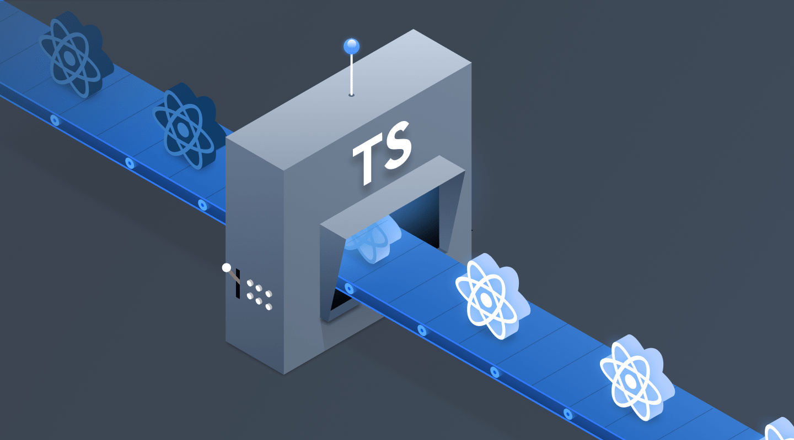

It's been a while since I first *init* a "personal blog" project but I haven't found the time to actually complete one until now. When I first started with the project, I went with [Angular](https://angular.io/) and [Angular Universal](https://angular.io/guide/universal). At the time, I was working on a [React](https://reactjs.org) project at work so I couldn't switch context between **Angular** and **React** to finish the blog. Then, I discovered [GatsbyJS](https://www.gatsbyjs.org) and it changed my mind on how I wanted to build my blog. After a long time (*since Gatsby v1*), I finally put this blog together and here's how I did it with: **Gatsby**, **React** and **TypeScript**.

> Of course, I haven't included many other functionality like **Newsletter** and such. Those are going to be included and will have their own written blog as well. Stay tuned!

## React + TypeScript
Since this blog is **powered** by **Gatsby** so I will save **Gatsby** for last. For **React**, I learned (*still learning*) **React** the same way as everybody does, mostly.


*React and TypeScript 😍*

I am an **Angular** developer. When I was learning **React**, I was trying to find similarities between the two frameworks. For instance:

1. Component Declaration

```typescript
// Angular
@Component({...})
export class SomeComponent {}

// React
export class SomeComponent extends Component<Props, State> {}
```

2. Input

```typescript
// Angular
@Input() someInput: string;

// React
type Props = {
  someInput: string;
}
export class SomeComponent extends Component<Props> {}
```

3. Output

```typescript
// Angular
@Output() event: EventEmitter;

// React
type Props = {
  event: () => void;
}
export class SomeComponent extends Component<Props> {}
```

4. Content Projection

```typescript
// Angular
<ng-content></ng-content>

// React
{this.props.children}
```

5. Fragment

```typescript
// Angular
<ng-container></ng-container>

// React
<Fragment></Fragment>
```

Above notes were some of the similarities I was trying to point out when I was learning **React** as an **Angular** developer. However, I soon realized that I should have *tripped* most of my knowledge about **Angular** specific to learn **React** better. I was completely lost and confused when I came to learn some **React** Advanced Concepts like Render Props and then there's also **Redux** 🤯. Reusability differs greatly between the two frameworks as well. Although I am comfortable with **React** now, I wish I would have spent less time getting familiar with it.

As for **TypeScript**, it's just a natural and personal choice for me. I love **TypeScript** and writing **React** with **TypeScript** feels really nice to me 🥳. I don't have any personal note about integrating **TypeScript** with **React** but to share my *ultimate* resources about the two technologies:
1. [React + TypeScript Cheatsheet](https://github.com/typescript-cheatsheets/react-typescript-cheatsheet)
2. [TypeScript Advanced Types](https://www.typescriptlang.org/docs/handbook/advanced-types.html)

## GatsbyJS
**Gastby** is an awesome technology. Though quick to get started, but it's not quite easy to get used to and start building something for yourself. When I started learning **Gatsby** months ago, all I did was to pull [Gatsby Starters](https://www.gatsbyjs.org/starters/) and play with them without the full understanding to actual build something. And I was frustrated 😨.

Up until about a month ago, I returned to start learning **Gatsby** from scratch. I followed the [Gatsby Tutorial](https://www.gatsbyjs.org/tutorial/) from start to finish. Along the way, I was also trying to integrate **TypeScript** and **[MaterialUI](https://material-ui.com/)**.

For my personal blog, I want to go with something minimalistic. I'm not the greatest UX/UI person in the world so I rely on a couple of third parties like:
1. [ParticleJS](https://vincentgarreau.com/particles.js/)
2. [MaterialUI](https://material-ui.com/)

For *Theme*, I utilize **Context** in combination with **MaterialUI Theming** to achieve a simple switch between *light 🏙* and *dark 🌃* theme. Here's my `ThemeChangerContext`:

```typescript
import React, {
  createContext,
  Dispatch,
  FC,
  SetStateAction,
  useCallback,
  useContext,
  useState,
} from "react";

export type BlogTheme = "light" | "dark";

export type ThemeChangerContext = {
  theme: BlogTheme;
  setTheme: Dispatch<SetStateAction<BlogTheme>>;
};

const context = createContext<ThemeChangerContext | null>(null);

export const ThemeChangerProvider: FC = ({ children }) => {
  const [theme, setTheme] = useState<BlogTheme>("light");

  return (
    <context.Provider value={{ theme, setTheme: useCallback(setTheme, []) }}>
      {children}
    </context.Provider>
  );
};

export const useThemeChangerContext = () => {
  const ctx = useContext(context) as ThemeChangerContext;

  if (ctx === undefined) {
    throw new Error(
      "useThemeChangerContext must be used within ThemeChangerProvider"
    );
  }

  return ctx;
};
```

And use it on my `Layout`:

```typescript
const Layout: FC = ({ children }) => {
  const { theme } = useThemeChangerContext();
  const muiTheme = useMemo(() => buildTheme(theme), [theme]);

  return (
    <ThemeProvider theme={muiTheme}>
      <CssBaseline />
      <ThemeToggler />
      {children}
    </ThemeProvider>
  );
};

const LayoutWithThemeChanger: FC = ({ children }) => {
  return (
    <ThemeChangerProvider>
      <Layout>{children}</Layout>
    </ThemeChangerProvider>
  );
};

export default LayoutWithThemeChanger;
```

Notice how I use `useMemo` to cache so when my `Layout` is rendered and the `theme` hasn't changed, I don't have to execute `buildTheme()` again.

For overall feels and looks, I just utilize **MaterialUI Components** where I see fit. [MaterialUI Styles](https://material-ui.com/styles/basics/) is a very important concept that you might want to pick up if you want to use **MaterialUI** efficiently.

For the content, I will not go over **Gatsby API** but I want to highlight a couple points:
#### createPages
I want to have a **Pagination** on my **Blogs** page. Here's what I came up with:

```javascript
exports.createPages = async ({ graphql, actions }) => {
  const { createPage } = actions;

  const result = await graphql(`
    {
      allMarkdownRemark {
        edges {
          node {
            fields {
              slug
            }
            frontmatter {
              title
              tags
            }
          }
        }
      }
      site {
        siteMetadata {
          blogsPerPage
        }
      }
    }
  `);

  if (result.errors) {
    console.error(result.errors);
    throw new Error(result.errors);
  }

  // Templates
  const blogsTemplate = path.resolve("./src/templates/blogs.tsx");

  const blogs = result.data.allMarkdownRemark.edges;
  const blogsPerPage = result.data.site.siteMetadata.blogsPerPage;
  const numPages = Math.ceil(blogs.length / blogsPerPage);

  Array.from({ length: numPages }).forEach((_, index) => {
    createPage({
      path: index === 0 ? "/blogs" : `/blogs/${index + 1}`,
      component: blogsTemplate,
      context: {
        limit: blogsPerPage,
        skip: index * blogsPerPage,
        numPages,
        currentPage: index + 1,
        total: blogs.length,
      },
    });
  });
}
```
The above will give me each `blogs/{pageNumber}` for every 10 blog post that I have which is pretty sweet.

#### graphql
I am a hard-fan on typings so working with `graphql` in the beginning wasn't really a pleasant. Luckily, I found **Webstorm GraphQL plugin** and it literally saved my life (*well not really, but it did save my interest in GraphQL*). Setup is easy as well:

1. Install `GraphQL` plugin
2. Setup a `.graphqlconfig` file like following:

```
{
  "projects": {
    "blog": { // notice of this "blog" name
      "name": "Untitled GraphQL Schema",
      "schemaPath": "schema.graphql",
      "extensions": {
        "endpoints": {
          "Default GraphQL Endpoint": {
            "url": "http://localhost:8000/___graphql",
            "headers": {
              "user-agent": "JS GraphQL"
            },
            "introspect": false
          }
        }
      }
    }
  }
}
```

3. Install `graphql-cli` npm package.
4. Setup a script (or not): `graph: graphql get-schema --project blog`. The `--project` points to the project name you set up in the config.
5. Run `npm run graph` against a running **Gatsby** instance.

The `graphql-cli` will output a `schema.graphql` file and this file is all the `GraphQL` plugin needs to provide intellisense in your `GraphQL` queries. Awesome 🥳!

> You can also generate **TypeScript** types from `scheme.graphql` but the types aren't really helpful since they're all of type `Maybe<T>` and it requires a lot of `null checking` in your code.

## End
Rather than the points that I mentioned above, it all comes down to your own **Customization** and how you want your blog to look, act, and feel like. **Gatsby** is a great tool that will allow you to build a full SEO-supported personal blog (or even more). Utilizing **React** allows you to build your components in a more concise and performant way. Overall, putting this blog together was a joy to me and I will definitely keep working on it to include more features in the future. Thanks for reading!
