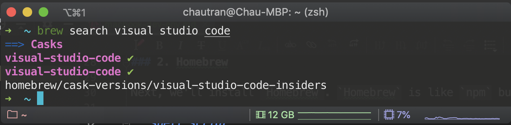
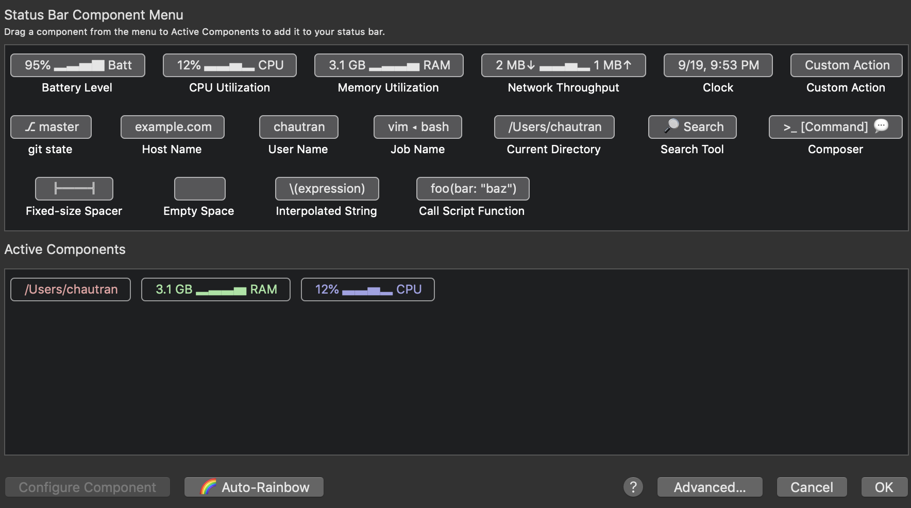
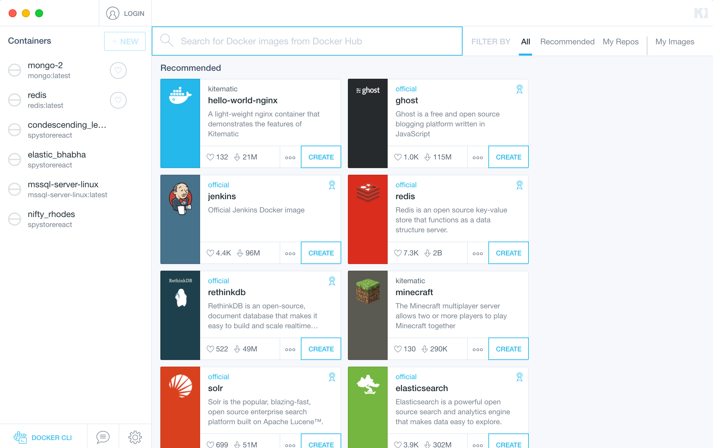

Today, I am going to share with you guys my **development environment** which has been serving me really well for the past year. By all means, mine is not that special or anything but I want to share because there might be people out there who might find this interesting, and for me to have a source that I could come back to every time I install `Parallels` 😂

> `Parallels` is a piece of software that lets you run `Windows` on a `Mac`. They're doing a very good job but I just don't like installing `VMs` on my machine. We have `Dockers` now you know?! tldr; I've had *not so good* experiences with `Parallels`

Now, if you're a developer, or developer-to-be and wants to setup your `Macbook` for **development**, I'll pick you up right here after you're finishing `Setup your Mac for first use`.

> I use [https://sourabhbajaj.com/mac-setup/](https://sourabhbajaj.com/mac-setup/) as my reference but mine is more concentrated on `JavaScript Dev`. Please check out [this guide](https://sourabhbajaj.com/mac-setup/SystemPreferences/) for **System Preferences** related setup.
  
### 1. Install Xcode

> Quick tip: you can start setting up your **System Preferences** when you're waiting for `Xcode` to finish installed.

- Open `AppStore` and install `Xcode`
- After `Xcode` finishes, open your `Terminal` and run the following command which will install `Xcode Command Line Tools` which is required for many other tools, especially `Homebrew`

```bash
 
xcode-select --install
 
```

### 2. Homebrew

Next, we'll install `Homebrew`. `Homebrew` is like `npm` but for your systems rather than your JS applications. With `Homebrew`, you can install all kind of tools/applications and manages them in one place. Open your `Terminal` and run the following command:

```bash
 
/usr/bin/ruby -e "$(curl -fsSL https://raw.githubusercontent.com/Homebrew/install/master/install)"
 
```

After the process is finished, you can run `brew doctor` in the same terminal to check if "your system is ready to brew". Once you're "ready", let's run:

```bash
 
brew tap caskroom/cask
 
```

Following are some most used `Homebrew` commands that you'll probably use:

- To search for a package (or **Formulae** or **Cask** in `Homebrew` vocabulary):

```bash
 
brew search search_phrase
 
```

- To install a **formulae**:

```bash
 
brew install formulae_name
 
```

- To install a **cask**:

```bash
 
brew cask install cask_name
 
```

 
*using Homebrew to search for VS Code*

> the little ✅ next to the **cask** annotates that this **cask** is already installed on my machine.

### 3. iTerm2 & Alfred

With `Homebrew` installed, you should start installing two things: `iTerm2` and `Alfred 4`

```bash
 
brew cask install iterm2
brew cask install alfred
 
```

Run `iTerm2` and start setting a couple of things up. **The following items are all optional**

- Go to `Preferences -> Profiles -> Keys`, and add new 4 **shortcuts**:

|shortcut|action|esc+|
|---|---|---|
|⌘←|Send Escape Sequence|OH|
|⌘→|Send Escape Sequence|OF|
|⌥←|Send Escape Sequence|b|
|⌥→|Send Escape Sequence|f|

- Go to `Preferences -> Profiles -> Session`, and check `Status bar enabled` and configure them how you want. I personally have: `Current Directory`, `CPU Utilization` and `Memory Utilization`


*Status Bar Components*  

- If you want to change your typography, go to `Preferences -> Profiles -> Text`. I use `Menlo 14pt`.

- Finally, browse to [iTerm2-Color-Schemes](https://github.com/mbadolato/iTerm2-Color-Schemes/tree/master/schemes) to pick a theme that you like. Then go to `Preferences -> Profiles -> Colors`, import the preset that you picked and select it.  I personally use `Dracula`

Next up is `Alfred 4`. `Alfred` is `Spotlight` replacement and if you're willing to pay (which you should) for the `Power Pack`, you'll never live your life normally without `Alfred`. First of all, we need to disable `Spotlight`.

- Run `Spotlight` and uncheck everything that you don't want. I uncheck `Fonts`, `Images` and such.

- Click on `Keyboard Shortcuts` and uncheck `Show Spotlight Search`. While you're here, click on `Services`, look for `Search man Page Index in Terminal` and uncheck that as well. I will explain later.

- Run `Alfred`. Check `Launch Alfred at login` and change your `Alfred Hotkey` to `⌘ Space`. Then you're all set.

### 4. zsh and oh-my-zsh

One of the reasons why `iTerm2` is so much more powerful than `Terminal` is that you can customize it. There are many different *frameworks* that can make your `iTerm2` experience up another level. Personally, I always go with `zsh` and `oh-my-zsh` because of how well-known it is, easy to look for answers you know 😋. To install `zsh`, we'll use `Homebrew`.

```bash
 
brew install zsh
 
```

After that's done, run the following command to install `oh-my-zsh`:

```bash
 
sh -c "$(curl -fsSL https://raw.githubusercontent.com/robbyrussell/oh-my-zsh/master/tools/install.sh)"
 
```

Now you have the power of `oh-my-zsh` in your `iTerm2`. Your main configuration file will be `~/.zshrc` instead of `~/.bash_profile` or `~/.bashrc`. We'll start setting up `oh-my-zsh` with some productivity stuffs.

- By default, `zsh` provides an `alias` to quickly open `~/.zshrc` from the terminal. However, you might want to install your favorite text editor before doing so. I usually install `nvim` and `vscode` at this point.

```bash
 
brew install nvim
brew cask install visual-studio-code
 
```

`nvim` feels easier to me and `VSCode` has that `code` command that you can open `VSCode` from the terminal. Go ahead and execute:

```bash
 
nvim ~/.zshrc
 
```
> You can use `code` if you want to. If `code` is not available, run `Visual Studio Code` -> Open the `Command Palette` -> `Shell Command: install 'code' command in PATH`

> `alias` is your shortcut to any shell/combinations of shell -  

Let's setup some aliases to make your life easier. The following list is my current aliases which I find super helpful.

```shell
 
# change to code if you use vscode
alias zshconfig="nvim ~/.zshrc"
# you need to source zshrc after you make change like adding plugins
alias zshsource="source ~/.zshrc"
# quickly open oh-my-zsh config
alias ohmyzsh="code ~/.oh-my-zsh"
# best alias ever
alias c="clear"

alias rm="rm -rf"
alias ls="ls -lah"
alias cd..="cd .."

# find node_modules recursively from the current dir
alias findnode="find . -name "node_modules" -type d -prune -print | xargs du -chs"
# remove those node_modules
alias rmnode="find . -name 'node_modules' -type d -prune -print -exec rm -rf '{}' \;"

# if you develop iOS app, this will list all available simulators
alias listios="xcrun simctl list devices"

# CLI Alias
alias cra="create-react-app"
alias crl="create-react-library"
alias rn="react-native"
 
```

If you're from `~/.bash_profile` or `~/.bashrc`, you'll need to add the next line to your `~/.zshrc`

```shell
 
# If you come from bash you might have to change your $PATH.
export PATH=$HOME/bin:/usr/local/bin:$PATH
 
```

```shell
 
# extraneous stuffs
export CLICOLOR=1
export LC_ALL=en_US.UTF-8
 
```

- Theming: You can go to [Themes](https://github.com/robbyrussell/oh-my-zsh/wiki/Themes) and pick a theme you like. Then edit the following line

```shell
 
ZSH_THEME="theme_name"
 
```
 
- Plugins. By default, `zsh` comes with various plugins and will enable `git` plugin by default. `git` plugin provides you with all kinds of `git` shortcuts. Check this [link](https://kapeli.com/cheat_sheets/Oh-My-Zsh_Git.docset/Contents/Resources/Documents/index) out. I have the following plugins enabled.
    - `colored-man-pages`: comes with `zsh`
    - `colorize`: comes with `zsh`
    - `zsh-syntax-highlighting`: [INSTALL.md](https://github.com/zsh-users/zsh-syntax-highlighting/blob/master/INSTALL.md#oh-my-zsh)
    - `zsh-autosuggestions`: [INSTALL.md](https://github.com/zsh-users/zsh-autosuggestions/blob/master/INSTALL.md#oh-my-zsh)
    - `zsh-completions`:  [INSTALL.md](https://github.com/zsh-users/zsh-completions#oh-my-zsh)

Now that we have setup our terminal, it's time to start installing some applications. Use `brew search` to search for an app that you want.

```bash 
 
brew cask install google-chrome
brew cask install appcleaner
brew cask install postman
 
```
    
### 5. NodeJS

There are many ways to install `NodeJS` but I'd recommend using `nvm` to manage `NodeJS` on your machine. `nvm` stands for `Node Version Manager` and it allows you to install and switch between versions very easily.

- Install `nvm`

```bash
 
curl -o- https://raw.githubusercontent.com/creationix/nvm/v0.31.1/install.sh | bash
 
```

- Run `zshsource`

- Run `command -v nvm` to check if `nvm` is available. If you have issue, it's most likely that `nvm` is missing in your `PATH`. Fix by adding the following block to your `~/.zshrc`

```shell
 
export NVM_DIR="$HOME/.nvm"
[ -s "$NVM_DIR/nvm.sh" ] && \. "$NVM_DIR/nvm.sh"  # This loads nvm
[ -s "$NVM_DIR/bash_completion" ] && \. "$NVM_DIR/bash_completion"  # This loads nvm bash_completion
 
```

- Run `nvm install node`. This will install the latest version of `NodeJS` on your machine.

- Run `nvm ls` to list installed `Node` versions.

- Run `nvm ls-remote` to list `Node` versions that you can install

### 6. Python

Even though I don't use `Python` as a programming language, but some tools are built with `Python`. So I'd also recommend installing `Python` using `pyenv` (just like `nvm` for `NodeJS`).

- Install `pyenv`

```bash
 
brew install pyenv
 
```

- Update `PATH`

```bash
 
echo 'eval "$(pyenv init -)"' >> ~/.zshrc
 
```

- Run `pyenv install --list`. If you have issue here, restart your terminal.

- Run `pyenv install version_here` to install `Python`. I usually install latest 2.x and latest 3.x

### 7, Database

Again, consult [https://sourabhbajaj.com/mac-setup/](https://sourabhbajaj.com/mac-setup/) and pick the ones that are relevant to you.

### 8. Docker

`Docker` can be installed by visiting this [link](https://docs.docker.com/docker-for-mac/install/). If you like GUI, I'd recommend `Kitematic` which is awesome.

```bash
 
brew cask install kitematic
 
```

 
*Kitematic*

### 9. MongoDB

I use `Docker` for my local `MongoDB` instance. However, I recently had to install `Mongo` client on my machine due to some work that requires some CLIs from `Mongo`. Visit this [link](https://docs.mongodb.com/manual/tutorial/install-mongodb-on-os-x/) and follow the manual to install `Mongo` locally.

Again, I like GUI because it saves a lot of times and there are many `Mongo GUI Client` out there for you to choose: **Studio 3T** 💰, **NoSQL Booster** 💰 or **Mongo Compass** 🆓 and **Robo 3T** 🆓. I personally like `NoSQL Booster` (they also have free version) because of their focus on `Shell` commands and provides extremely good intellisense.

### 10. Jetbrains

I am a **Jetbrains** fan. **Jetbrains** is a suite of well-known IDEs like **IntelliJ**, **Webstorm**, **PyCharm**, **PHPStorm**, **Android Studio** ..etc... Only thing to note here is if you use **Jetbrains**, consider installing their toolbox **Jetbrains Toolbox** and it's available via `Homebrew`

```bash
 
brew cask install jetbrains-toolbox
 
```

**Jetbrains Toolbox** allows you to manage your IDEs installation and versions. It also allows you to install certain `shell` commands so you can open your IDEs from the terminal.

That is all I have to share for **Development Environment Setup**. I hope you find the information helpful. My next blob will probably be on **Jetbrains** specific so I can share my productivity tips with you through the tools that we use everyday. Go and be productive, and make sure to always install things with `Homebrew` whenever possible. Thanks for reading 😀.  
