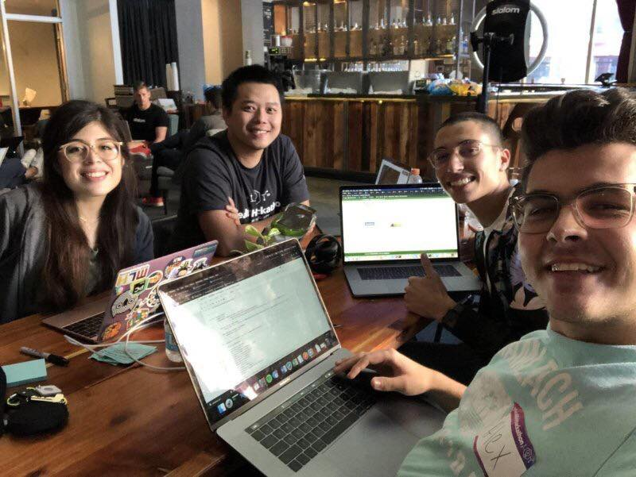
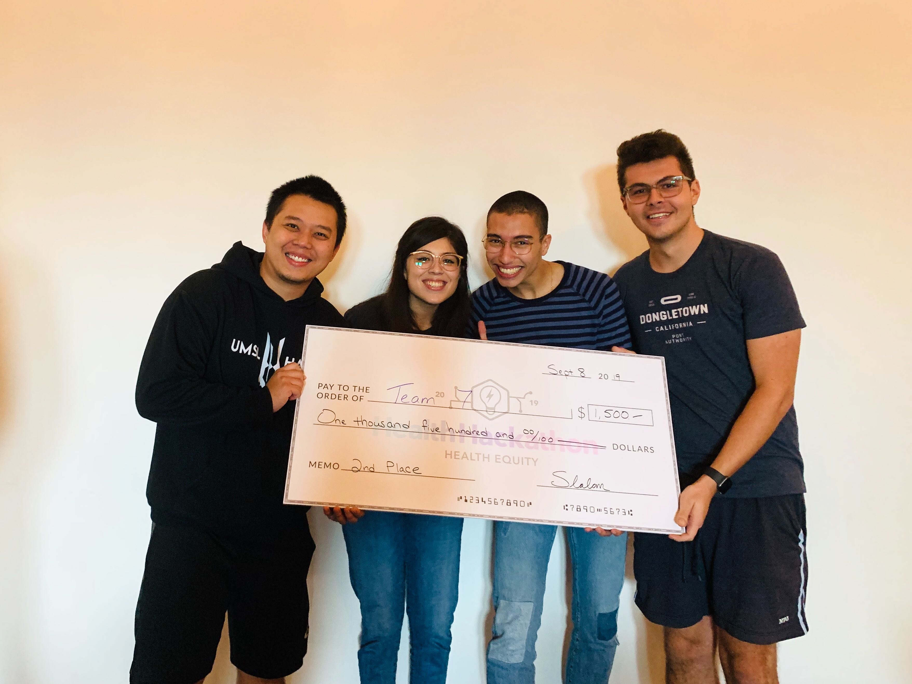
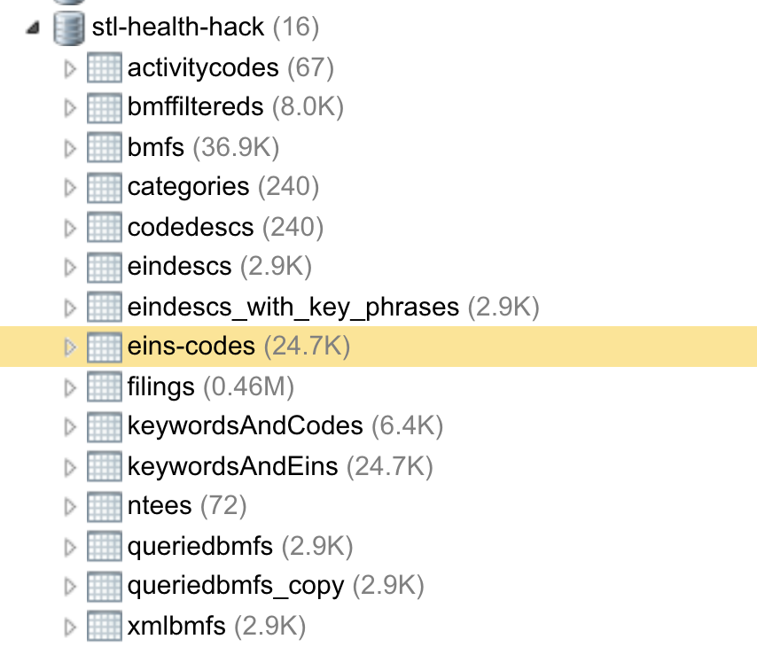

This is **Part One** of a two-part series about my journey through **Slalom Health Equity Hackathon**. You can read about **[Part Two](/blogs/slalom-health-equity-hackathon-2)** here.

Over the past weekend, I was participating in **Health Equity Hackathon** which was hosted and organized by **[Slalom](https://www.slalom.com)**, partnered with **[Covo](https://stl.hellocovo.com/)** and **[Johego](https://www.johego.org/)**, and sponsored by **[AWS](https://aws.amazon.com/)**. And it was a blast 🚀 !

Personally, I wasn't planning on take part in the Hackathon at first. But I changed my mind immediately when I read the more about the Hack, which I'll elaborate more down below. One of the reasons that I was hesitant to join in the beginning was because my "*usual hack-mates*" were busy (*At least, that's what I thought through our daily chat*). When I decided to participate, I joined by myself and hoped to get in a team during **Team Formation** session of the Hack. Here's how it went.

### The Challenge

The Hack started off by an organizer from **Slalom**, Tara Nesbitt, giving her presentation about the Hack's guidelines and purposes. Next up was **Johego** Founder and CEO, Michael Kehoe. Michael was introducing **Johego** and explaining why he does what he's doing and the positive impact of the work that his team at **Johego** is doing, as well as all the Hack's participants were willing to sign their weekends up to contribute to the same positivity.

The problem statement sounds simple enough, at least to me: Medical and Health Services Accessibility for everyone. Sounds simple right? Medical and Health services are essential things that everyone should have access to, easily. Well, unfortunately that's not the case. According to Michael, the average amount of time that a person gets connected to the right resource for their medical and health need is **43 minutes/resource**. Michael also gave a clear example on how we could access to movie tickets via **Fandango** in a matter of minute. Why can't we do the same for Medical? The reason, mainly, is how scattered the data is and how expensive it is to validate data on Medical.

Michael founded **Johego** with the purpose of closing the gap of **Medical Accessibility** and by participating in this Hackathon, I feel like everyone wants to contribute to the same purpose.

This Hackathon was a little bit different than the ones that I've done before. When I think about Hackathons, I think about making an *Application* that has an impact on one or more aspects of the Problem Statement. The deliverable has been always something visible, and, for lack of better words, presentable. In contrast, participants were given raw datasets and were asked to analyze, filter, and augment the raw provided datasets by using different tools and especially, with the power of **Natual Language Processing** by utilizing **AWS Comprehend**. This was also the main reason that changed my mind about joining the Hack. I was both surprised and excited for being able to finally learn something about data and Machine Learning. Problem statement's provided. Next, I needed a team.

### The Team


*behind the scene*

I was able to join a team that was consisted of 3 amazing people: Mar, Vanessa and Alex. A friend of mine introduced me to Mar and I've decided to join with Mar because I liked his personality when he approached me. Mar and Vanessa were very energetic and welcoming which made me feel really nice about the team. Alex didn't show up on the first day but we "*communicated*" briefly during the first night through **Slack** and I thought this guy was smart and knew what he's doing, and I was excited to meet him.

Next morning, I got to meet Alex and the guy was like I thought he was, a smart guy. We immediately started working on the project and discussed about how we interpreted the data along the way. It was such a fun experience working with these guys. And it was rewarding, as we finished the Hack with the **2nd place**


*The check though 🤑*

### What We Did

The main purpose of this blog was to brag. No, not really 😛. I'm writing this blog post to share with all of you how our team contributed to the goal of the Hackathon's organizers, partners, and sponsors.

A fast rundown of all the technologies/tools we used in the Hack:

1. **[MongoDB](https://www.mongodb.com)**
2. **[AWS Comprehend](https://aws.amazon.com/comprehend/)**
3. **[NodeJS](https://nodejs.org/en/)**
4. **[Puppeteer - Headless Chrome API](https://github.com/GoogleChrome/puppeteer)**
5. **[AWS SDK for NodeJS](https://aws.amazon.com/sdk-for-node-js/)**
6. **[Python](https://www.python.org/)**
7. **[Jupyter](https://jupyter.org/)**
8. **[Boto3](https://boto3.amazonaws.com/v1/documentation/api/latest/index.html)**
9. **[VSCode](https://code.visualstudio.com/)**
10. **[NoSQL Booster for MongoDB](https://nosqlbooster.com/)**
11. **[Postman](https://www.getpostman.com/)**

After we get the data from the organizers, the first thing we did was to figure out how to store this data in a place where we can work and continue working on it for the next 2 days. That's why I suggested that we should store the data in **MongoDB**. The main reason is because **MongoDB** is a **NoSQL** database and a *schema-less* database solution is great for situations like the challenge of this Hackathon. We only need a place to jot all the data down without worrying about what shape the data is. With that in mind, I quickly got all the **CSV** and **JSON** files that were provided and imported them in my local **MongoDB** instance using **NoSQL Booster**.

> All data provided was in **CSV** format or **JSON** format. It was funny because I didn't have any tools on my machine that read CSV 🤧 so I had to use **Postman** to fetch the data.


*my final local MongoDB instance*

Out of all 5 datasets that were provided, the biggest one has 450k rows of data which was a pain in the butt to work with. We didn't really bother indexing any of the imported data due to time constraint of a hackathon format. Once all the data was imported, I started to run through the Documentation that **Johego** put together as to how to filter the data and came up with the following fundamental criteria:

1. I only want the Organizations that have matching **EIN** (*a unique ID to Organization in IRS data*) with the ones in **Tax Filings 2018**
2. Each organization provides activities/services to the community and this information is captured by annotating the services by **Activity Codes** and/or **NTEE Codes** (*based on when the organization was established. To my understanding, Activity Codes are old format*). **Johego** only cares about a specific subset of *Services* Codes and also provides the participants all the **Whitelisted Codes** so I only want the Organizations that have *Services* code in the range of the **Whitelisted Codes**
3. The Organizations dataset do not come with the **Filings XML** file that will provide us more information about the Organization: **Phone Number** and **Website**. So I also need to make sure to add the **Filings XML URL** to my *enhanced* Organizations dataset.

With all 3 above things in mind, I started writing my queries against all the provided datasets.

1. The first query is pretty simple. All I did was read two collections: `bmfs` (36K rows) and `filings` (450k rows) and match all the **EINs** between the two.

```javascript
const filings = db.filings.find({});

db.bmfs.find({}).forEach((doc) => {
  const found = filings.find(f => f.EIN === doc.EIN);
  if (found) {
    // if have matching EIN, grab the XML URL from Filings Index and save that onto the document.
    db.bmfs.updateOne({_id: doc._id}, {$set: {URL: found.URL}});
  } else {
    // if not match, remove the document from the collection.
    db.bmfs.deleteOne({_id: doc._id});
  }
});
```

After this query is ran, I got the `bmfs` from 36K rows down to 8k rows, which means we have 8k organizations that have matching **EINs** with the **Filings Index**, and at the same time, I could update the `bmfs` with matching `XML URL` as well. This is a beauty of **MongoDB**. **(1)** and **(3)** were taken care of.

2. Next query is a bit more complicated and composed of multiple steps. The requirement is straightforward but the provided data is a bit messup. Again, I'll run down what happens:

    - Each Organization has a field called **ACTIVITY** and/or **NTEE_CD**.
    - The whitelisted Activities is a collection of 3-digit codes.
    - **ACTIVITY** fields among all Organizations were not consistent. The max-length is 9 characters (which is 3 Activities at the most) but some **ACTIVITY** fields were missing 0s because of the way data is handled from one medium to another, 0s are missing.
    - If an Organization has EITHER matching **ACTIVITY** with the Whitelisted OR matching **NTEE_CD** with the Whitelisted codes, then it should be included.
    
With all of these information, my first step was to clean up the `bmfs` collection.

1. Get all `bmfs` that have **ACTIVITY** field and its value is not `"0"`. If the **ACTIVITY** length is less than 9, then prepend 0s to it to make it 9 characters.

```javascript
db.bmfs.find({ACTIVITY: {$ne: "0"}}).forEach((doc) => {
  if (doc.ACTIVITY.length < 9) {
    // If ACTIVITY length is less than 9, then make an array of length: 9 - length 
    // fill that array with 0, 
    // join the array of 0s 
    // concat the current ACTIVITY

    // Eg: ACTIVITY.length is 2. Then an array of ["0", "0"] is needed.
    // ["0", "0"].join("") => "00"
    // "00".concat("1234567") => "001234567"
    doc.ACTIVITY = Array.from({length: 9 - doc.ACTIVITY.length}).fill("0").join("").concat(doc.ACTIVITY);
    
    // Then update the document with the prepended ACTIVITY
    db.bmfs.updateOne({_id: doc._id}, {$set: {ACTIVITY: doc.ACTIVITY}});
  }
})
```

2. Now that I've got the **ACTIVITY** cleaned up, I thought that it might be easier to compare if the **ACTIVITY** were in a form of Array of 3 3-digit code. Eg: `["123", "456", "789"]` instead of `"123456789"`. So I did exactly that, make **ACTIVITY** into an array of 3-digit codes.

```javascript
db.bmfs.find({ACTIVITY: {$ne: 0}}).forEach((doc) => {
  // initialize an empty array
  const codes = [];
  
  // create a loop that will loop 3 times
  for (let i = 0; i < 3; i++) {
    // each time, get a substring of the ACTIVITY in length of 3 and push that to codes array
    // eg: first iteration, i = 0, get the substring from index 0 (i * 3) and take 3 characters. So 123456789.substr(0, 3) gives me 123
    // second iteration, i = 1, continue getting the substring from index 3 and take 3 chars. So 123456789.substr(3, 3) gives me 456
    // same for last iteration.  
    codes.push(doc.ACTIVITY.substr(i * 3, 3));
  }
  // Update the document with the codes array.
  db.bmfs.updateOne({_id: it._id}, {$set: {ACTIVITY_CODES: codes}});
})
```

> You can see that I could have combined the two previous queries but because I didn't realize I needed the **CODES** until later.

3. Now I have **ACTIVITY**, **ACTIVITY_CODES** and **NTEE_CD** all good to go. Time to actually filter the Organizations.

```javascript
// Initialize an empty array
const result = [];

// This is just to be safe, I drop the collection before running this script.
db.queriedbmfs.deleteMany({});

// Grab all the Whitelisted Codes
const codes = db.activitycodes.find({});

// Grab all the whitelisted NTEEs
const ntees = db.ntees.find({});

// Since my whitelisted codes are both MongoDB Collection
// so they come back with a form of Array of Object with _id and the actual code.
// I only want the Array of codes so I run them both through .map() method to grab the code.
const codesArr = codes.map(c => c.code);
const nteesArr = ntees.map(n => n.code);

// Filter the bmfs collection for EITHER:
// 1. If an Organization has both NTEE_CD and ACTIVITY
// 2. If an Organization does not have NTEE_CD (which means it only has ACTIVITY)
// 3. If an Organization does not have ACTIVITY (which mean it only has NTEE_CD)
db.bmfs.find({
    $or: [
        { $and: [{ NTEE_CD: { $exists: true }, ACTIVITY: { $ne: "0" } }] },
        { NTEE_CD: { $exists: false } },
        { ACTIVITY: { $eq: "0" } }
    ]
}).forEach((it) => {
    
    // Determine if this Organization should be included.
    // 1. If it only has NTEE_CD and its NTEE_CD startsWith at least one of the whitelisted NTEEs. It's good
    // 2. If it only has ACTIVITY and its ACTIVITY_CODES array (the one I made from the previous query)
    //    exists and its ACTIVITY_CODES array includes at least one of the whitelisted Activity Codes.
    // 3. If it has both NTEE_CD and ACTIVITY 
    //    then either its NTEE_CD startsWith at least one the whitelisted NTEEs
    //    or its ACTIVITY_CODES exists and includes at least one of the whitelisted Activity Codes.
    const shouldPush = (it.NTEE_CD && !it.ACTIVITY && nteesArr.some(n => it.NTEE_CD.startsWith(n)))
        || (it.ACTIVITY && !it.NTEE_CD && codesArr.some(c => it.ACTIVITY_CODES && it.ACTIVITY_CODES.includes(c)))
        || (it.ACTIVITY && it.NTEE_CD && (nteesArr.some(n => it.NTEE_CD.startsWith(n)) || codesArr.some(c => it.ACTIVITY_CODES && it.ACTIVITY_CODES.includes(c))));

    // If an Organization should be included, push it to the array.
    if (shouldPush) {
        result.push(it);
    }
});

// After the looping, insert the result array into a new collection 
// (which I intentionally drop at the beginning of this script)
db.queriedbmfs.insert(result);
```

After this query's ran, I got the dataset down to 2.8K rows and `queriedbmfs` becomes the main collection that our team works with. And this concludes our first day.

The first task of the second day was to start parsing the XMLs to get the organizations' **WEBSITE** and **PHONE_NUM**. Since I have the `queriedbmfs` with all the URLs I need on my local **MongoDB**, I took on the task. Meanwhile, my teammates started cramping up on **AWS Comprehend**. Back to my XML Parsing task, I needed a parser package which I went with `fast-xml-parser` and `he`. I also needed a *HTTP Client* which I went with good ol' `node-fetch`.  

> Just FYI, all the previous code snippets were Mongo Shell scripts. You can write some JavaScript within the Mongo Shell but because it's Mongo Shell so variable like `db` works. The below script is written in JS, specifically with NodeJS Runtime, so we need to approach **MongoDB** a little differently.

```javascript
// Just bringing in the 3rd party libraries
const fetch = require('node-fetch');
const mongo = require('mongodb');
const parser = require('fast-xml-parser');
const he = require('he');

// Initialize MongoDB client at localhost:27017, default port of MongoDB
const client = new mongo.MongoClient("mongodb://localhost:27017", {
  // some recommended options to work with newer version of MongoDB
  useNewUrlParser: true,
  useUnifiedTopology: true
});

// XML parser options. I don't have a lot of experience
// working with XML so I don't really know what the options entail.
// This is from fast-xml-parser documentations
const options = {
  attributeNamePrefix: '@_',
  attrNodeName: 'attr', //default is 'false'
  textNodeName: '#text',
  ignoreAttributes: true,
  ignoreNameSpace: false,
  allowBooleanAttributes: false,
  parseNodeValue: true,
  parseAttributeValue: false,
  trimValues: true,
  cdataTagName: '__cdata', //default is 'false'
  cdataPositionChar: '\\c',
  localeRange: '', //To support non english character in tag/attribute values.
  parseTrueNumberOnly: false,
  attrValueProcessor: a => he.decode(a, { isAttributeValue: true }), //default is a=>a
  tagValueProcessor: a => he.decode(a) //default is a=>a
}

// Connect to MongoClient
// Note: I won't get into Async/Await or Promises in JS
client.connect(async err => {
  if (err) {
    // if the connection has error
    console.log('Error connecting: ', err);
    return; // stop executing
  }
  
  // initialize db instance
  const db = client.db('stl-health-hack'); // connect to stl-health-hack Database
  const xmls = db.collection('xmls'); // connect (create if not existed, and connect) to xmls collection
  
  const queriedBmfsCursor = db.collection('queriedbmfs').find({URL: {$exists: true}});
  const bmfs = await queriedBmfsCursor.toArray();
  
  // grab all XML URls from BMFs, and construct a GET request for the XML
  // as a form of a Promise (Asynchronous Operation)
  const xmlUrls = bmfs.map(bmf => fetch(bmf.URL).then(res => res.text()));
  
  // xmlUrls is an Array of Promises.
  // I intentionally did so so I could utilize Promise.all
  // to execute all the XMLs requests in parallel
  const xmlsResponses = await Promise.all(xmlUrls);
  
  // Loop through the responses
  // parse them into JSON
  // save JSON into the xmls collection
  xmlsResponses.forEach(xml => {
    if (parser.validate(xml) === true) {
      xmls.insertOne(parser.parse(xml, options));
    }
  })
})
```

So I only grabbed all the XMLs and pushed them into the database. There's no actual XML Parsing happening yet which it will in the next query. Now that I have the XML content in the database, I can start running queries on it.

> Back to Mongo Shell

```javascript
// Get all XMLs
const xmls = db.xmls.find({}).toArray();

db.queriedbmfs.find({}).forEach((it)=> {
    // Match EINs
    const found = xmls.find(xml => xml.Return.ReturnHeader.Filer.EIN === it.EIN);
    
    // Initialize update object
    const update = {$set: {}};
    
    if (found) {
        // if has PhoneNum, set PHONE_NUM on the update object
        if (found.Return.ReturnHeader.Filer.PhoneNum) {
            update.$set["PHONE_NUM"] = found.Return.ReturnHeader.Filer.PhoneNum;
        }
        
        // if has IRS990EZ
        if (found.Return.ReturnData["IRS990EZ"]) {
          
            // if has Website, add WEBSITE to update object
            if (found.Return.ReturnData["IRS990EZ"]["WebsiteAddressTxt"]) {
                update.$set["WEBSITE"] = found.Return.ReturnData["IRS990EZ"]["WebsiteAddressTxt"];
            }
            
            // if has MissionDesc, add MISSION_DESC to update object
            if (found.Return.ReturnData["IRS990EZ"]["MissionDesc"]) {
                update.$set["MISSION_DESC"] = found.Return.ReturnData["IRS990EZ"]["MissionDesc"];
            }
            
            // if has Desc, add XML_DESC to update object
            if (found.Return.ReturnData["IRS990EZ"]["Desc"]) {
                update.$set["XML_DESC"] = found.Return.ReturnData["IRS990EZ"]["Desc"];
            }
        } else if (found.Return.ReturnData["IRS990"]) {
            // same process as above
            if (found.Return.ReturnData["IRS990"]["WebsiteAddressTxt"]) {
                update.$set["WEBSITE"] = found.Return.ReturnData["IRS990"]["WebsiteAddressTxt"];
            }
            
            if (found.Return.ReturnData["IRS990"]["MissionDesc"]) {
                update.$set["MISSION_DESC"] = found.Return.ReturnData["IRS990"]["MissionDesc"];
            }
            
            if (found.Return.ReturnData["IRS990"]["Desc"]) {
                update.$set["XML_DESC"] = found.Return.ReturnData["IRS990"]["Desc"];
            }
        }
        
        // if update object is not an empty object, then update
        if (Object.keys(update.$set).length) {
            db.queriedbmfs.updateOne({_id: it._id},update)    
        }
    }
});
```

> The reason why I constructed an `update` object was because one of the requirements was do not include the field if it does not have data/value.

At this point, my `queriedbmfs` collection should have quite a bit more data with `WEBSITE` and `PHONE_NUM` from the XMLs. But little did we know that the data from the XMLs (IRS) was missing a bunch of data and also contains inconsistent data. For example:

1. The `WEBSITE` field has inconsistent values for "No Website":
    - No **WEBSITE** field
    - **WEBSITE** has value of `"N/A"`
    - **WEBSITE** has value of `"NONE"`
    - **WEBSITE** has value of `"None"`
2. A lot of organizations do not provide `PHONE_NUM`

So we're missing quite a few `PHONE_NUM` and `WEBSITE` information which are crucial in terms of Accessibility. After this query-run, it's starting to get heavily into more `JavaScript` with web scrapping and stuffs. My teammates were also ready to start playing with **AWS Comprehend**. All of this will have to wait to **Part 2** of the blog because this one is getting quite lengthy. Thank you for getting this far and hopefully you will continue to follow me through this journey in **[Part 2](/blogs/slalom-health-equity-hackathon-2)**.
