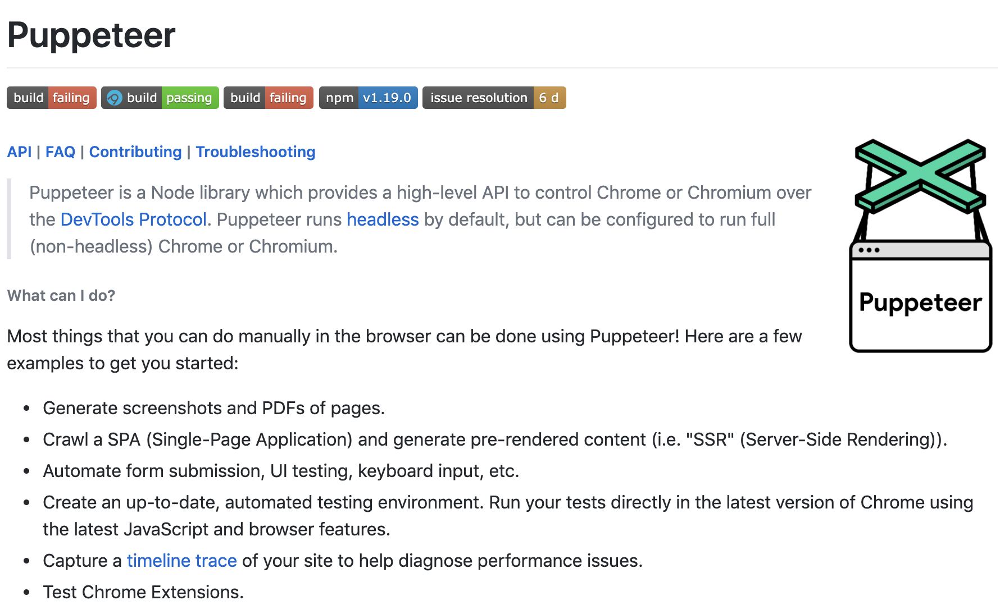
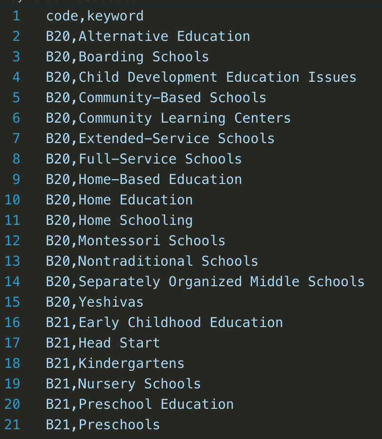
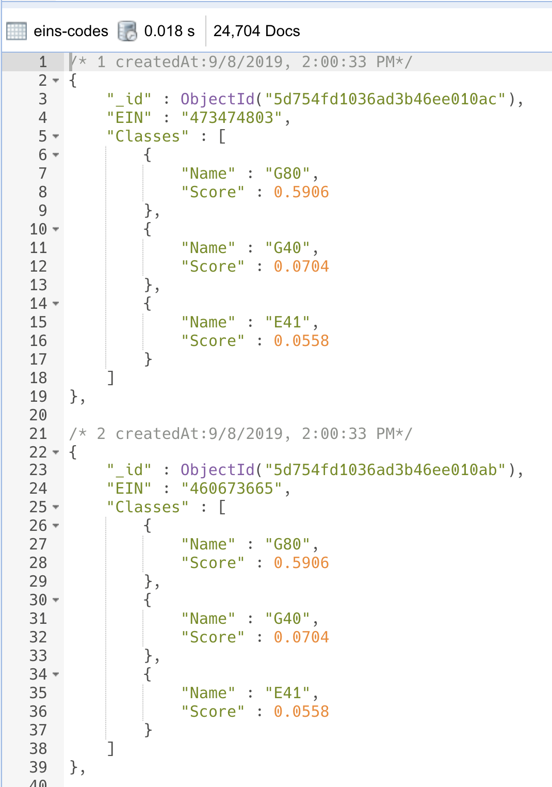

Welcome back to part 2 (and probably final part) of my journey through **Slalom Health Equity Hackathon**. As mentioned towards the end of [Part 1](/blogs/slalom-health-equity-hackathon-1), this part will start getting into the weed of fine-tuning the data after we have tried fetching and consolidating everything we're provided by the organizers.

The agenda for this part will be as follow:

1. Web Scraping
2. AWS Comprehend
3. Presentation

> It's worth noting that the organizers did provide an **API Endpoint** for participants to make a request by sending their data and the **endpoint** will return a set of scores so participants could see how they're doing and what they should be improving on.

### Web Scraping

Before our team resorted to **Web Scraping**, we were actually thinking about two different APIs:

1. [Google Places API](https://cloud.google.com/maps-platform/places/): This is a Google's service that provides information about businesses.
2. [Bing Entity Search API](https://azure.microsoft.com/en-us/services/cognitive-services/bing-entity-search-api/): This is pretty much the same service as above but provided by Bing.
3. [Google Custom Search API](https://developers.google.com/custom-search/): This API will allow you to build your custom search.

With the amount of data we had, there's no way to utilize these two APIs without paying or taking turns creating multiple free accounts (which was totally valid) but I'd rather do something simple, quick, and less bothering, especially to my teammates.

> My teammates was working with **Python**, namely **jupyter** and **boto3** to get familiar and adapt to **AWS Comprehend**.

> For projects that are not in Hackathon format, I would totally suggest going for a well-known and fully supported API like **Google Places**. What I am about to do is fun, somewhat effective, and pretty inaccurate 😅

After every consideration for not wanting to pay 3rd-party services, we decided to go with [Puppeteer](https://developers.google.com/custom-search/)


*Google Chrome Puppeteer*

**Puppeteer** is a Google Chrome Headless API that allows you to basically use Chrome programmatically and automatically. For what **Puppeteer** has to offer, I'd refer you to **Puppeteer README**


*Google Chrome Puppeteer README*

The plan was to have Puppeteer running on the dataset, perform a Google Search with the organization name, and fetch the first URL that Google Search returns. This approach is easy and quick but facing these issues: **inaccurate data** and **advertisement**. Given our time constraint and hackathon format, we decided to go with it anyway. First, I needed to run a query to query for all the Organizations that *DO NOT HAVE* a `WEBSITE` yet.

1. Same ol' setup to start working `MongoDB` and `JavaScript`.

```javascript
const mongo = require('mongodb');

let result = 0;

const client = new mongo.MongoClient('mongodb://localhost:27017', {
  useNewUrlParser: true,
  useUnifiedTopology: true
});

client.connect((err) => {
    if (err) {
        console.log(err);
        return;
    }

    const db = client.db('stl-health-hack');
    const col = db.collection('queriedbmfs');
})
```

2. `npm install puppeteer` and start with importing `puppeteer`

```javascript{1}
const puppeteer = require('puppeteer');
const mongo = require('mongodb');

let result = 0;
```

3. Add a query to find all Organizations that do not have `WEBSITE` or have invalid `WEBSITE`

```javascript{20-27}
const puppeteer = require('puppeteer');
const mongo = require('mongodb');

let result = 0;

const client = new mongo.MongoClient('mongodb://localhost:27017', {
  useNewUrlParser: true,
  useUnifiedTopology: true
});

client.connect((err) => {
    if (err) {
        console.log(err);
        return;
    }

    const db = client.db('stl-health-hack');
    const col = db.collection('queriedbmfs');

    col.find({$or: [
        {WEBSITE: {$exists: false}},
        {WEBSITE: {$eq: "N/A"}},
        {WEBSITE: {$eq: "NONE"}},
        {WEBSITE:  {$eq: "None"}}
    ]}).toArray(async (err, bmfs) => {
        
    });
})
```

4. Loop through the result and call `getFirstUrl()` and pass in the organization name

```javascript{26-29}
const puppeteer = require('puppeteer');
const mongo = require('mongodb');

let result = 0;

const client = new mongo.MongoClient('mongodb://localhost:27017', {
  useNewUrlParser: true,
  useUnifiedTopology: true
});

client.connect((err) => {
    if (err) {
        console.log(err);
        return;
    }

    const db = client.db('stl-health-hack');
    const col = db.collection('queriedbmfs');

    col.find({$or: [
        {WEBSITE: {$exists: false}},
        {WEBSITE: {$eq: "N/A"}},
        {WEBSITE: {$eq: "NONE"}},
        {WEBSITE:  {$eq: "None"}}
    ]}).toArray(async (err, bmfs) => {
        for (let i = 0; i < bmfs.length; i++) {
            const bmf = bmfs[i];
            const href = await getFirstUrl(bmf.NAME);
        }
    });
})
```

> I'll get to `getFirstUrl()` in a bit

5. If `href` (the URL we want) is found, then I want to update the same organization with the newly found URL

```javascript{30}
const puppeteer = require('puppeteer');
const mongo = require('mongodb');

let result = 0;

const client = new mongo.MongoClient('mongodb://localhost:27017', {
  useNewUrlParser: true,
  useUnifiedTopology: true
});

client.connect((err) => {
    if (err) {
        console.log(err);
        return;
    }

    const db = client.db('stl-health-hack');
    const col = db.collection('queriedbmfs');

    col.find({$or: [
        {WEBSITE: {$exists: false}},
        {WEBSITE: {$eq: "N/A"}},
        {WEBSITE: {$eq: "NONE"}},
        {WEBSITE:  {$eq: "None"}}
    ]}).toArray(async (err, bmfs) => {
        for (let i = 0; i < bmfs.length; i++) {
            const bmf = bmfs[i];
            const href = await getFirstUrl(bmf.NAME);
            if (href) {
                await col.updateOne({_id: bmf._id}, {$set: {WEBSITE: href}});
            }
        }
    });
})
```

6. Implement `getFirstUrl()`. Everything that happens with `puppeteer` is **asynchronous** operations so I utilize `async/await` here.

```javascript
const getFirstUrl = async (query) => {
    // Just a log for knowing which organization puppeteer is trying to fetch
    console.log(`Getting URL for ${query}`);
    
    // Initialize a browser instance. Default value for "headless" is true which means
    // puppeteer will open up a Chrome/Chromium window
    // I set it to "true" explicitly so you can see there's an option.
    const browser = await puppeteer.launch({headless: true});
    
    // Initialize a new page
    const page = await browser.newPage();
    
    // Go to this URL
    await page.goto('https://google.com');

    // Type in the search box the Organization name. 
    // What you pass in .type() is the input selector. 
    // You can find out about the selectors for all elements in the webpage by using Chrome Dev Tools.
    await page.type("input.gLFyf", query);
    
    // Hit Enter
    await page.keyboard.press(String.fromCharCode(13))
    
    // Wait for the next page's done loading
    await page.waitForNavigation();
    
    // Wait additional 2 seconds for no reason at all
    await page.waitFor(2000);
    
    // Try to get the first URL
    let href = await page.$eval("div.g", el => el.firstElementChild.href);
    if (!href) {
        href = await page.$eval("div.r", el => el.firstElementChild.href);
    }

    // the next two lines are for "reporting" purposes
    result++;
    console.log(`Found URL: ${href}. Already ran ${result}`);
    
    // Close the page
    await page.close();
    
    // Close the browser
    await browser.close();
    
    // return the URL if found, return null if not found
    return href;
}
```

Next thing to do is to run the script with **Node** and watch **Puppeteer** does its thing. With this approach, our team was able to come down to only 5 organizations that *DO NOT* have a `WEBSITE`. Well, the websites weren't really accurate because we didn't take "Ads" into account when we did "first URL". At this point, we were also ready to start getting into **AWS Comprehend**. Our plan was:

1. Train **AWS Comprehend** to recognize Service Codes by Descriptions: `MISSION_DESC`, `ORG_DESC` and the actual `CODE_DESC`
2. Use `fuzzywuzzy string matching` to compare the trained descriptions with the organization's description.

The goal is to find out which services an organization might provide. And we did just that. With all the information we've gotten so far, I was able to whip up quickly an input file in format of a `CSV` so we could feed that into **AWS Comprehend** via **AWS S3**

```javascript
db.categories.find({}).forEach((it)=> { 
    let concatDesc = "";
    if (it.keywords && it.keywords.length) {
        concatDesc = concatDesc.concat(it.keywords.join(" "));
    }
    
    if (it.description) {
        concatDesc = concatDesc.concat(" ", it.description);
    }
    
    if (concatDesc) {
        db.codedescs.insertOne({code: it.code, description: concatDesc})
    }
});
``` 

Basic query, ain't it? I concat all the `keywords` associated with a `category` and the `description` of the category, then insert each one in a `codedescs` collection which later allows me to export that collection to `CSV`.

> About **AWS Comprehend**, you'd have to utilize many different components of the **AWS Suite** like **S3**, **Permissions Management**, and couple more that I don't really recall. Basically, you need to setup in a way that **AWS Comprehend** can read and write from/to your **S3** bucket on the same account and region because **Comprehend** will read the input from **S3** as well as writing the resutlt to **S3**.

Once our model has been trained, the comparison starts. We utilized an NPM package called: `fuzzball` [](https://www.npmjs.com/package/fuzzball). This package is the `JavaScript` implementation of `fuzzywuzzy` methods from `Python`. At a high level, this library contains a set of methods to compare two `strings` and return a ratio of how close the two `strings` match.

1. First, as usual, bring in your libraries. I'll skip `Mongo` initialization part because it's identical to previous snippet.

```javascript{1-2}
const fuzz = require('fuzzball');
const mongo = require('mongodb');
```

2. Setup our team's thresholds. These thresholds determine the results. As mentioned above, `fuzzball` returns a ratio and if the ratio is greater than or equal to both thresholds, we accept the result. However, the data was so bad that for a high threshold, we didn't get anything back. That's why we iterated through couple of different thresholds to find that "sweet spot".

```javascript{6-14}
const fuzz = require('fuzzball');
const mongo = require('mongodb');

// ...

/*
 * First set of threshold: 55 - 70
 * Second set of threshold: 30 - 40
 * Third set of threshold: 40 - 55
 * Fourth set of threshold: 35 - 50
 * Fifth set of threshold: 37.5 - 52.5
 */
const fuzzRatio = 37.5;
const fuzzPartialRatio = 52.5;
```

3. Next is to connect to our `MongoDB` client and starts doing some actual string comparisons. The actual code is pretty self-explanatory. All I did was to go through all the `keyPhrases`, compare it to the `description` on `category` using `fuzzball`. If it's above the thresholds, return the `code` of the `category` then update the collection.

```javascript
const fuzz = require('fuzzball');
const mongo = require('mongodb');

/**
 * First set of threshold: 55 - 70
 * Second set of threshold: 30 - 40
 * Third set of threshold: 40 - 55
 * Fourth set of threshold: 35 - 50
 * Fifth set of threshold: 37.5 - 52.5
 */
const fuzzRatio = 37.5;
const fuzzPartialRatio = 52.5;

const client = new mongo.MongoClient('mongodb://localhost:27017', {
  useNewUrlParser: true,
  useUnifiedTopology: true
});

const colName = 'eindescs_with_key_phrases';

client.connect(async err => {
  if (err) {
    console.log('error connecting to db', err);
    return;
  }

  const db = client.db('stl-health-hack');
  const keyPhrasesCol = db.collection(colName);
  const keyPhrases = await keyPhrasesCol.find({}).toArray();
  const categories = await db
    .collection('categories')
    .find({})
    .toArray();

  for (let i = 0; i < keyPhrases.length; i++) {
    const keyPhrase = keyPhrases[i];

    const codes = categories
      .map(cat => {
        const originalString = keyPhrase.phrase_keys
          ? keyPhrase.phrase_keys.split(',').join(' ')
          : '';
        const comparedString = cat.keywords.length
          ? cat.keywords.join(' ')
          : cat.description;

        const ratio = fuzz.ratio(
          originalString.toLowerCase(),
          comparedString.toLowerCase()
        );
        const partialRatio = fuzz.token_set_ratio(
          originalString.toLowerCase(),
          comparedString.toLowerCase(),
          { trySimple: true }
        );

        console.log(`${keyPhrase.EIN}`, ratio, partialRatio);

        if (ratio >= fuzzRatio && partialRatio >= fuzzPartialRatio) {
          return cat.code;
        }

        return '';
      })
      .filter(c => !!c);

    await keyPhrasesCol.updateOne(
      { _id: keyPhrase._id },
      { $set: { SERVICES: codes } }
    );
    console.log(`Updated: ${keyPhrase._id}`);
  }

  console.log('finished');
});

```

After this, we had pretty complete dataset, in our opinion. We've got `WEBSITE` and `SERVICES` at a pretty good point. But we're still missing two key information: `HOURS_OF_OPERATION` and `PHONE_NUM`. We got "some" of the `PHONE_NUM` from the `XMLs` but there were a lot more organizations that *DO NOT* have their `PHONE_NUM` listed on their Tax Filing. Once again, we're going to utilize `Puppeteer` for this task. The approach is pretty much the same as before, we're just targeting different `DOM Element` to get what we want. The full script can be viewed below:

```javascript
const puppeteer = require('puppeteer');
const mongo = require('mongodb');
const { getHour } = require('./utils');

let result = 0;

const client = new mongo.MongoClient('mongodb://localhost:27017', {
  useNewUrlParser: true,
  useUnifiedTopology: true
});

client.connect(err => {
  if (err) {
    console.log(err);
    return;
  }

  const db = client.db('stl-health-hack');
  const col = db.collection('queriedbmfs');

  col.find({}).toArray(async (err, bmfs) => {
    for (let i = 0; i < bmfs.length; i++) {
      const bmf = bmfs[i];
      const { hours, phoneNum } = await getPhoneNumAndHours(bmf.NAME);

      const update = { $set: {} };

      if (phoneNum) {
        update.$set['PHONE_NUM'] = phoneNum;
      }

      if (hours && hours.length) {
        update.$set['HOURS'] = hours;
      }

      if (Object.keys(update.$set).length) {
        await col.updateOne({ _id: bmf._id }, update);
        console.log('Done updated: ', bmf._id);
        console.log('----------------------------------------');
      }
    }
  });
});

const getPhoneNumAndHours = async query => {
  console.log('----------------------------------------');
  console.log(`Getting PhoneNumber and Hours for ${query}`);
  const browser = await puppeteer.launch({ headless: false });
  const page = await browser.newPage();
  await page.goto('https://google.com');

  await page.type('input.gLFyf', query);
  await page.keyboard.press(String.fromCharCode(13));
  await page.waitForNavigation();
  //   await page.waitForSelector('span[data-local-attribute="d3ph"] > span');
  await page.waitFor(2000);
  let phoneNum;
  let hours;

  const hasPhoneNode = await page.$('span[data-local-attribute="d3ph"] > span');
  if (hasPhoneNode) {
    const phoneNumberNode = await page.$eval(
      'span[data-local-attribute="d3ph"] > span',
      el => el.textContent
    );
    console.log(`Found PhoneNumber: ${phoneNumberNode}`);
    phoneNum = phoneNumberNode
      .replace('(', '')
      .replace(')', '')
      .replace(/\s/, '')
      .replace('-', '');
  }

  const hoursNode = await page.$(
    'div[data-local-attribute="d3oh"] div.h-n[jsaction="oh.handleHoursAction"]'
  );

  if (hoursNode) {
    hours = [];
    console.log(`Found Hours`);
    await page.click(
      'div[data-local-attribute="d3oh"] div.h-n[jsaction="oh.handleHoursAction"]'
    );
    const allHoursNodes = await page.$$(
      'div[data-local-attribute="d3oh"] div.a-h > table > tbody tr'
    );

    for (let i = 0; i < allHoursNodes.length; i++) {
      const node = allHoursNodes[i];
      const day = await node.$eval('td.SKNSIb', el => el.textContent);
      const hour = await node.$eval('td:last-of-type', el => el.textContent);
      hours.push({ day: day.toLowerCase(), hour: getHour(hour) });
    }
  }

  result++;
  console.log(`Already ran ${result}`);
  await page.close();
  await browser.close();
  return { phoneNum, hours };
};
```

I had this script ran overnight as it's running through all 2800+ organizations and it took about 4 hours to complete. Upon completion, we were able to get ~1400 more `PHONE_NUM` and ~700 more `HOURS_OF_OPERATION`. We're happy with the amount of data we have gathered so far. Without further ado, we've started constructing the **required data structure** and send a test request to check out our scores.

```javascript
/**
* The structure
* {
*   "team_id": "our team id",
*   "data": {
*     [EIN]: {
*       name: {string} Organization name
*       hours: {
*         [sunday | monday | tuesday | wednesday | thursday | friday | saturday]: {
*           opens_at: {string} 24HR format - if closed, use 00:00
*           closes_at: {string} 24HR format - if opened 24hrs, use 24:00
*         }
*       }
*       url: {string} Organization URL
*       phone: {string} Organization Phone Number - US 10 digits
*       services: {Array<string>} A list of Service Codes
*     }
*   }
* }
*/

// Initialize a request JSON object
const reqJson = { team_id: '<our_team_id>', data: {} };

// Connect to Mongo
client.connect(err => {
  if (err) return;
  console.log('connected');

  // Reference all needed database and collections
  const db = client.db('stl-health-hack');
  const col = db.collection('queriedbmfs');
  const einsWithCodes = db.collection('eindescs_with_key_phrases');

  einsWithCodes.find({}).toArray((err, einsWithCodes) => {
    col.find({}).toArray((err, docs) => {
      if (err) {
        console.log(err);
        return;
      }

      docs.forEach(doc => {
        // Grab the EIN
        reqJson.data[doc.EIN] = {
          name: doc.NAME
        };

        // If there's HOURS, grab the HOURS. getHours() is a function to clean-up hours gotten from Puppeteer Scraping
        if (doc.HOURS && doc.HOURS.length) {
          console.log(doc.NAME, doc.HOURS);
          reqJson.data[doc.EIN]['hours'] = {
            sunday: getHours('sunday', doc.HOURS),
            monday: getHours('monday', doc.HOURS),
            tuesday: getHours('tuesday', doc.HOURS),
            wednesday: getHours('wednesday', doc.HOURS),
            thursday: getHours('thursday', doc.HOURS),
            friday: getHours('friday', doc.HOURS),
            saturday: getHours('saturday', doc.HOURS)
          };
        }

        // If there's WEBSITE, grab it
        if (
          doc.WEBSITE &&
          doc.WEBSITE !== 'N/A' &&
          doc.WEBSITE !== 'NONE' &&
          doc.WEBSITE !== 'None'
        ) {
          reqJson.data[doc.EIN]['url'] = doc.WEBSITE;
        }

        // PHONE_NUM
        if (
          !!doc.PHONE_NUM &&
          doc.PHONE_NUM !== 'undefined' &&
          doc.PHONE_NUM !== '0'
        ) {
          reqJson.data[doc.EIN]['phone'] = doc.PHONE_NUM;
        }

        // and Service Codes
        const foundCodes = einsWithCodes.find(ewc => ewc.EIN === doc.EIN)
          .SERVICES;
        if (foundCodes.length && foundCodes.some(fc => fc.length >= 3)) {
          reqJson.data[doc.EIN]['services'] = foundCodes.filter(
            fc => fc.length >= 3
          );
        } else if (!!doc.NTEE_CD) {
          reqJson.data[doc.EIN]['services'] = [doc.NTEE_CD.substr(0, 3)];
        }

        eins.push(doc.EIN);
      });

      // Write the result to a file called request.json
      fs.writeFileSync('request.json', JSON.stringify(reqJson), {
        encoding: 'utf8'
      });
      console.log('Finished');
    });
  });
});
```

After we got our `request.json`, we sent that in a request right away. Our scores was, well, **negative** 🙀. However, the organizers did mention that the scores during the test runs are nothing but a mere measurement for teams to try to improve, but ultimately they do not contribute to final judging, which was a really good thing for us. It's already day 3 when we've got to this time of the Hackathon. We felt like we've done everything we could in the amount of time we had so we "called it". Personally, I was pretty *pissed* about how my **AWS** account needed 24-hour to verify to be able to use **AWS Comprehend**. That's one of the reasons that kind of set our team back on the **Comprehend** part of the Hack. However, on the last day, I've tried using **Comprehend** with a different approach:

1. Still use `categories` for its `code` and `keywords`. But, I flatten the `code` and `keywords` so that each `code` will have multiple records, each record will be correspond to a single `keyword`


*something like this*

2. Feed the `CSV` to **Comprehend** to start training it. My hope was when I input a `keyword`, **Comprehend** might be able to suggest a list of services that are close to the input `keyword`
3. Put the result back in **Mongo** and work on some aggregations to get more meaningful, and hopefully more accurate data on what services an organization provides.


*I was able to get to this but ran out of time and couldn't work on any aggregation*

### Presentation

Our team was 7th on the list of teams to present. It was nerve wrecking, even more so after listening to other teams. There were so many good approaches that we could have taken. Most of the teams struggled with the same problems:

1. Data is messy or not able to understand the data fully
2. **AWS Comprehend** comprehension?! 
3. Consolidating/Centralizing the data
4. Other 3rd party APIs limitation, like `Google Places API`

Our team came up to present. We talked about what we did, what problems we faced. We discussed what we could have done earlier and answered judges' questions. I think we did pretty good but I honestly think we wouldn't place at all because there were so many good teams. There were even some really good one-man team. But against all odds, our team places **2nd** for utilizing `fuzzywuzzy`. As soon as I heard that, I jumped out of my seat, started approaching my teammates and celebrating 🎉. Through this Hackathon, I've learned so much more about both on personal level and social level. I learned that there are so many people out there that are lacking accesses to the essentials like Medical and Health Services and I did feel like what all participants have done over the weekend was tremendously meaningful to the society as a whole. Personally, I learned a couple more technologies and earned myself a couple more friends. And I'd say that's a win-win-win-win-win-win 🎊. 

Thank you all for going along this far. I know it's all technical stuffs, code stuffs but it's literally what we did, we code. And I loved explaining the meanings behind all those lines of code to all of you who're interested. I've also pushed our project on [Github](https://github.com/nartc/stl-healh-equity-hack). Please feel free to reach out to me if you have further questions or discussions. You can always get in touch with me on my social medias. Until next time 👋

